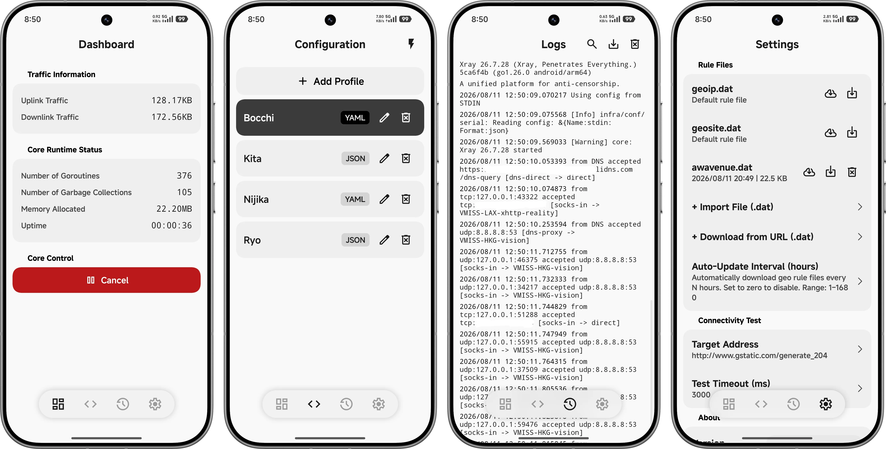

# SimpleXray (Personal Fork)
<div align="center">


**English** | **[中文](./README_CN.md)**

</div>

SimpleXray is a lightweight proxy client for Android built on [Xray-core](https://github.com/XTLS/Xray-core) and Android `VpnService` / `hev-socks5-tunnel`. It separates the Android application layer from the proxy core by launching the native Xray-core shared library (`libxray.so`) through `ProcessBuilder`.

## Scope

SimpleXray is primarily an Android frontend and launcher for Xray-core. It accepts complete Xray-core configuration files in JSON or YAML format and executes the resulting configuration on Android.

The application does not parse or generate configurations from share links or subscription URIs such as `vless://`, `vmess://`, or `trojan://`. Users are expected to have a basic understanding of Xray-core configuration files.

Imported configurations may be processed before execution to accommodate Android-specific requirements. This includes removing or modifying configuration elements that are specific to desktop or root environments, while preserving supported Xray-core functionality.

This repository is a personal fork based on the upstream [SimpleXray](https://github.com/lhear/SimpleXray) project.

## UI Preview

### Mobile

<div align="center">
  
</div>

### Tablet

<div align="center">
  
  
  <br>
  
  
</div>

---

## Differences from Upstream

| Area | Upstream | Personal Fork |
|-|-|-|
| **Process & Execution**         | `ProcessBuilder`-based stdin pipe execution                                       | `ProcessBuilder`-based configuration streaming via stdin, with CMake-based multi-ABI builds                                                                                       |
| **Traffic & IPC**               | Loopback SOCKS5 proxying and dynamically allocated `127.x.x.x` gRPC ports         | Unix Domain Sockets (UDS) and loopback gRPC for local IPC and statistics                                                                                                          |
| **Configuration Import**        | JSON-only                                 | JSON and YAML import through the Storage Access Framework (SAF)                                |
| **Rule Files**                  | Embedded `geoip.dat` and `geosite.dat` files                                      | Retains embedded rule files and adds local import/replacement, support for arbitrary custom `.dat` files, and per-file update URLs                                                |
| **Configuration Sanitization**  | Basic regular-expression-based removal of selected inbound configuration elements | SnakeYAML-based AST processing with a one-way sanitization pipeline for Android-specific configuration compatibility                                                              |
| **Build System**                | Legacy `ndkBuild` (`Android.mk`) and standard Gradle configuration                | CMake (`CMakeLists.txt`) with Android 16 KB page alignment support; Gradle Wrapper `9.7.0`, Android Gradle Plugin `9.3.1`, Version Catalogs, and Plugins DSL                      |
| **UI & Layout**                 | Standard Material 3 UI                                                            | Xiaomi HyperOS / MIUI-inspired UI implemented with `compose-miuix-ui`, with adaptive layouts for phones and large screens, NavigationRail support, and Android 12+ dynamic colors |
| **Persistence & Serialization** | `SharedPreferences` and `Gson`                                                    | Provider-backed `Preferences` and `kotlinx.serialization`, with Compose `StateFlow` state management                                                                              |
| **Core Components**             | Xray-core `v26.3.27` and `hev-socks5-tunnel` `v2.14.3`                            | Xray-core `v26.7.28` and `hev-socks5-tunnel` `v2.17.0`, including updated `hev-socks5-core`, `hev-task-system`, and `lwip` components                                             |

---

## Features and Modifications

### 1. UI and Adaptive Layout

The user interface has been refactored around `compose-miuix-ui`, using a design language inspired by Xiaomi HyperOS / MIUI.

* **Miuix components**: Uses Miuix components and shapes, including `TopAppBar`, `Card`, `InputField`, `Checkbox`, `OverlayIconDropdownMenu`, `OverlayDialog`, and `OverlayBottomSheet`.
* **Theme support**: Provides Light, Dark, and Automatic theme modes, together with Android 12+ Monet dynamic colors integrated with the Miuix color scheme.
* **Adaptive navigation**: Uses a vertical Miuix `NavigationRail` on wide screens when `screenWidthDp >= 600dp`.
* **Master-detail layout**: Uses a dual-pane layout for `ConfigScreen` on larger landscape displays when `screenWidthDp >= 840dp`, allowing profile selection and configuration editing to be displayed side by side.
* **Editor layout**: Provides a fullscreen editor mode and constrains the maximum content width to `840dp` on large displays.
* **Edge-to-edge navigation**: Uses a floating navigation bar that allows page content to scroll beneath the translucent navigation surface.
* **Per-app proxy filtering**: Adds an option in the App-Based Proxy screen to show or hide applications that do not declare `android.permission.INTERNET`.
* **Direct actions**: Replaces legacy three-dot menus on the main screens with direct actions for importing, running latency tests, exporting, and clearing data.

### 2. Xray-core Configuration Import

SimpleXray accepts complete Xray-core configuration files rather than individual proxy nodes or share links.

Supported input formats include:

* JSON configuration files;
* YAML configuration files;
* `.json`, `.yaml`, and `.yml` files imported through the Android Storage Access Framework (SAF);
* Configuration text pasted from the clipboard.

Share links and subscription URIs, such as `vless://`, `vmess://`, and `trojan://`, are not supported.

YAML configurations are parsed into an abstract syntax tree (AST), processed by the configuration sanitization pipeline, and serialized before being passed to Xray-core.

The application also provides an in-app configuration editor with syntax display, search, and editing support.

### 3. Rule File Management

SimpleXray retains the embedded `geoip.dat` and `geosite.dat` rule files and provides additional local and remote management capabilities.

* **Local replacement**: Import local `geoip.dat` and `geosite.dat` files from device storage.
* **Custom rule files**: Import and manage arbitrary non-standard `.dat` files.
* **Custom tags**: Support custom rule references such as `ext:custom.dat:subcategory`.
* **Per-file update URLs**: Configure individual update URLs for non-standard `.dat` files.
* **Background updates**: Download configured custom rule files in the background.

### 4. Process Management and IPC

The process execution and local IPC mechanisms have been refactored to reduce reliance on temporary files and loopback ports.

* **Configuration streaming**: Generated JSON configuration data is passed to Xray-core through stdin instead of being written to an intermediate configuration file.
* **Local IPC**: Uses Unix Domain Sockets (UDS) where appropriate for communication between application components and the proxy core.
* **Statistics**: Uses local loopback gRPC and UDS-based communication for core status and real-time bandwidth statistics.

### 5. Routing and Core Configuration

The fork includes several configuration-level optimizations and Android-specific adjustments.

* **Hybrid domain matcher**: Changes `domainMatcher` from `mph` to `hybrid` to balance memory usage and domain lookup performance.
* **DoH bootstrap configuration**: Adds static host mappings for DoH providers to avoid DNS bootstrap dependencies.
* **Listen address normalization**: Converts wildcard listen addresses such as `::` and `0.0.0.0` to `127.0.0.1` where required by the Android execution environment.

### 6. Platform-Specific Configuration Sanitization

Complete Xray-core configuration files can be imported without requiring users to manually remove every desktop-specific setting. Before execution, the imported configuration passes through an Android-specific sanitization pipeline.

The pipeline currently handles the following cases:

* **Windows process rules**: Removes Windows-specific executable paths such as `chrome.exe` from `routing.rules` and removes rules that become invalid as a result.
* **Desktop TUN inbounds**: Removes desktop-specific `protocol: tun` inbounds when running in a non-root Android environment.
* **File-based logging**: Removes filesystem paths configured through the `access` and `error` logging fields where required to avoid Android filesystem permission errors.
* **Listen addresses**: Normalizes `::` and `0.0.0.0` to `127.0.0.1` where required by the Android execution environment.
* **Sniffing configuration**: Preserves supported sniffing-related settings, including `destOverride`, when sanitizing the configuration.

The sanitization pipeline is intentionally one-way: imported configuration data is transformed into an Android-compatible configuration before being passed to the core.

### 7. Log Level Configuration

SimpleXray provides a LogLevel preference with the following options:

* `Auto`
* `Debug`
* `Info`
* `Warning`
* `Error`
* `None`

The selected log level is applied to the imported configuration during the sanitization process. File-based `access` and `error` logging paths are removed where necessary to avoid filesystem permission issues on Android.

### 8. Build System and Dependencies

The native build system has been migrated from the legacy Android NDK build system to CMake.

* **CMake**: Uses `CMakeLists.txt` instead of `Android.mk` / `ndkBuild`.
* **Android 16 KB page alignment**: The native build configuration includes support for Android devices using 16 KB memory page sizes.
* **Gradle Wrapper**: Updated to `v9.7.0`.
* **Android Gradle Plugin**: Uses `v9.3.1`.
* **Version Catalogs**: Project dependencies are managed through Gradle Version Catalogs.
* **Plugins DSL**: Gradle plugins are configured through the Plugins DSL.
* **Serialization**: `Gson` has been replaced with `kotlinx.serialization` for type-safe serialization and deserialization.

---

## Requirements

The following environment is required to build the project:

* Android 10 (API level 29) or later.
* Android SDK with Build Tools and Platform SDK for the configured target SDK (`36`).
* Android NDK.
* CMake.
* JDK 21.
* Git with submodule support.

The project uses Gradle Wrapper, so the required Gradle version is obtained automatically from the repository's Gradle Wrapper configuration.

---

## Building from Source

Clone the repository and its submodules:

```bash
git clone --recursive https://github.com/ReRokutosei/SimpleXray.git
cd SimpleXray
```

Build the release APK:

```bash
./gradlew assembleRelease
```

The generated APK is located at:

```text
app/build/outputs/apk/release/simplexray-arm64-v8a.apk
```

If the repository has already been cloned without its submodules, initialize them with:

```bash
git submodule update --init --recursive
```

---

## Upstream Projects and Dependencies

SimpleXray incorporates or builds upon the following open-source projects:

* [`compose-miuix-ui`](https://github.com/compose-miuix-ui/miuix) — Jetpack Compose UI component library inspired by Xiaomi HyperOS / MIUI.
* [`Xray-core`](https://github.com/XTLS/Xray-core) — Proxy and network core used by SimpleXray.
* [`SimpleXray`](https://github.com/lhear/SimpleXray) — Upstream Android client on which this fork is based.
* [`hev-socks5-tunnel`](https://github.com/heiher/hev-socks5-tunnel) — SOCKS5 VPN tunnel implementation used for Android traffic handling.

The versions and modifications used by this fork may differ from those in the upstream projects.

---

## Privacy Policy and Disclaimer

For details, please refer to the [Privacy Policy](./PrivacyPolicy_CN.md) and [Disclaimer](./Disclaimer_CN.md).

By using this application, you acknowledge that you have read and agree to the Privacy Policy and Disclaimer. If you do not agree with either document, please uninstall the application and discontinue its use.

---

## License

Unless otherwise stated, this project is distributed under the Mozilla Public License 2.0 (MPL-2.0), in accordance with the licensing terms of the upstream project.

See [`LICENSE`](../LICENSE) for the complete license text.
