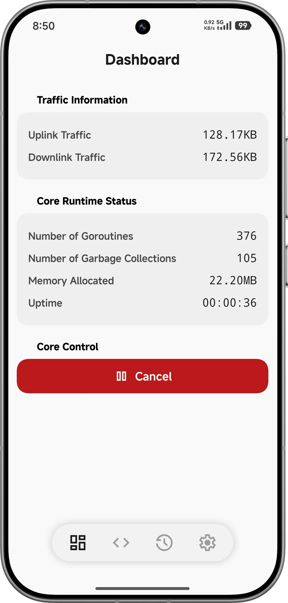
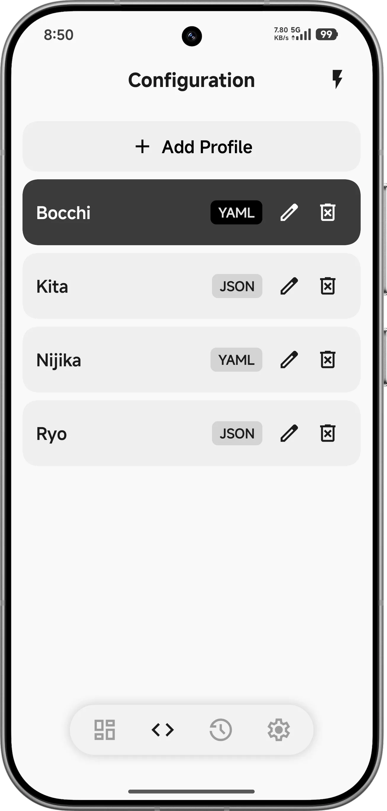
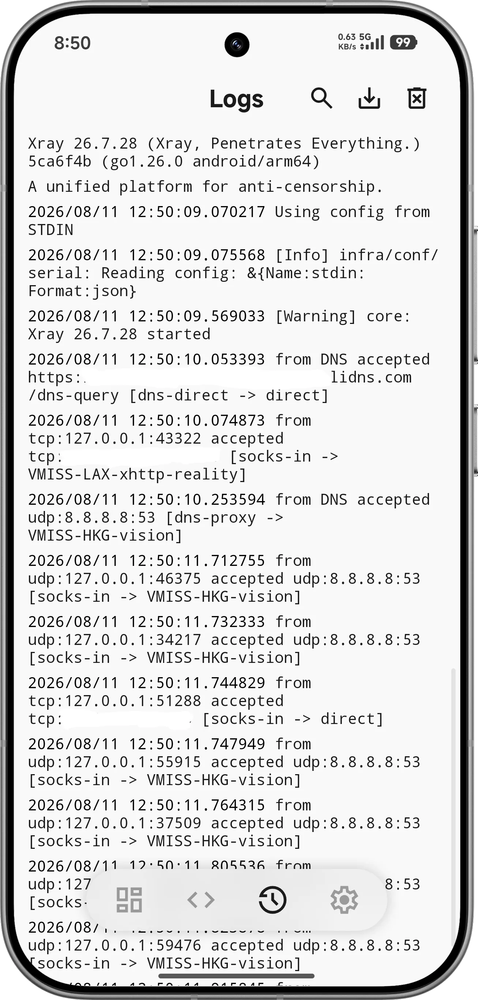
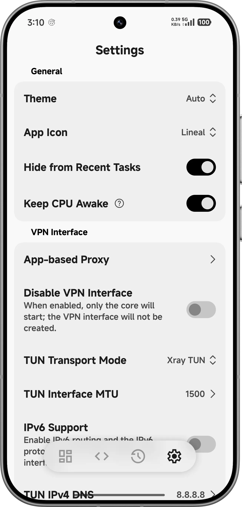
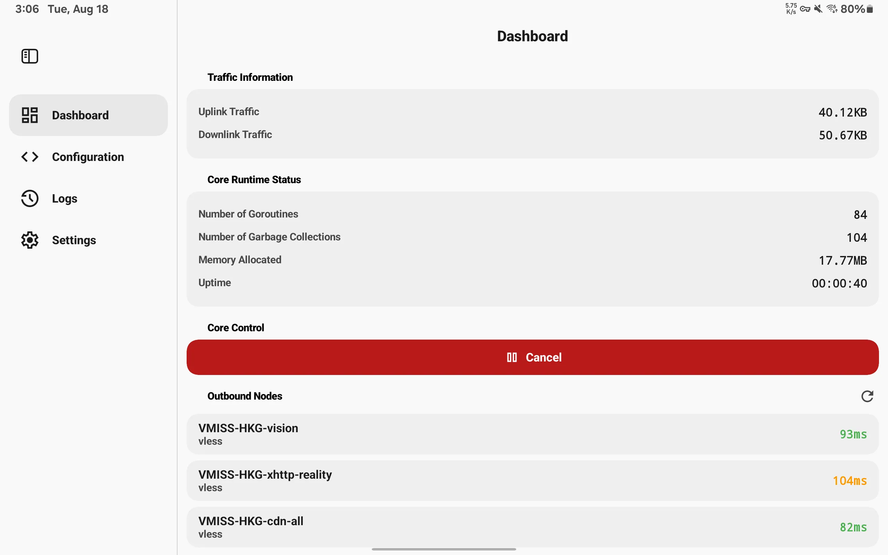
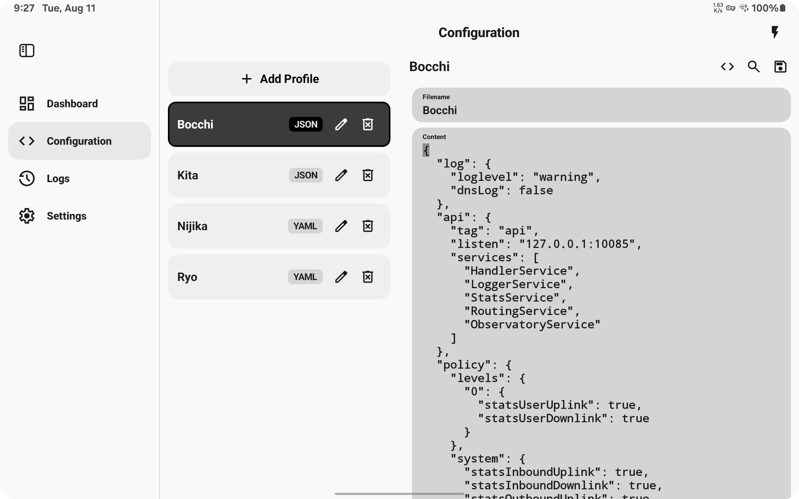
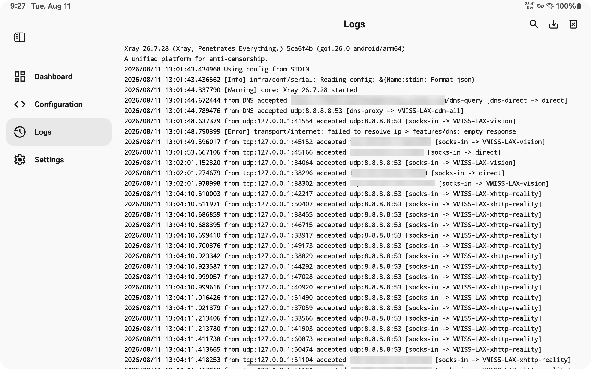
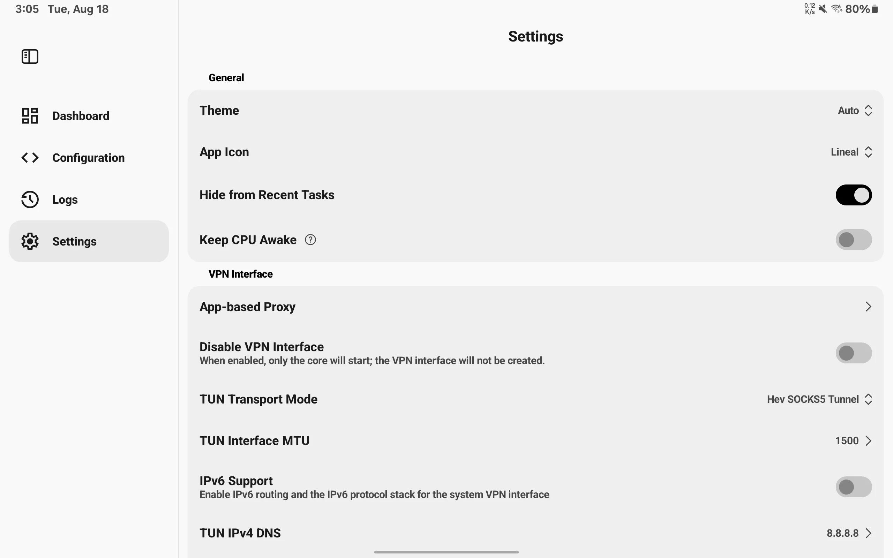

# SimpleXray (Personal Fork)

<div align="center">


**English** | **[中文](./README_CN.md)**


<sub>Android 14+ (API 34) | arm64-v8a | MPL-2.0</sub>
</div>

SimpleXray is an Android launcher and frontend for Xray-core. It accepts complete JSON or YAML configurations, applies Android-specific normalization, and executes the result under `VpnService`. It does not parse share links or subscriptions.

This repository is a personal fork of [SimpleXray](https://github.com/lhear/SimpleXray). It keeps the upstream full-configuration model and adds a selectable TUN data plane, a reworked configuration pipeline, rule-file management, a Miuix-based interface, and benchmark tooling.

> [!NOTE]
> This fork is maintained for personal use and experimentation. Issues and pull requests are not accepted, and no support is provided. If you need a maintained client, use upstream or fork this repository and build it through CI.

## Why This Fork

- **Four TUN backends** — Hev (C/lwIP, default), SingTUN (Go), SimpleTUN (in-tree Zig), and native Xray TUN.
- **Complete configuration workflow** — JSON/YAML import, in-app editor, one-way Android sanitization, log controls, and runtime statistics injection.
- **Rule-file management** — built-in `geoip.dat`/`geosite.dat`, arbitrary custom `.dat` files, `ext:` references, per-file update URLs, and background updates.
- **Miuix interface** — Xiaomi HyperOS/MIUI-inspired Compose UI with adaptive phone and tablet layouts, NavigationRail, Light/Dark/System themes, and Android 12+ dynamic colors.
- **Android integration** — per-app proxy controls, direct local SOCKS5 inbound, network handover handling, and 16 KB page-alignment support.
- **Benchmark tooling** — headless benchmark runner, publication dashboards, and device benchmark datasets.
- **Platform baseline** — Android 14+ and `arm64-v8a` only.

The full structural comparison is in [Differences from Upstream](./upstream-differences.md).

## UI Preview

### Phone

<div align="center">
  
  
  <br>
  
  
</div>

### Tablet

<div align="center">
  
  
  <br>
  
  
</div>

## Features

### Xray-core

- Xray-core runs as an independent child process and receives its configuration through stdin. No intermediate configuration file is written to disk.
- Native Xray TUN mode uses the JNI launcher (`xray_exec.c`) to pass the Android VPN file descriptor to the child process.
- The dashboard probes TCP handshake latency to supported outbound endpoints when it is shown or manually refreshed. UDP-only protocols, QUIC transports, and private, loopback, or link-local IP literals are skipped.
- In Hev, SingTUN, and SimpleTUN modes, Xray is started with `ProcessBuilder`; the selected backend forwards TUN traffic to Xray's local SOCKS5 inbound.
- Core status and traffic statistics are queried over plaintext gRPC on a dynamically allocated `127.0.0.1` port. Standard output and error are streamed to the UI and may be exported.

### Configuration

- Complete JSON and YAML configurations, imported through SAF or the clipboard (`.json`, `.yaml`, `.yml`).
- A one-way sanitizer removes desktop/root-oriented fields and adapts inbounds, routing rules, DNS bootstrap hosts, logging, and outbound transport settings for Android. See [Configuration Overrides and Removals](./configuration.md).
- Error, access, and DNS logs are controlled separately. The `Auto` log level maps to `warning` when no explicit level is configured.
- The built-in editor supports text editing, search, and bracket matching.

### TUN Backends

- **Hev** — C/lwIP implementation. Default backend.
- **SingTUN** — Go user-space stack based on the in-tree `sing-tun` integration.
- **SimpleTUN** — in-tree Zig engine. IPv4 only, SOCKS5 no-auth, MTU fixed at 1500, no IPv6 route or address. See the [architecture specification](./simpletun_spec.md).
- **Xray TUN** — native Xray TUN inbound with the VPN file descriptor delivered by the JNI launcher.

### Rule Files

- Import and replace the standard `geoip.dat` and `geosite.dat` files.
- Import arbitrary custom `.dat` files and reference entries with `ext:<file>:<tag>`.
- Configure independent update URLs per custom rule file. Downloads run in the background and are validated before installation.

### Android Integration

- The Android app layer (UI + `TProxyService`) runs in a single process. Service state and log streams are delivered through in-memory `StateFlow` / `SharedFlow`.
- Per-app proxy filtering, direct SOCKS5 access at `127.0.0.1:<socksPort>`, network handover callbacks, and adaptive layout for phones and tablets.

### Benchmark and Tooling

- `tools/benchmark.py` drives throughput, idle-memory, bufferbloat, stability, weak-network, CPS, and QUIC suites through a headless `BenchmarkService`.
- Chart and report generation are included. Results: [Snapdragon 8 Elite Gen 5](./benchmark/8-elite-gen-5/report/benchmark_report.md) and [Snapdragon 778G](./benchmark/778g/report/benchmark_report.md).

## Known Issues

### Telegram may retain a stale local SOCKS5 connection

When Android changes its default network, an existing TCP connection from a client to `127.0.0.1:<socksPort>` can remain open while its Xray upstream transport has already become stale. The official Telegram client has been observed to reuse that loopback connection indefinitely. Routing through the TUN interface and clients with their own liveness detection recover normally.

Workarounds:

- Toggle the VPN or Xray core off and on.
- Reconnect the network interface.
- Use a client that recreates its SOCKS5 connection after network changes.

This is client-side stale-connection reuse, not a listener or Xray-core defect. SimpleXray injects shorter outbound keepalive and TCP user-timeout values to detect blackholed upstream transports faster, but it does not forcibly close otherwise healthy loopback sessions.

## Quick Start

Prerequisites are summarized in the [building guide](./building.md). First build requires network access because Gradle downloads and verifies the pinned Xray-core prebuilt.

```bash
git clone --recursive https://github.com/ReRokutosei/SimpleXray.git
cd SimpleXray

mkdir -p app/src/main/assets
wget https://github.com/MetaCubeX/meta-rules-dat/releases/download/latest/geoip.dat -O app/src/main/assets/geoip.dat
wget https://github.com/MetaCubeX/meta-rules-dat/releases/download/latest/geosite.dat -O app/src/main/assets/geosite.dat

(cd third_party/simpletun && zig build android)
ANDROID_NDK_HOME=/path/to/ndk bash third_party/sing-tun/build.sh

./gradlew :app:testDebugUnitTest :app:assembleDebug
```

Debug APK: `app/build/outputs/apk/debug/simplexray-arm64-v8a.apk`. Release signing, no-GEO builds, and CI details are documented in [Building from Source](./building.md).

## Documentation

- [Building from Source](./building.md)
- [Configuration Overrides and Removals](./configuration.md)
- [Differences from Upstream](./upstream-differences.md)
- [SimpleTUN Architecture Specification](./simpletun_spec.md)
- [Benchmark Reports](./benchmark/8-elite-gen-5/report/benchmark_report.md)
- [Changelog](../CHANGELOG.md)

## Upstream and Third-Party

Built on [Xray-core](https://github.com/XTLS/Xray-core), [hev-socks5-tunnel](https://github.com/heiher/hev-socks5-tunnel), [sing-tun](https://github.com/SagerNet/sing-tun), and [compose-miuix-ui](https://github.com/compose-miuix-ui/miuix), and derived from the upstream [SimpleXray](https://github.com/lhear/SimpleXray) project.

Application icon assets use free Cookie Icons provided by [Magnific](https://www.magnific.com).

## Privacy and License

See the [Privacy Policy](./PrivacyPolicy_EN.md) and [Disclaimer](./Disclaimer_EN.md).

Unless otherwise stated, this project is distributed under the Mozilla Public License 2.0 (MPL-2.0). See [`LICENSE`](../LICENSE) for the full text.
