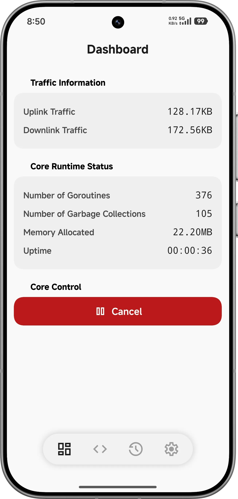
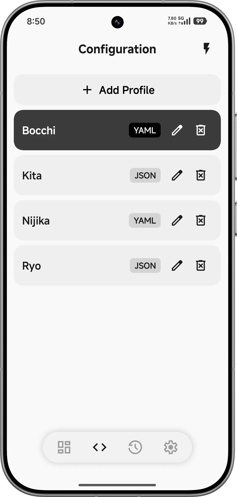
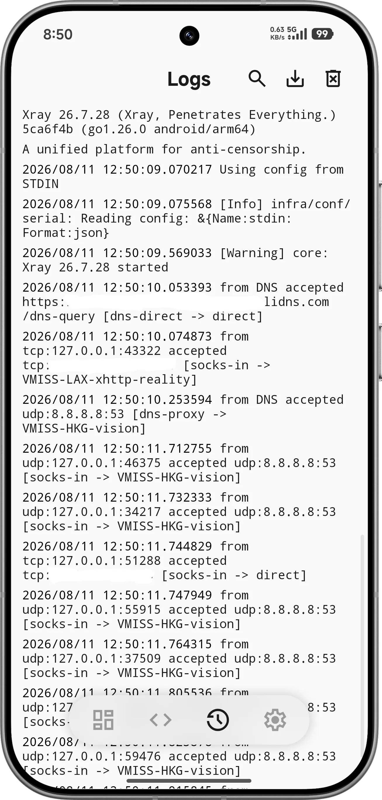
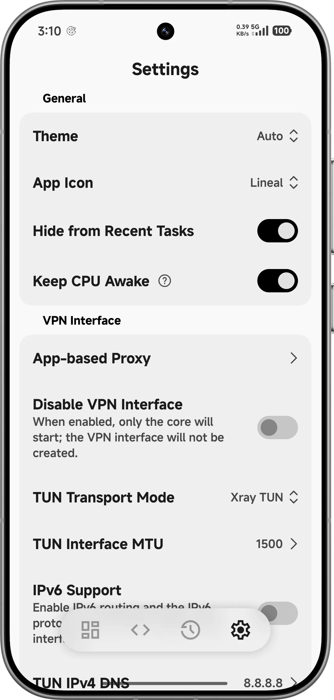
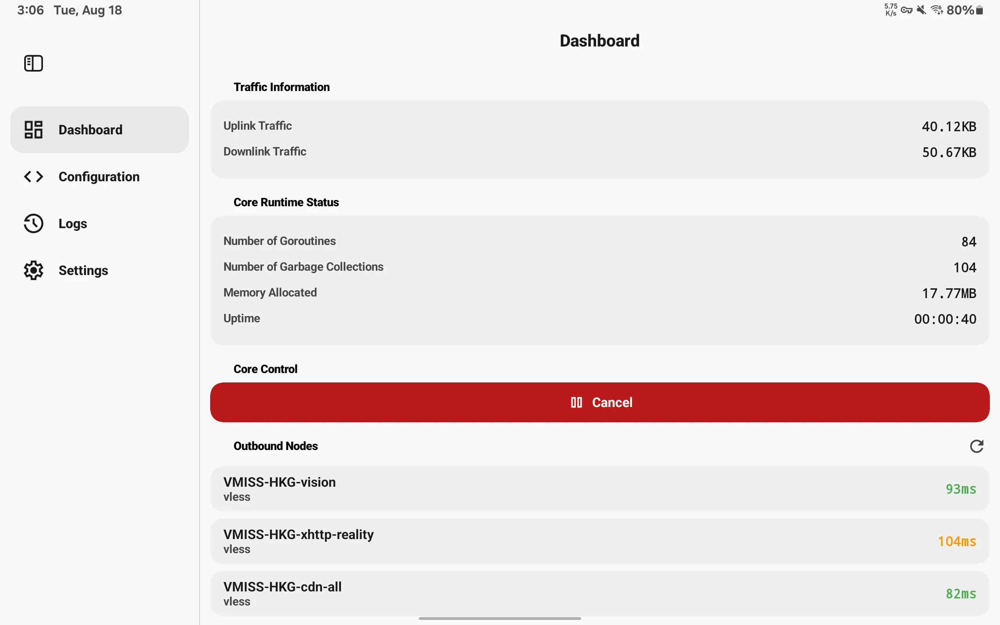
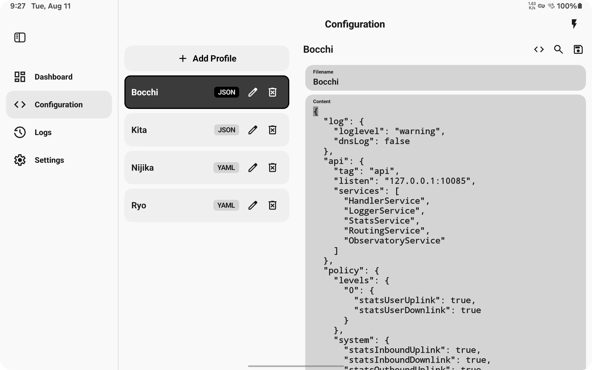
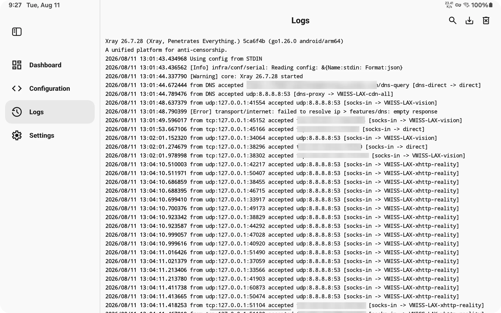
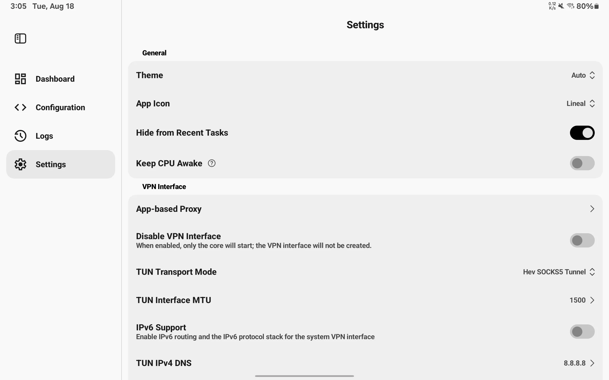

# SimpleXray 个人分支
<div align="center">


**[English](./README.md)** | **中文**


</div>

SimpleXray 是一款面向 Android 的轻量级代理客户端。项目使用 [Xray-core](https://github.com/XTLS/Xray-core) 作为代理核心，并结合 Android `VpnService` 与 `hev-socks5-tunnel` 实现网络流量处理。

应用层与代理核心彼此独立。SimpleXray 通过 `ProcessBuilder` 启动原生 Xray-core 共享库 `libxray.so` 对应的进程，并通过标准输入传递配置。

## 项目定位

SimpleXray 主要负责在 Android 上运行和管理 Xray-core。应用接受完整的 Xray-core 配置文件，并在 Android 环境中完成必要的适配后启动代理核心。

使用本项目需要具备基本的 Xray-core 配置知识，目前支持 JSON 和 YAML 两种配置格式。应用不会解析或生成 `vless://`、`vmess://`、`trojan://` 等分享链接，也不会根据单个节点信息自动生成完整配置，并且不负责处理订阅链接。

导入的配置在启动前会经过适配处理。部分仅适用于桌面系统或 Root 环境的配置会被删除或调整，其余受支持的 Xray-core 配置会尽可能保留。

本仓库是基于上游 [SimpleXray](https://github.com/lhear/SimpleXray) 开发的个人分支。

## 界面预览

### 手机端

<div align="center">
  
  
  <br>
  
  
</div>

### 平板端

<div align="center">
  
  
  <br>
  
  
</div>

---

## 与上游版本的主要区别

| 项目 | 上游版本 | 本仓库 |
|-|-|-|
| **进程与配置传递**  | 使用 `ProcessBuilder` 通过标准输入传递配置                       | 保留标准输入传递方式，并使用 CMake 构建多个 Android ABI                                                                                                   |
| **流量与进程间通信** | 使用回环 SOCKS5 代理和动态分配的 `127.x.x.x` gRPC 端口             | 使用 Unix Domain Socket 和回环 gRPC 进行本地通信及状态统计                                                                                              |
| **配置导入**     | 仅支持 JSON 手动导入                               | 支持通过 Android Storage Access Framework 导入 JSON 和 YAML |
| **规则文件**     | 内置 `geoip.dat` 和 `geosite.dat`                       | 保留内置规则文件，并支持从本地导入和替换，同时支持自定义 `.dat` 文件以及独立的更新地址                                                                                         |
| **配置处理**     | 使用基础的正则表达式处理部分 inbound 配置                            | 使用 SnakeYAML 解析抽象语法树，并通过单向处理流程完成 Android 平台适配                                                                                           |
| **构建系统**     | 使用 `ndkBuild` 和 `Android.mk`，配合标准 Gradle 配置          | 使用 CMake 和 `CMakeLists.txt`，支持 Android 16 KB 内存页，并使用 Gradle Wrapper `9.7.0`、Android Gradle Plugin `9.3.1`、Version Catalog 和 Plugins DSL |
| **界面与布局**    | 使用标准 Material 3 界面                                   | 使用 `compose-miuix-ui` 实现具有 Xiaomi HyperOS / MIUI 风格的界面，并针对手机和平板提供自适应布局                                                           |
| **数据存储与序列化** | 使用 `SharedPreferences` 和 `Gson`                      | 使用基于 Provider 的 `Preferences` 和 `kotlinx.serialization`，并通过 Compose `StateFlow` 管理状态                                                    |
| **核心组件**     | Xray-core `v26.3.27` 和 `hev-socks5-tunnel` `v2.14.3` | Xray-core `v26.7.28` 和 `hev-socks5-tunnel` `v2.17.0`                                  |

---

## 功能与修改

### 1. 界面与自适应布局

项目重新设计了应用界面，并使用 `compose-miuix-ui` 实现具有 Xiaomi HyperOS / MIUI 风格的界面。

主要修改包括以下内容。

* 使用 Miuix 提供的 `TopAppBar`、`Card`、`InputField`、`Checkbox`、`OverlayIconDropdownMenu`、`OverlayDialog` 和 `OverlayBottomSheet` 等组件。
* 支持浅色、深色和跟随系统三种主题模式。
* 支持 Android 12 及以上版本的 Monet 动态取色，并将动态颜色应用于 Miuix 配色方案。
* 当屏幕宽度达到 `600dp` 时，将主要导航切换为垂直方向的 Miuix `NavigationRail`。
* 当屏幕宽度达到 `840dp` 且处于横屏状态时，`ConfigScreen` 使用双栏布局，同时显示配置列表和配置编辑区域。
* 在较大屏幕上限制主要内容区域的最大宽度为 `840dp`，避免内容区域过宽。
* 使用悬浮式导航栏，并允许页面内容在半透明导航区域下方继续滚动。
* 在基于应用的代理页面中增加应用筛选功能，可以选择是否显示未声明 `android.permission.INTERNET` 权限的应用。
* 将主页面原有的三点菜单调整为直接操作按钮，包括导入、延迟测试、导出和清除等操作。
* 配置编辑器支持全屏编辑模式。

### 2. Xray-core 配置导入

SimpleXray 接受完整的 Xray-core 配置文件，不负责将单个代理节点或分享链接转换为配置。

支持以下配置来源。

* JSON 配置文件。
* YAML 配置文件。
* 通过 Android Storage Access Framework 导入的 `.json`、`.yaml` 和 `.yml` 文件。
* 从剪贴板粘贴的配置文本。

以下内容不受支持。

* `vless://` 等节点分享链接。
* `vmess://` 等节点分享链接。
* `trojan://` 等节点分享链接。
* 订阅链接。

YAML 配置会先被解析为抽象语法树。应用随后对配置进行平台适配处理，并在完成处理后重新序列化，再将配置传递给 Xray-core。

应用同时提供内置配置编辑器，支持配置内容查看、搜索和编辑。

### 3. 规则文件管理

SimpleXray 保留内置的 `geoip.dat` 和 `geosite.dat` 规则文件，并增加本地导入和在线更新功能。

* 可以从设备存储导入新的 `geoip.dat` 和 `geosite.dat` 文件，并替换内置文件。
* 可以导入和管理其他自定义 `.dat` 规则文件。
* 支持使用自定义规则标签，例如 `ext:custom.dat:subcategory`。
* 可以为不同的自定义 `.dat` 文件设置独立的在线更新地址。
* 配置了更新地址的规则文件可以在后台下载更新。

### 4. 进程管理与进程间通信

项目调整了代理核心的启动方式和本地通信机制，减少对临时文件和随机回环端口的依赖。

配置数据会通过标准输入直接传递给 Xray-core，不再为了启动核心而生成中间配置文件。

应用与代理核心之间的部分本地通信使用 Unix Domain Socket。核心状态和实时流量统计则通过本地 IPC 和回环 gRPC 获取。

### 5. 路由与核心配置优化

项目对部分 Xray-core 配置进行了调整。

* 将 `domainMatcher` 从 `mph` 调整为 `hybrid`，以改善内存占用和域名匹配性能之间的平衡。
* 为 DoH 服务增加静态主机映射，以避免 DoH 服务自身的域名解析依赖本地 DNS 引导。
* 在 Android 环境需要时，将 `::` 和 `0.0.0.0` 等通配监听地址调整为 `127.0.0.1`。
* **仪表盘延迟展示**：仪表盘的每节点延迟来自轻量级 TCP 连接探测（1 个 RTT），目标是配置中各出站的服务器端点（解析规则：vless/vmess 取 `settings.vnext[0]`，trojan/shadowsocks/http/socks 取 `settings.servers[0]`）。进入仪表盘时探测一次，并提供手动刷新按钮。UDP-only 协议（wireguard/hysteria2）与 QUIC 传输不参与探测，私网/环回/链路本地 IP 字面量也从不探测。显示的值是从设备到节点的 TCP 握手 RTT，与 Xray 内核无关；不可达节点显示为失败。

### 6. Android 平台配置适配

SimpleXray 可以直接导入完整的 Xray-core 配置文件。配置启动前会经过针对 Android 环境设计的适配流程，因此不要求用户手动删除所有桌面系统相关配置。

目前主要处理以下内容。

* **Windows 进程规则**

  删除 `routing.rules` 中的 Windows 可执行文件路径，例如 `chrome.exe`。如果相关规则因此失去有效条件，也会一并删除。

* **桌面系统 TUN 入站**

  在非 Root Android 环境中删除仅适用于桌面系统的 `protocol: tun` 入站配置。

* **文件日志**

  根据 Android 文件系统权限限制，删除 `access` 和 `error` 中不适用的文件写入路径，避免 Xray-core 因无法访问指定路径而启动失败。

* **监听地址**

  在 Android 环境需要时，将 `::` 和 `0.0.0.0` 等监听地址调整为 `127.0.0.1`。

* **流量嗅探**

  在配置适配过程中保留受支持的流量嗅探配置，包括 `destOverride`。

配置适配采用单向处理流程。原始配置经过处理后生成适用于 Android 环境的新配置，并将处理结果交给 Xray-core 执行。

### 7. 日志级别设置

应用提供日志级别设置，可以选择以下级别。

* `Auto`
* `Debug`
* `Info`
* `Warning`
* `Error`
* `None`

用户选择的日志级别会在配置处理过程中写入 Xray-core 配置。

如果配置中包含不适用于 Android 环境的 `access` 或 `error` 文件日志路径，应用会在处理过程中将其删除。

### 8. 构建系统与依赖更新

项目将原有的 Android NDK 构建方式迁移至 CMake。

* 使用 `CMakeLists.txt` 替代 `Android.mk` 和 `ndkBuild`。
* 原生构建配置支持 Android 16 KB 内存页。
* Gradle Wrapper 更新至 `v9.7.0`。
* Android Gradle Plugin 使用 `v9.3.1`。
* 使用 Gradle Version Catalog 管理项目依赖。
* 使用 Gradle Plugins DSL 管理 Gradle 插件。
* 使用 `kotlinx.serialization` 替代 `Gson`，负责类型安全的序列化和反序列化。

---

## 构建要求

构建本项目需要以下环境。

* Android 10 或更高版本，对应 API Level 29。
* Android SDK，包括项目所需的 Build Tools 和 Android Platform SDK。
* Target SDK 36。
* Android NDK。
* CMake。
* JDK 21。
* 支持子模块操作的 Git。

项目使用 Gradle Wrapper，因此构建时会根据仓库中的 Wrapper 配置使用指定的 Gradle 版本。

---

## 从源码构建

首先克隆仓库及其子模块。

```bash
git clone --recursive https://github.com/ReRokutosei/SimpleXray.git
cd SimpleXray
```

执行以下命令构建 Release APK。

```bash
./gradlew assembleRelease
```

构建完成后，APK 位于以下路径。

```text
app/build/outputs/apk/release/simplexray-arm64-v8a.apk
```

如果仓库在克隆时没有初始化子模块，可以执行以下命令。

```bash
git submodule update --init --recursive
```

---

## 上游项目与依赖

SimpleXray 使用或基于以下开源项目开发。

* [`compose-miuix-ui`](https://github.com/compose-miuix/miuix)
  面向 Kotlin Multiplatform 的 Jetpack Compose UI 组件库，界面设计参考 Xiaomi HyperOS / MIUI。

* [`Xray-core`](https://github.com/XTLS/Xray-core)
  SimpleXray 使用的代理核心。

* [`SimpleXray`](https://github.com/lhear/SimpleXray)
  本项目所基于的上游 Android 客户端。

* [`hev-socks5-tunnel`](https://github.com/heiher/hev-socks5-tunnel)
  用于 Android 网络流量处理的 SOCKS5 VPN 隧道实现。

本项目使用的组件版本和具体修改内容可能与对应上游项目存在差异。

---

## 隐私政策与免责声明

隐私政策请参阅[《隐私政策》](./PrivacyPolicy_CN.md)，免责声明请参阅[《免责声明》](./Disclaimer_CN.md)。

使用本应用即表示您已阅读并同意隐私政策与免责声明。如您不同意其中任何内容，请卸载本应用并停止使用。

---

## 许可证

除另有说明外，本项目按照上游项目的许可条款使用 Mozilla Public License 2.0（也称 MPL-2.0）

完整许可证文本请参阅 [`LICENSE`](../LICENSE) 文件。

<div align="center">


</div>