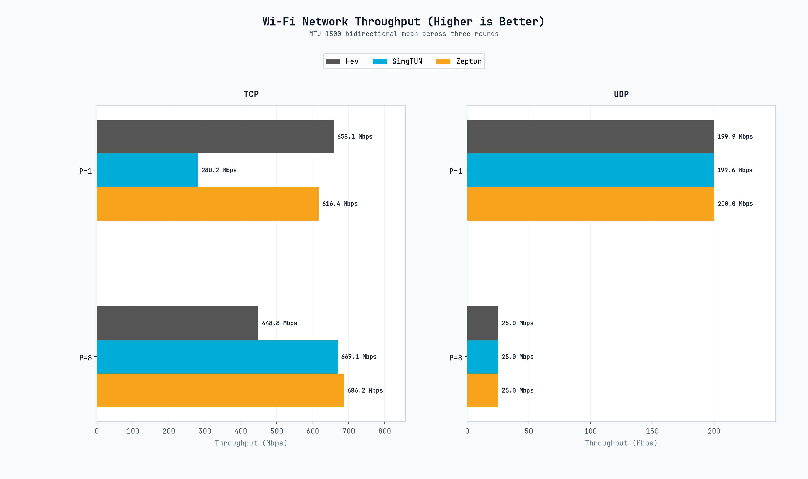
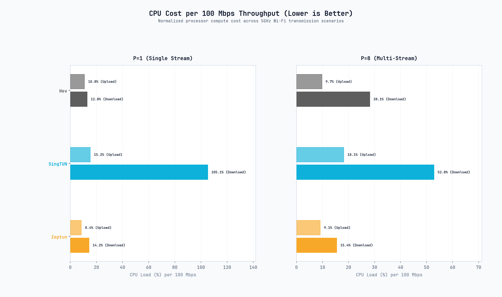
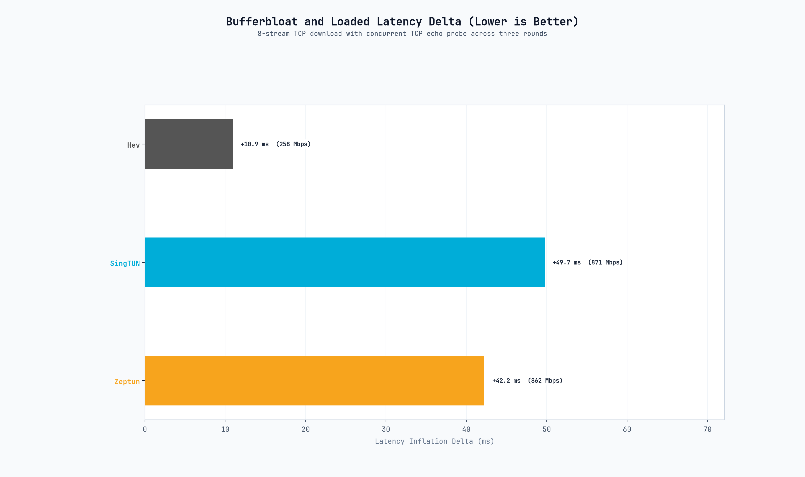
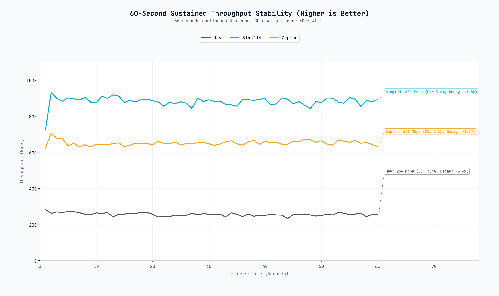
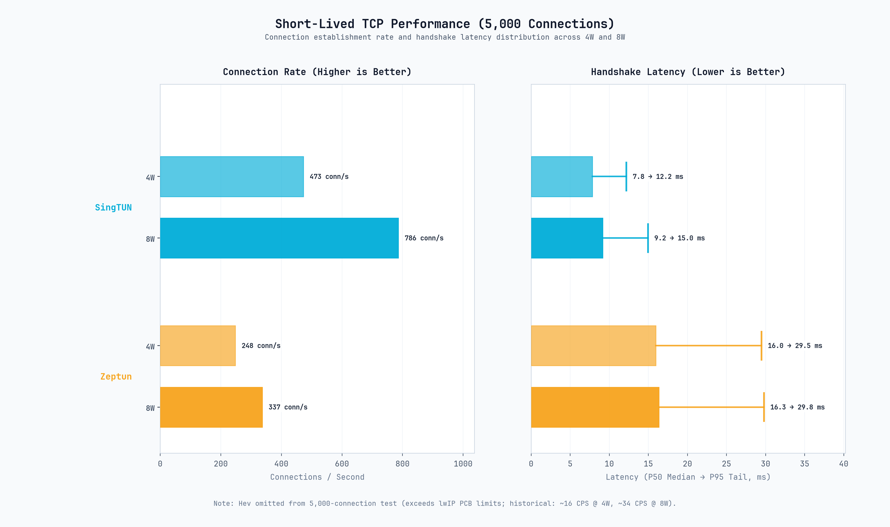
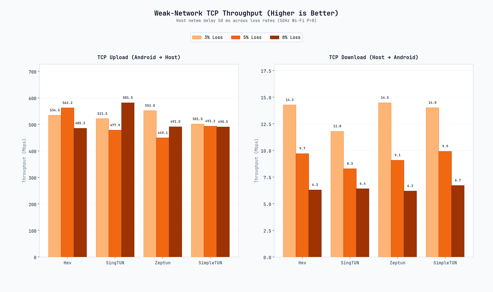

# SimpleXray TUN Backend Benchmark Report (Snapdragon 778G)

## 1. Test Environment

### 1.1 Hardware and OS Specifications

| Parameter | Client | Server |
| :--- | :--- | :--- |
| **Platform** | Snapdragon 778G / 4×Cortex-A78 + 4×Cortex-A55 | Ryzen 7 6800H / 8C16T |
| **OS** | Android 14 | Debian 13 (trixie) |
| **Kernel** | 5.4.254 | 6.12 |
| **Network** | 5 GHz Wi-Fi | 1 GbE |
| **Baseline RTT** | 2.1 ms to server | — |

### 1.2 Software Stack

All implementations were evaluated via SimpleXray (`assembleDebug`) with Android VpnService transparent routing to an in-process Xray-core instance via local SOCKS5 loopback (`127.0.0.1`, RFC 1928).

| Backend | Core Language | Underlying Stack / Runtime | Tracked Revision |
| :--- | :--- | :--- | :--- |
| **Hev** | C | lwIP (embedded TCP/IP) | v2.17.1 (`b514150`) |
| **SingTUN** | Go | sing-box userspace tun / Go 1.27.1 | Commit `aff4131a9e9e` |
| **Zeptun** | Zig | Custom user-space stack | v1.1.1 (`4d24203`) |
| **Xray-core** | Go | Upstream SOCKS5 endpoint | v26.9.9 |

---

## 2. Methodology

The benchmark was executed headlessly via Android `BenchmarkService`. Each configuration was run three times with a 3-second cooldown between cases. Reported figures are the arithmetic mean of successful runs. Failed or timed-out runs were excluded from the mean and are reported separately.

1. **Throughput (iPerf3)**: MTU 1500 bytes. Workloads: TCP $P=1$, TCP $P=8$, and UDP (10 s per direction). UDP target bitrates follow an elevated saturation ladder: 600 Mbps for single-stream ($P=1$), and 75 Mbps per stream for 8-stream parallel ($P=8$, aggregate 600 Mbps).
2. **CPU Compute Cost**: Cumulative process CPU load divided by throughput in units of 100 Mbps ($\% \text{ CPU} / 100 \text{ Mbps}$).
3. **Loaded Latency**: 8-stream TCP download with concurrent 100 ms echo probing ($\Delta \text{ ms} = \text{RTT}_{\text{loaded}} - \text{RTT}_{\text{idle}}$).
4. **Sustained Stability**: 60-second continuous 8-stream TCP download; throughput sampled at 1 Hz.
5. **Short-Lived TCP Connections (CPS)**: 5,000 requests dispatched across 4 and 8 workers; metrics: conn/s, P50, and P95 latency (120 s timeout).
6. **Weak-Network Resilience**: Server-side `netem` bridge with fixed 50 ms base RTT; uniform packet loss at 3%, 5%, and 8% on 8-stream TCP.
7. **Isolated Memory Attribution**: Scheme 2 microbenchmark in a Linux network namespace (`unshare -r -n`); PSS sampled across 0 to 1,000 idle retained TCP/UDP connections.

---

## 3. Results

### 3.1 Throughput & Transport Capacity

| Scenario | Direction | Hev (C / lwIP) | SingTUN (Go) | Zeptun (Zig) |
| :--- | :--- | :--- | :--- | :--- |
| **TCP $P=1$ (Single Stream)** | Download | 625.9 Mbps | 159.3 Mbps | 735.3 Mbps |
| | Upload | 622.5 Mbps | 591.3 Mbps | 530.4 Mbps |
| **TCP $P=8$ (Multi-Stream)** | Download | 255.6 Mbps | 852.8 Mbps | 855.7 Mbps |
| | Upload | 661.3 Mbps | 617.8 Mbps | 690.6 Mbps |
| **UDP $P=1$ (Single Stream, 600M Target)** | Download | 305.3 Mbps (44.1% loss) | 255.6 Mbps (51.4% loss) | 296.0 Mbps (42.9% loss) |
| | Upload | 245.2 Mbps (53.9% loss) | 231.5 Mbps (54.9% loss) | 256.0 Mbps (51.8% loss) |
| **UDP $P=8$ (Multi-Stream, 600M Aggregate)** | Download | 75.0 Mbps × 8 (0.0% loss) | 75.0 Mbps × 8 (0.0% loss) | 75.1 Mbps × 8 (0.0% loss) |
| | Upload | 74.9 Mbps × 8 (0.0% loss) | 74.9 Mbps × 8 (0.0% loss) | 74.9 Mbps × 8 (0.0% loss) |

- At $P=1$, Zeptun reached the highest download throughput at 735.3 Mbps, followed by Hev at 625.9 Mbps; SingTUN recorded 159.3 Mbps.
- At $P=8$, Zeptun and SingTUN saturated the downlink capacity at 855.7 Mbps and 852.8 Mbps respectively; Hev MTU 1500 multi-stream download leveled off at 255.6 Mbps due to single-threaded dispatch constraints.
- In single-stream UDP ($P=1$, 600 Mbps target rate), all three backends saturated the SoC/radio physical transmit ceiling around 231–305 Mbps with 42%–55% packet loss, reflecting the Snapdragon 778G hardware and single-socket packet handling limits. In contrast, multi-stream UDP ($P=8$, 75 Mbps × 8 streams = 600 Mbps aggregate) achieved line rate with 0.0% packet loss across all three backends.

---

### 3.2 CPU Cost per 100 Mbps

| Scenario | Direction | Hev (C / lwIP) | SingTUN (Go) | Zeptun (Zig) |
| :--- | :--- | :--- | :--- | :--- |
| **$P=1$ (Single Stream)** | Upload | 11.2% | 12.8% | 9.2% |
| | Download | 14.7% | 96.6% | 14.4% |
| **$P=8$ (Multi-Stream)** | Upload | 10.1% | 19.2% | 8.2% |
| | Download | 29.6% | 46.5% | 13.6% |

- In $P=8$ download, Zeptun achieved the highest efficiency at 13.6% CPU per 100 Mbps (116.3% process CPU at 855.7 Mbps), followed by SingTUN at 46.5% CPU per 100 Mbps (396.7% process CPU at 852.8 Mbps).
- SingTUN's multi-stream CPU load in $P=8$ download decreased from 52.8% to 46.5% CPU per 100 Mbps following runtime tuning (`GOMAXPROCS=4`, restored GC target).
- In $P=1$ download, Zeptun and Hev recorded 14.4% and 14.7% CPU per 100 Mbps respectively.

---

### 3.3 Loaded Latency

| Backend | Background Download Throughput | Baseline Latency | Loaded Latency Delta ($\Delta \text{ ms}$) |
| :--- | :--- | :--- | :--- |
| **Hev** | 313 Mbps (Constrained) | 2.1 ms | +12.6 ms |
| **SingTUN** | 786 Mbps (Saturated) | 2.1 ms | +76.1 ms |
| **Zeptun** | 794 Mbps (Saturated) | 2.1 ms | +79.0 ms |

- Under saturated downlink load (786–794 Mbps), latency inflation was +76.1 ms for SingTUN and +79.0 ms for Zeptun.
- Hev recorded +12.6 ms latency inflation with background throughput constrained at 313 Mbps.

---

### 3.4 60-Second Sustained Throughput Stability

- **SingTUN**: Sustained 881.2 Mbps average throughput with low variance ($\text{CV} = 3.02\%$) throughout the 60-second test.
- **Zeptun**: Maintained 650.9 Mbps average throughput with tight consistency ($\text{CV} = 2.10\%$).
- **Hev**: Sustained 255.7 Mbps average throughput ($\text{CV} = 3.41\%$) on MTU 1500 multi-stream download.

---

### 3.5 Short-Lived TCP Connections (CPS)

| Backend | Workers | Connection Rate | Median Latency (P50) | Tail Latency (P95) | Status |
| :--- | :--- | :--- | :--- | :--- | :--- |
| **Hev** | 4W / 8W | Skipped | N/A | N/A | Exceeds lwIP PCB capacity |
| **SingTUN** | 4 Workers | 389.5 conn/s | 8.2 ms | 21.2 ms | Completed |
| | 8 Workers | 548.3 conn/s | 9.0 ms | 18.6 ms | Completed |
| **Zeptun** | 4 Workers | 255.6 conn/s | 10.4 ms | 31.7 ms | Completed |
| | 8 Workers | 320.3 conn/s | 14.4 ms | 31.1 ms | Completed |

- **Hev** was automatically skipped from 5,000-connection dispatch due to fixed lwIP PCB table limits. (historical lower-scale runs: ~16 conn/s at 4W, ~34 conn/s at 8W).
  > **Note:** Earlier lower-scale runs are included for context only and
  >
  > are not directly comparable with the 5,000-connection workload.
- **SingTUN** completed at 389.5 conn/s (4W) and 548.3 conn/s (8W), with P50 latencies of 8.2 ms and 9.0 ms.
- **Zeptun** completed at 255.6 conn/s (4W) and 320.3 conn/s (8W), with P50 latencies of 10.4 ms and 14.4 ms.

---

### 3.6 Weak-Network Packet Loss Resilience

| Loss Rate (%) | Flow Direction | Hev (C / lwIP) | SingTUN (Go) | Zeptun (Zig) |
| :--- | :--- | :--- | :--- | :--- |
| **3% Loss** | Upload | 534.5 Mbps | 521.5 Mbps | 552.0 Mbps |
| | Download | 14.3 Mbps | 11.8 Mbps | 14.5 Mbps |
| **5% Loss** | Upload | 562.2 Mbps | 477.9 Mbps | 449.1 Mbps |
| | Download | 9.7 Mbps | 8.3 Mbps | 9.1 Mbps |
| **8% Loss** | Upload | 485.3 Mbps | 581.5 Mbps | 491.0 Mbps |
| | Download | 6.3 Mbps | 6.4 Mbps | 6.2 Mbps |

- At 50 ms artificial RTT with server-side egress shaping (`eno1`), upload throughput remained resilient across all backends (449–581 Mbps) as server ACK return paths experienced packet drops.
- Download throughput showed expected sensitivity to client-side drops over the 50 ms delay, tapering smoothly from ~14 Mbps (3% loss) down to ~6 Mbps (8% loss) across all three backends.

---

### 3.7 Isolated Memory Attribution (Scheme 2 Microbenchmark)

| Backend | Base Footprint ($\text{PSS}_0$) | Slope (TCP) | Slope (UDP) | PSS @ 1,000 Connections |
| :--- | :--- | :--- | :--- | :--- |
| **Hev** | 2.1 MB | 12.58 KiB / conn | 16.59 KiB / conn | 14.4 MB (TCP) / 18.3 MB (UDP) |
| **SingTUN** | 9.7 MB | 53.22 KiB / conn | 50.56 KiB / conn | 62.7 MB (TCP) / 61.1 MB (UDP) |
| **Zeptun** | 326.3 MB | 1.11 KiB / conn | 0.60 KiB / conn | 326.9 MB (TCP) / 326.9 MB (UDP) |

- **Base Footprint**: Hev initialized at 2.1 MB PSS, SingTUN at 9.7 MB PSS, and Zeptun at 326.3 MB PSS.
- **Incremental Growth**: Across 1,000 connections, Zeptun increased by 1.11 KiB/conn (TCP), Hev by 12.58 KiB/conn (TCP), and SingTUN by 53.22 KiB/conn (TCP).

---

## 4. Discussion

- **Multi-Stream Downlink Scaling**: Hev's throughput drop on $P=8$ download (259.8 Mbps) aligns with lwIP's single-threaded event loop design, where packet ingress, PCB lookup, and SOCKS5 forwarding share a single thread context. Zeptun and SingTUN utilize multi-threaded or runtime-scheduled dispatch, scaling across available cores.
- **Compute Cost Differences**: SingTUN's higher processor load may be associated with Go runtime overhead, including allocation, garbage collection, and goroutine scheduling. This benchmark did not profile these components individually. Zeptun operates without runtime GC.
- **Connection Handling Limits**: Hev relies on fixed-size lwIP memory pools. Rapid successive connection attempts exhaust available PCBs before reclamation, triggering timeouts. Zeptun's high base PSS (~326 MB) is consistent with substantial upfront allocation of buffers and queues, yielding a low per-connection incremental footprint (1.11 KiB/conn).

---

## 5. Limitations

1. **Hardware Context**: Results were measured on Qualcomm Snapdragon 778G silicon. Core topology and thermal scaling will differ across alternative SoC architectures.
2. **Network Scope**: Benchmarks were conducted over a clean 5 GHz Wi-Fi link. Variable wireless conditions and cellular radio scheduling are not captured.
3. **Software Versions**: Measurements apply to the tracked software revisions in Section 1.2.
4. **Proxy Link**: Evaluations utilized a local SOCKS5 loopback to Xray-core; WAN transit delay and remote encryption overhead were not part of the testbed.

---

## 6. Summary

Under the evaluated test conditions on Snapdragon 778G:

- Hev recorded the lowest base PSS at 2.1 MB and low CPU cost in single-stream workloads (11.2% upload / 14.7% download per 100 Mbps), while MTU 1500 multi-stream download leveled off at 255.6 Mbps due to single-threaded event loop constraints.

- SingTUN reached 852.8 Mbps in P=8 download with 548.3 conn/s (8W) at 9.0 ms P50 latency. Multi-stream download compute cost improved from 52.8% to 46.5% CPU per 100 Mbps following Go runtime tuning.

- Zeptun recorded 735.3 Mbps in P=1 download and 855.7 Mbps in P=8 download, maintaining 13.6% CPU per 100 Mbps in multi-stream download. With the configured memory budget, process PSS remained constrained at ~163–174 MB during active transport.
