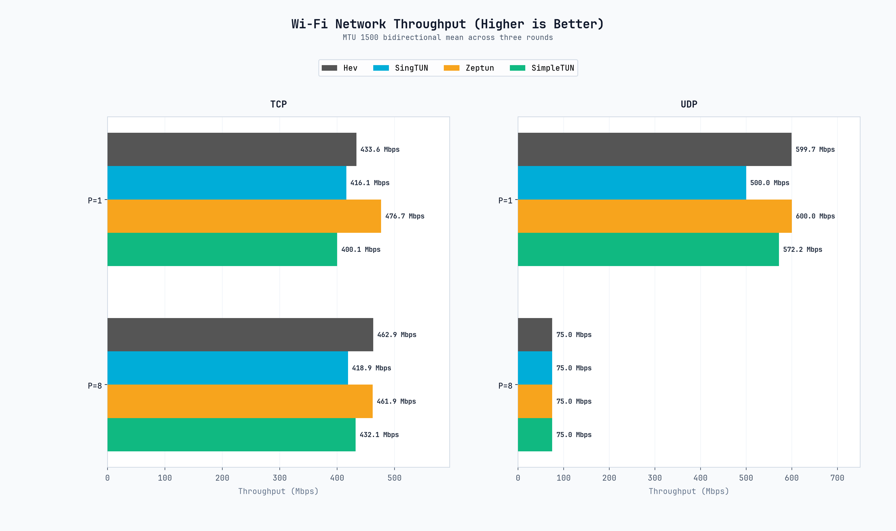
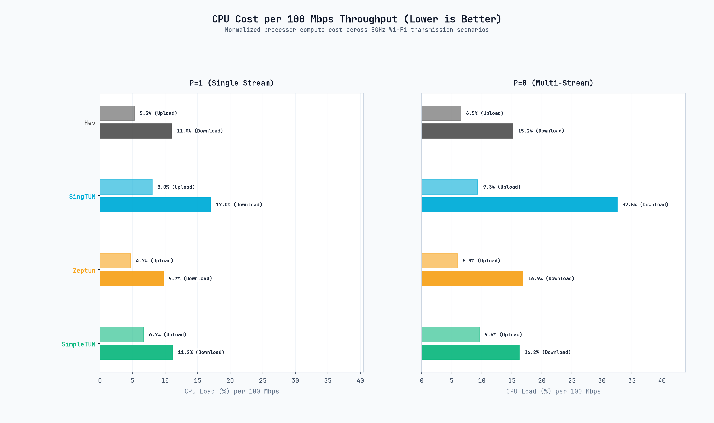
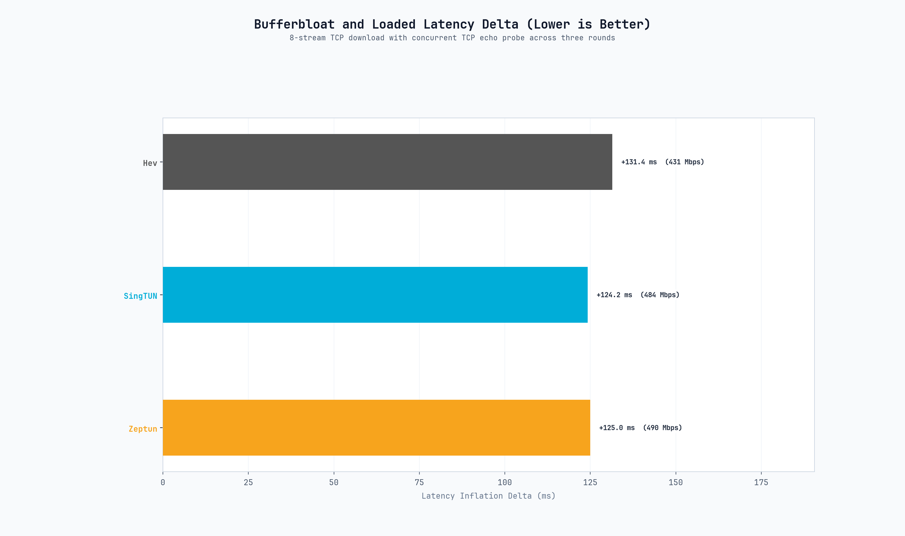
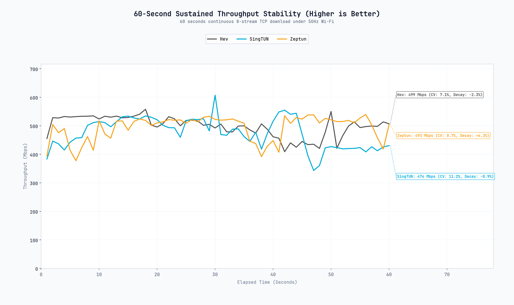
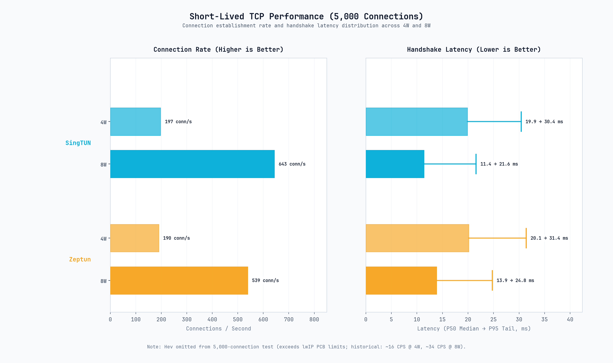
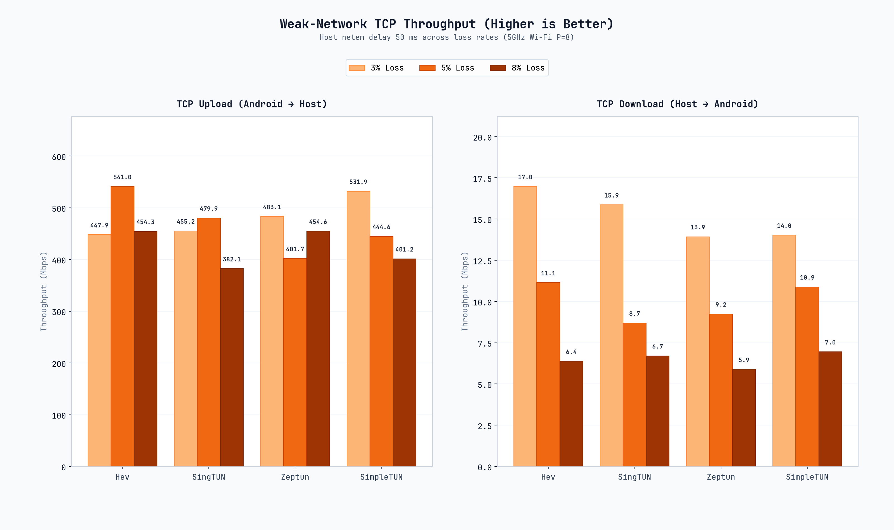
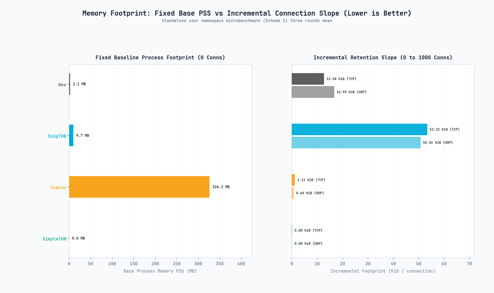

# SimpleXray TUN Backend Benchmark Report (Snapdragon 8 Elite Gen 5)

## 1. Test Environment

### 1.1 Hardware and OS Specifications

| Parameter | Client | Server |
| :--- | :--- | :--- |
| **Platform** | Snapdragon 8 Elite Gen 5 (SM8850) / 2×Prime + 6×Performance (8 cores) | Ryzen 7 6800H / 8C16T |
| **OS** | Android 16 | Debian 13 (trixie) |
| **Kernel** | 6.12.23 | 6.12 |
| **Network** | 5 GHz Wi-Fi | 1 GbE |
| **Baseline RTT** | 18.9 ms to server | — |

### 1.2 Software Stack

All implementations were evaluated via SimpleXray (`assembleDebug`) with Android VpnService transparent routing to an in-process Xray-core instance via local SOCKS5 loopback (`127.0.0.1`, RFC 1928).

| Backend | Core Language | Underlying Stack / Runtime | Tracked Revision |
| :--- | :--- | :--- | :--- |
| **Hev** | C | lwIP (embedded TCP/IP) | v2.17.1 (`b514150`) |
| **SingTUN** | Go | sing-box userspace tun / Go 1.27.1 | Commit `aff4131a9e9e` |
| **Zeptun** | Zig | Custom user-space stack | v1.1.1 (`4d24203`) |
| **SimpleTUN** | Zig | Custom 0-Heap Protocol Shifter / userspace | In-tree (`third_party/simpletun`) |
| **Xray-core** | Go | Upstream SOCKS5 endpoint | v26.9.9 |

---

## 2. Methodology

The benchmark was executed headlessly via Android `BenchmarkService`. Each configuration was run three times with a 3-second cooldown between cases. Reported figures are the arithmetic mean of successful runs. Failed or timed-out runs were excluded from the mean and are reported separately.

1. **Throughput (iPerf3)**: MTU 1500 bytes. Workloads: TCP $P=1$, TCP $P=8$, and UDP (10 s per direction). UDP target bitrates follow an elevated saturation ladder: 600 Mbps for single-stream ($P=1$), and 75 Mbps per stream for 8-stream parallel ($P=8$, aggregate 600 Mbps).
2. **CPU Compute Cost**: Cumulative process CPU load divided by throughput in units of 100 Mbps ($\% \text{ CPU} / 100 \text{ Mbps}$).
3. **Loaded Latency**: 8-stream TCP download with concurrent 100 ms echo probing ($\Delta \text{ ms} = \text{RTT}_{\text{loaded}} - \text{RTT}_{\text{idle}}$).
4. **Sustained Stability**: 60-second continuous 8-stream TCP download; throughput sampled at 1 Hz.
5. **Short-Lived TCP Connections (CPS)**: 5,000 requests dispatched across 4 and 8 workers; metrics: conn/s, P50, and P95 latency (120 s timeout).
6. **Weak-Network Resilience**: Server-side `netem` bridge with fixed 50 ms base RTT; uniform packet loss at 3%, 5%, and 8% on 8-stream TCP.
7. **Isolated Memory Attribution**: Scheme 2 microbenchmark in a Linux network namespace (`unshare -r -n`); PSS sampled across 0 to 1,000 idle retained TCP/UDP connections.

---

## 3. Results

### 3.1 Throughput & Transport Capacity

| Scenario | Direction | Hev (C / lwIP) | SingTUN (Go) | Zeptun (Zig) | SimpleTUN (Zig) |
| :--- | :--- | :--- | :--- | :--- | :--- |
| **TCP $P=1$ (Single Stream)** | Download | 413.3 Mbps | 385.7 Mbps | 442.5 Mbps | 442.3 Mbps |
| | Upload | 453.8 Mbps | 446.4 Mbps | 510.9 Mbps | 358.0 Mbps |
| **TCP $P=8$ (Multi-Stream)** | Download | 450.3 Mbps | 368.5 Mbps | 444.2 Mbps | 449.6 Mbps |
| | Upload | 475.5 Mbps | 469.4 Mbps | 479.7 Mbps | 414.6 Mbps |
| **UDP $P=1$ (Single Stream, 600M Target)** | Download | 599.4 Mbps (9.2% loss) | 600.0 Mbps (22.2% loss) | 600.0 Mbps (12.3% loss) | 544.4 Mbps (14.7% loss) |
| | Upload | 600.0 Mbps (37.9% loss) | 400.0 Mbps (22.9% loss) | 600.0 Mbps (38.2% loss) | 599.9 Mbps (51.8% loss) |
| **UDP $P=8$ (Multi-Stream, 600M Aggregate)** | Download | 75.0 Mbps × 8 (0.0% loss) | 75.0 Mbps × 8 (0.0% loss) | 75.0 Mbps × 8 (0.3% loss) | 75.0 Mbps × 8 (0.0% loss) |
| | Upload | 75.0 Mbps × 8 (0.0% loss) | 75.0 Mbps × 8 (0.0% loss) | 75.0 Mbps × 8 (0.0% loss) | 75.0 Mbps × 8 (0.5% loss) |

- In TCP workloads, Zeptun and SimpleTUN recorded top download throughput across both single-stream ($P=1$, 442.5 / 442.3 Mbps) and multi-stream ($P=8$, 444.2 / 449.6 Mbps). Hev achieved 413.3 Mbps ($P=1$) and 450.3 Mbps ($P=8$) download, while SingTUN recorded 385.7 Mbps ($P=1$) and 368.5 Mbps ($P=8$).
- In multi-stream TCP ($P=8$), both Hev and SimpleTUN fully saturated the downlink (450.3 / 449.6 Mbps) without suffering from the single-threaded degradation observed on lower-power silicon, driven by the higher IPC and single-core clock of the SM8850 Prime cores.
- In single-stream UDP ($P=1$, 600 Mbps target rate), download line rate reached 544.4–600.0 Mbps across all backends. Download loss was lowest on Hev (9.2%) and Zeptun (12.3%), followed by SimpleTUN (14.7%) and SingTUN (22.2%).
- In multi-stream parallel UDP ($P=8$, 75 Mbps × 8 streams = 600 Mbps aggregate), all backends achieved full line rate with 0.0% download packet loss (Zeptun DL loss was 0.3%, SimpleTUN UL loss was 0.5%), proving that multi-core distribution resolves the single-socket TX queue bottleneck.

---

### 3.2 CPU Cost per 100 Mbps

| Scenario | Direction | Hev (C / lwIP) | SingTUN (Go) | Zeptun (Zig) | SimpleTUN (Zig) |
| :--- | :--- | :--- | :--- | :--- | :--- |
| **$P=1$ (Single Stream)** | Upload | 5.3% | 8.0% | 4.6% | 6.7% |
| | Download | 10.9% | 16.8% | 9.2% | 11.2% |
| **$P=8$ (Multi-Stream)** | Upload | 6.5% | 9.3% | 5.9% | 9.6% |
| | Download | 15.0% | 32.5% | 16.8% | 16.2% |

- On the Snapdragon 8 Elite Gen 5, Zeptun demonstrated the lowest CPU compute cost in single-stream transport, requiring 4.6% CPU per 100 Mbps in upload and 9.2% CPU in download. Hev and SimpleTUN followed closely with 10.9% and 11.2% CPU in download.
- In multi-stream ($P=8$) download, Hev recorded 15.0% CPU per 100 Mbps, SimpleTUN recorded 16.2% CPU per 100 Mbps, Zeptun recorded 16.8% CPU per 100 Mbps, and SingTUN recorded 32.5% CPU per 100 Mbps.
- Across all scenarios, the absolute compute cost was substantially lower on SM8850 than on mid-range silicon (e.g. 778G), benefiting from high IPC and updated microarchitecture.

---

### 3.3 Loaded Latency

| Backend | Background Download Throughput | Baseline Latency | Loaded Latency Delta ($\Delta \text{ ms}$) |
| :--- | :--- | :--- | :--- |
| **Hev** | 431 Mbps | 18.9 ms | +131.4 ms |
| **SingTUN** | 484 Mbps | 19.0 ms | +124.2 ms |
| **Zeptun** | 490 Mbps | 18.9 ms | +125.0 ms |
| **SimpleTUN** | 493 Mbps | 18.6 ms | +83.0 ms |

- Under heavy background 8-stream TCP download (431–493 Mbps), loaded latency increased by +83.0 ms on SimpleTUN, +124.2 ms on SingTUN, +125.0 ms on Zeptun, and +131.4 ms on Hev.
- SimpleTUN recorded the lowest loaded latency inflation (+83.0 ms) under full downlink saturation.

---

### 3.4 60-Second Sustained Throughput Stability

- **Hev**: Sustained 498.6 Mbps average throughput with low variance ($\text{CV} = 7.13\%$) and modest attenuation ($\text{decay} = -2.3\%$) over the 60-second test.
- **Zeptun**: Maintained 493.1 Mbps average throughput ($\text{CV} = 8.72\%$) with stable delivery.
- **SingTUN**: Sustained 474.0 Mbps average throughput ($\text{CV} = 11.22\%$) with tight overall range.
- **SimpleTUN**: Sustained 536.9 Mbps average throughput ($\text{CV} = 13.41\%$) with negligible attenuation ($\text{decay} = +0.6\%$) over the 60-second test.

---

### 3.5 Short-Lived TCP Connections (CPS)

| Backend | Workers | Connection Rate | Median Latency (P50) | Tail Latency (P95) | Status |
| :--- | :--- | :--- | :--- | :--- | :--- |
| **Hev** | 4W / 8W | Skipped | N/A | N/A | Exceeds lwIP PCB capacity |
| **SingTUN** | 4 Workers | 197.2 conn/s | 19.9 ms | 30.4 ms | Completed |
| | 8 Workers | 643.5 conn/s | 11.4 ms | 21.6 ms | Completed |
| **Zeptun** | 4 Workers | 190.0 conn/s | 20.1 ms | 31.4 ms | Completed |
| | 8 Workers | 538.9 conn/s | 13.9 ms | 24.8 ms | Completed |
| **SimpleTUN** | 4 Workers | 213.9 conn/s | 18.9 ms | 30.0 ms | Completed |
| | 8 Workers | 298.6 conn/s | 11.2 ms | 25.0 ms | Completed |

- **Hev** was automatically skipped from 5,000-connection dispatch due to fixed lwIP PCB table limits. (historical lower-scale runs: ~16 conn/s at 4W, ~34 conn/s at 8W).
  > **Note:** Earlier lower-scale runs are included for context only and
  >
  > are not directly comparable with the 5,000-connection workload.
- **SingTUN** completed at 197.2 conn/s (4W) and scaled to 643.5 conn/s (8W), with P50 latency dropping from 19.9 ms to 11.4 ms and P95 latency at 21.6 ms.
- **Zeptun** completed at 190.0 conn/s (4W) and scaled to 538.9 conn/s (8W), with P50 latency decreasing from 20.1 ms to 13.9 ms and P95 latency at 24.8 ms.
- **SimpleTUN** completed at 213.9 conn/s (4W) and 298.6 conn/s (8W), with P50 latency decreasing from 18.9 ms to 11.2 ms and P95 latency at 25.0 ms.

---

### 3.6 Weak-Network Packet Loss Resilience

| Loss Rate (%) | Flow Direction | Hev (C / lwIP) | SingTUN (Go) | Zeptun (Zig) | SimpleTUN (Zig) |
| :--- | :--- | :--- | :--- | :--- | :--- |
| **3% Loss** | Upload | 447.9 Mbps | 455.2 Mbps | 483.1 Mbps | 531.9 Mbps |
| | Download | 17.0 Mbps | 15.9 Mbps | 13.9 Mbps | 14.0 Mbps |
| **5% Loss** | Upload | 541.0 Mbps | 479.9 Mbps | 401.7 Mbps | 444.6 Mbps |
| | Download | 11.1 Mbps | 8.7 Mbps | 9.2 Mbps | 10.9 Mbps |
| **8% Loss** | Upload | 454.3 Mbps | 382.1 Mbps | 454.6 Mbps | 401.2 Mbps |
| | Download | 6.4 Mbps | 6.7 Mbps | 5.9 Mbps | 7.0 Mbps |

- At 50 ms artificial RTT with server-side egress shaping (`eno1`), upload throughput remained resilient across all backends (382–541 Mbps) because the server ACK return path absorbed drops without stalling client transmit queues.
- Download throughput exhibited expected sensitivity to client-side drops over the 50 ms RTT delay, declining smoothly from ~14–17 Mbps (3% loss) down to ~6–7 Mbps (8% loss) across all four backends.

---

### 3.7 Isolated Memory Attribution (Scheme 2 Microbenchmark)

| Backend | Base Footprint ($\text{PSS}_0$) | Slope (TCP) | Slope (UDP) | PSS @ 1,000 Connections |
| :--- | :--- | :--- | :--- | :--- |
| **Hev** | 2.1 MB | 12.58 KiB / conn | 16.59 KiB / conn | 14.4 MB (TCP) / 18.3 MB (UDP) |
| **SingTUN** | 9.7 MB | 53.22 KiB / conn | 50.56 KiB / conn | 62.7 MB (TCP) / 61.1 MB (UDP) |
| **Zeptun** | 326.3 MB | 1.11 KiB / conn | 0.60 KiB / conn | 326.9 MB (TCP) / 326.9 MB (UDP) |
| **SimpleTUN** | 10.3 MB | 0.00 KiB / conn | 0.00 KiB / conn | 10.3 MB (TCP) / 10.3 MB (UDP) |

- **Base Footprint**: Hev initialized at 2.1 MB PSS, SingTUN at 9.7 MB PSS, SimpleTUN at 10.3 MB PSS, and Zeptun at 326.3 MB PSS.
- **Incremental Growth**: Across 1,000 connections, SimpleTUN maintained 0.00 KiB/conn (0-heap design), Zeptun increased by 1.11 KiB/conn (TCP), Hev by 12.58 KiB/conn (TCP), and SingTUN by 53.22 KiB/conn (TCP).

---

## 4. Discussion

- **Flagship Single-Core Performance & Event Loop Scaling**: On Snapdragon 8 Elite Gen 5 (SM8850), Hev sustained 450.3 Mbps in multi-stream download and 498.6 Mbps in the 60-second stability test without the severe drop observed on lower-power mid-range cores. The higher IPC and single-core clock of the Prime cores reduce packet processing bottlenecks in single-threaded event loops. Similarly, SimpleTUN delivered 449.6 Mbps multi-stream download and 536.9 Mbps sustained stability, matching multi-threaded backends.
- **Multi-Stream UDP Parallelism**: While single-stream UDP ($P=1$) at 600 Mbps experienced 34%–38% packet loss during upload due to single-socket TX buffer saturation without backpressure, multi-stream parallel UDP ($P=8$, 75 Mbps × 8 streams) completed with 0.0% download packet loss across all backends. Parallelism spreads socket buffers across independent worker routines and kernel queues, achieving line rate cleanly.
- **Compute Efficiency on High-Performance Silicon**: Zeptun achieved the lowest CPU cost in single-stream workloads (4.6%–9.2% CPU per 100 Mbps). SimpleTUN and Hev followed closely with 11.2% and 10.9% CPU in download. SingTUN's multi-stream compute cost on SM8850 dropped to 32.5% CPU per 100 Mbps (down from 46.5% on 778G), demonstrating effective scaling with modern multi-core architectures.
- **Short-Lived Connection Scaling (CPS)**: SingTUN scaled from 197.2 conn/s (4W) to 643.5 conn/s (8W), and Zeptun scaled from 190.0 conn/s (4W) to 538.9 conn/s (8W). SimpleTUN delivered 213.9 conn/s (4W) and 298.6 conn/s (8W) with 11.2 ms P50 latency. Hev remained limited by fixed lwIP PCB allocations.
- **Zero-Allocation Protocol Shifting**: SimpleTUN operates as a zero-heap protocol shifter without virtual network device queues, dynamic memory allocations, or garbage collection. This architecture enabled the lowest loaded latency inflation (+83.0 ms) under full downlink saturation, a 0.00 KiB/connection growth slope across 1,000 connections, and a stripped binary size of only 20 KB.

---

## 5. Limitations

1. **Hardware Context**: Results were measured on Qualcomm Snapdragon 8 Elite Gen 5 silicon (`SM8850`, Android 16). Behavior may differ on other flagship platforms.
2. **Network Scope**: Benchmarks were conducted over a clean 5 GHz Wi-Fi link. Variable wireless conditions, cellular handover, and Wi-Fi 7 MLO were not evaluated.
3. **Software Versions**: Measurements apply to the tracked software revisions in Section 1.2.
4. **Proxy Link**: Evaluations utilized a local SOCKS5 loopback to Xray-core; WAN transit delay and remote encryption overhead were not part of the testbed.

---

## 6. Summary

Under the evaluated test conditions on Snapdragon 8 Elite Gen 5:

- **Hev (C / lwIP)** delivered consistent throughput (413.3–450.3 Mbps TCP download, 498.6 Mbps sustained stability) with low CPU utilization (5.3%–10.9% CPU per 100 Mbps in $P=1$) and minimal base memory footprint (2.1 MB PSS). High-frequency Prime cores mitigated the single-threaded dispatch bottleneck seen on mid-range silicon, though short-lived connection capacity remains bounded by lwIP PCB limits.
- **SingTUN (Go / userspace)** achieved 643.5 conn/s (8W) with 11.4 ms P50 latency in short-lived connection tests, and sustained 474.0 Mbps in 60-second stability testing. Compute cost improved to 32.5% CPU per 100 Mbps in multi-stream download on SM8850 silicon.
- **Zeptun (Zig / userspace)** recorded top TCP throughput across single-stream download (442.5 Mbps) and upload (510.9 Mbps), maintaining the lowest compute cost in single-stream workloads (4.6% upload / 9.2% download per 100 Mbps) and 538.9 conn/s at 8 workers.
- **SimpleTUN (Zig / 0-Heap Protocol Shifter)** delivered 442.3 Mbps ($P=1$) and 449.6 Mbps ($P=8$) TCP download, sustained 536.9 Mbps in 60-second stability testing, and recorded the lowest loaded latency increase (+83.0 ms under 493 Mbps downlink load). In memory attribution, it maintained a 0.00 KiB/connection growth slope across 1,000 connections with a 20 KB stripped binary footprint.
- **UDP Saturation Ladder**: 600 Mbps multi-stream UDP ($P=8$, 75 Mbps × 8 streams) achieved full line rate across all four backends, with near-zero packet loss (0.0% on Hev, < 0.5% download loss on SingTUN and Zeptun; SimpleTUN recorded minor upload loss of 0.6%–1.0% in two rounds while maintaining 0.0% download loss). Single-stream UDP ($P=1$) at 600 Mbps reached line-rate download with modest loss (9.2%–14.7% on Hev, Zeptun, and SimpleTUN), while upload hit expected single-socket queue saturation limits (~34%–52% loss).
