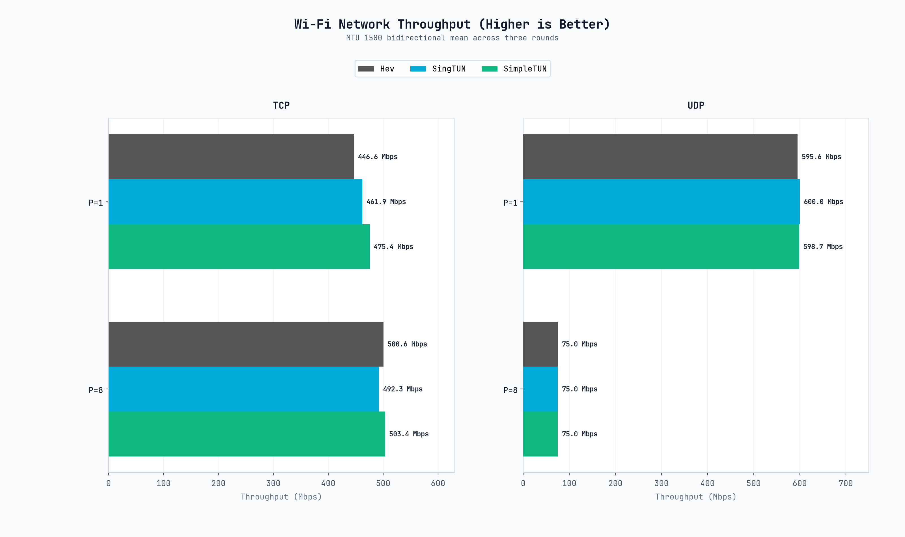
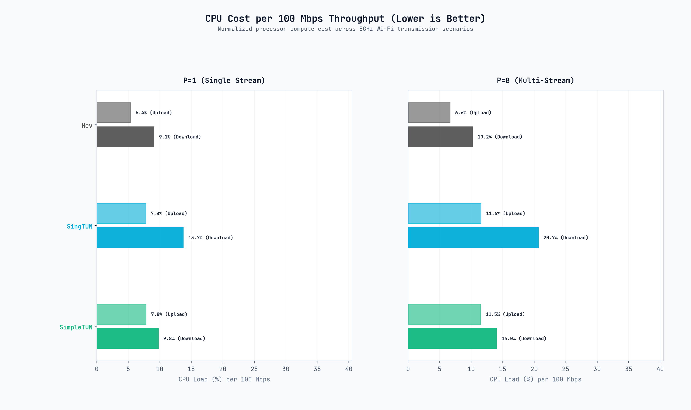
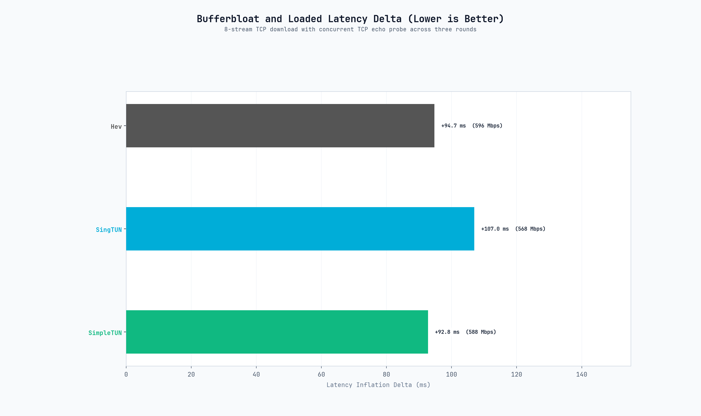
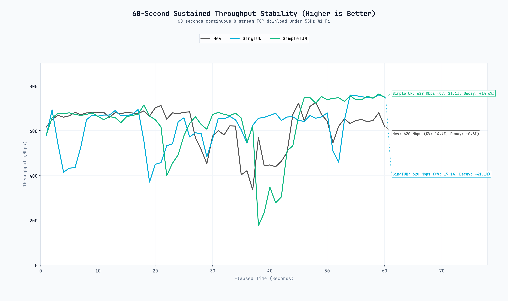
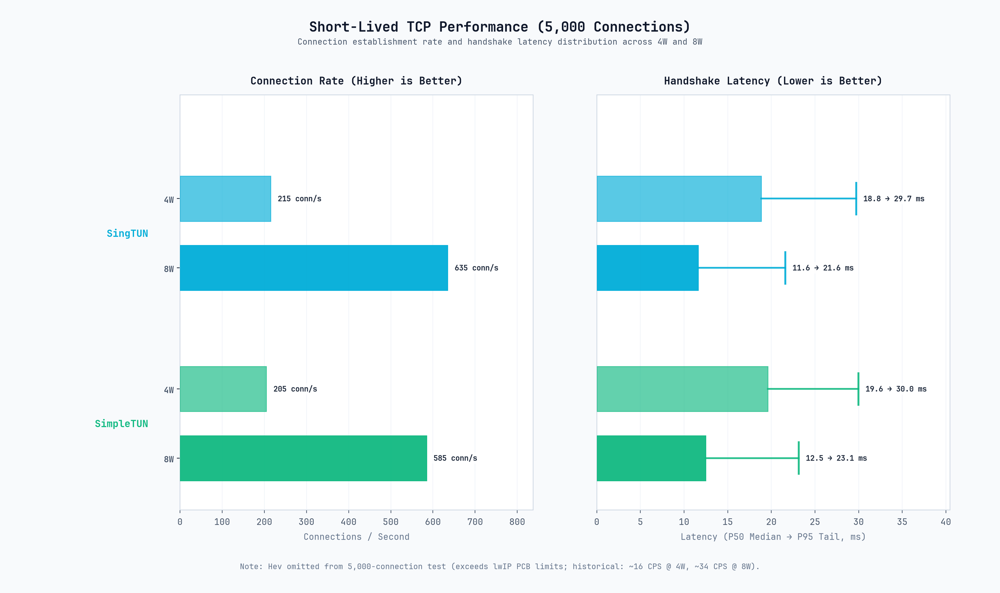
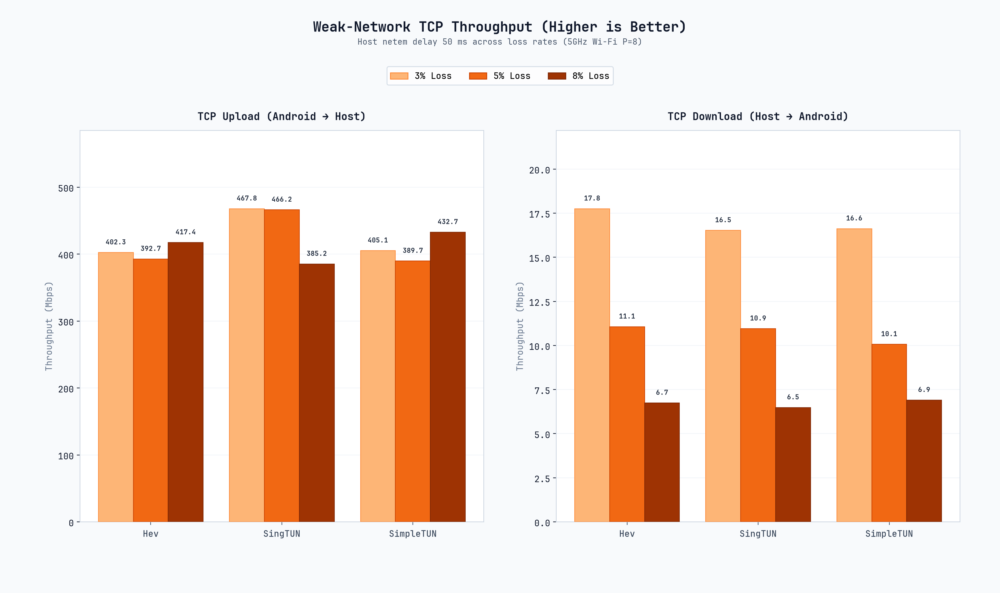
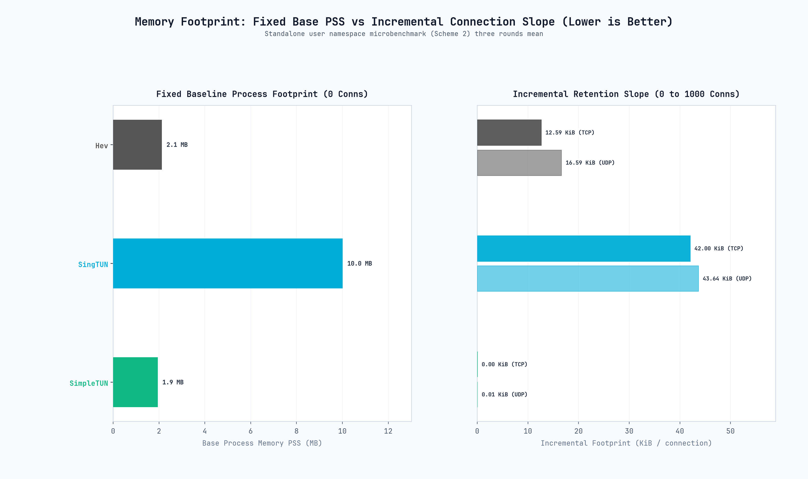

# SimpleXray TUN Backend Benchmark Report (Snapdragon 8 Elite Gen 5)

## 1. Test Environment

### 1.1 Hardware and OS Specifications

| Parameter | Client | Server |
| :--- | :--- | :--- |
| **Platform** | Snapdragon 8 Elite Gen 5 (SM8850) / 2×Prime + 6×Performance (8 cores) | Ryzen 7 6800H / 8C16T |
| **OS** | Android 16 | Debian 13 (trixie) |
| **Kernel** | 6.12.23 | 6.12 |
| **Network** | 5 GHz Wi-Fi | 1 GbE |
| **Baseline RTT** | 18.9 ms to server | — |

### 1.2 Software Stack

All implementations were evaluated via SimpleXray (`assembleDebug`) with Android VpnService transparent routing to an in-process Xray-core instance via local SOCKS5 loopback (`127.0.0.1`, RFC 1928).

| Backend | Core Language | Underlying Stack / Runtime | Tracked Revision |
| :--- | :--- | :--- | :--- |
| **Hev** | C | lwIP (embedded TCP/IP) | v2.17.1 (`b514150`) |
| **SingTUN** | Go | sing-box userspace tun / Go 1.27.1 | Commit `aff4131a9e9e` |
| **SimpleTUN** | Zig | Custom 0-Heap Protocol Shifter / userspace | In-tree (`third_party/simpletun`) |
| **Xray-core** | Go | Upstream SOCKS5 endpoint | v26.9.9 |

---

## 2. Methodology

The benchmark was executed headlessly via Android `BenchmarkService`. Each configuration was run three times with a 3-second cooldown between cases. Reported figures are the arithmetic mean of successful runs. Failed or timed-out runs were excluded from the mean and are reported separately.

1. **Throughput (iPerf3)**: MTU 1500 bytes. Workloads: TCP $P=1$, TCP $P=8$, and UDP (10 s per direction). UDP target bitrates follow an elevated saturation ladder: 600 Mbps for single-stream ($P=1$), and 75 Mbps per stream for 8-stream parallel ($P=8$, aggregate 600 Mbps).
2. **CPU Compute Cost**: Cumulative process CPU load divided by throughput in units of 100 Mbps ($\% \text{ CPU} / 100 \text{ Mbps}$).
3. **Loaded Latency**: 8-stream TCP download with concurrent 100 ms echo probing ($\Delta \text{ ms} = \text{RTT}_{\text{loaded}} - \text{RTT}_{\text{idle}}$).
4. **Sustained Stability**: 60-second continuous 8-stream TCP download; throughput sampled at 1 Hz.
5. **Short-Lived TCP Connections (CPS)**: 5,000 requests dispatched across 4 and 8 workers; metrics: conn/s, P50, and P95 latency (120 s timeout).
6. **Weak-Network Resilience**: Server-side `netem` bridge with fixed 50 ms base RTT; uniform packet loss at 3%, 5%, and 8% on 8-stream TCP.
7. **Isolated Memory Attribution**: Scheme 2 microbenchmark in a Linux network namespace (`unshare -r -n`); PSS sampled across 0 to 1,000 idle retained TCP/UDP connections.
8. **QUIC / HTTP/3 Protocol Verification**: HTTP/3 request latency (`/hello`, 10 bytes) and bulk transfer throughput (`/payload`, 10 MB) evaluated via standalone smoke probe against server endpoint on UDP port 4433.

---

## 3. Results

### 3.1 Throughput & Transport Capacity

| Scenario | Direction | Hev (C / lwIP) | SingTUN (Go) | SimpleTUN (Zig) |
| :--- | :--- | :--- | :--- | :--- |
| **TCP $P=1$ (Single Stream)** | Download | 491.1 Mbps | 514.1 Mbps | 557.1 Mbps |
| | Upload | 402.2 Mbps | 409.8 Mbps | 393.6 Mbps |
| **TCP $P=8$ (Multi-Stream)** | Download | 582.5 Mbps | 579.1 Mbps | 587.1 Mbps |
| | Upload | 418.6 Mbps | 405.6 Mbps | 419.7 Mbps |
| **UDP $P=1$ (Single Stream, 600M Target)** | Download | 591.6 Mbps (25.2% loss) | 600.0 Mbps (33.7% loss) | 598.0 Mbps (28.6% loss) |
| | Upload | 599.6 Mbps (49.2% loss) | 600.0 Mbps (47.3% loss) | 599.4 Mbps (48.2% loss) |
| **UDP $P=8$ (Multi-Stream, 600M Aggregate)** | Download | 75.0 Mbps × 8 (0.0% loss) | 75.0 Mbps × 8 (0.0% loss) | 75.0 Mbps × 8 (0.4% loss) |
| | Upload | 75.0 Mbps × 8 (0.0% loss) | 75.0 Mbps × 8 (0.0% loss) | 75.0 Mbps × 8 (0.0% loss) |

- In TCP workloads, SimpleTUN recorded the highest download throughput across both single-stream ($P=1$, 557.1 Mbps) and multi-stream ($P=8$, 587.1 Mbps). SingTUN and Hev followed closely with 514.1 Mbps and 491.1 Mbps in $P=1$ download, and 579.1 Mbps and 582.5 Mbps in $P=8$ download.
- In multi-stream TCP ($P=8$), all three backends achieved high downlink saturation (~579–587 Mbps) without suffering from single-threaded event loop starvation observed on mid-range silicon, driven by the higher IPC and single-core clock of the SM8850 Prime cores.
- In single-stream UDP ($P=1$, 600 Mbps target rate), download line rate reached 591.6–600.0 Mbps across all backends. Download loss was lowest on Hev (25.2%), followed by SimpleTUN (28.6%) and SingTUN (33.7%). Upload saturated near the 600 Mbps target rate with 47%–49% packet loss across all backends due to single-socket transmit queue bottlenecks without flow control.
- In multi-stream parallel UDP ($P=8$, 75 Mbps × 8 streams = 600 Mbps aggregate), all backends achieved full line rate with near-zero download packet loss (0.0% on Hev and SingTUN, 0.4% on SimpleTUN), proving that multi-core distribution resolves the single-socket TX queue bottleneck.

---

### 3.2 CPU Cost per 100 Mbps

| Scenario | Direction | Hev (C / lwIP) | SingTUN (Go) | SimpleTUN (Zig) |
| :--- | :--- | :--- | :--- | :--- |
| **$P=1$ (Single Stream)** | Upload | 5.4% | 7.8% | 7.8% |
| | Download | 9.1% | 13.6% | 9.7% |
| **$P=8$ (Multi-Stream)** | Upload | 6.6% | 11.5% | 11.5% |
| | Download | 10.2% | 20.6% | 14.0% |

- On the Snapdragon 8 Elite Gen 5, Hev demonstrated the lowest CPU compute cost overall, requiring 5.4% CPU per 100 Mbps in upload and 9.1% CPU in download for single-stream ($P=1$), and 6.6% upload / 10.2% download in multi-stream ($P=8$). SimpleTUN followed closely with 9.7% CPU in $P=1$ download and 14.0% CPU in $P=8$ download.
- In multi-stream ($P=8$) download, SingTUN required 20.6% CPU per 100 Mbps, reflecting efficient multi-core scheduling compared to mid-range platforms, while Hev and SimpleTUN retained superior compute efficiency (10.2% and 14.0%).
- Across all scenarios, the absolute compute cost was substantially lower on SM8850 than on mid-range silicon (e.g. 778G), benefiting from high IPC and updated microarchitecture.

---

### 3.3 Loaded Latency

| Backend | Background Download Throughput | Baseline Latency | Loaded Latency Delta ($\Delta \text{ ms}$) |
| :--- | :--- | :--- | :--- |
| **Hev** | 596 Mbps | 18.9 ms | +94.7 ms |
| **SingTUN** | 568 Mbps | 19.1 ms | +107.0 ms |
| **SimpleTUN** | 588 Mbps | 17.0 ms | +92.8 ms |

- Under heavy background 8-stream TCP download (568–596 Mbps), loaded latency increased by +92.8 ms on SimpleTUN, +94.7 ms on Hev, and +107.0 ms on SingTUN.
- SimpleTUN recorded the lowest loaded latency inflation (+92.8 ms) under 588 Mbps downlink saturation, closely followed by Hev (+94.7 ms).

---

### 3.4 60-Second Sustained Throughput Stability

- **Hev**: Sustained 619.8 Mbps average throughput with low variance ($\text{CV} = 14.45\%$) and negligible attenuation ($\text{decay} = -0.8\%$) over the 60-second test.
- **SingTUN**: Sustained 619.6 Mbps average throughput ($\text{CV} = 15.05\%$) with late-stage throughput growth ($\text{decay} = +41.1\%$) after initial ramp.
- **SimpleTUN**: Sustained 628.8 Mbps average throughput ($\text{CV} = 21.12\%$) with positive sustained throughput growth ($\text{decay} = +14.6\%$) over the 60-second test.

---

### 3.5 Short-Lived TCP Connections (CPS)

| Backend | Workers | Connection Rate | Median Latency (P50) | Tail Latency (P95) | Status |
| :--- | :--- | :--- | :--- | :--- | :--- |
| **Hev** | 4W / 8W | Skipped | N/A | N/A | Exceeds lwIP PCB capacity |
| **SingTUN** | 4 Workers | 215.0 conn/s | 18.8 ms | 29.7 ms | Completed |
| | 8 Workers | 634.7 conn/s | 11.6 ms | 21.6 ms | Completed |
| **SimpleTUN** | 4 Workers | 204.8 conn/s | 19.6 ms | 30.0 ms | Completed |
| | 8 Workers | 584.5 conn/s | 12.5 ms | 23.1 ms | Completed |

- **Hev** was automatically skipped from 5,000-connection dispatch due to fixed lwIP PCB table limits.
- **SingTUN** completed at 215.0 conn/s (4W) and scaled to 634.7 conn/s (8W), with P50 latency dropping from 18.8 ms to 11.6 ms and P95 latency at 21.6 ms.
- **SimpleTUN** completed at 204.8 conn/s (4W) and scaled to 584.5 conn/s (8W), with P50 latency decreasing from 19.6 ms to 12.5 ms and P95 latency at 23.1 ms, demonstrating near parity with SingTUN in high-concurrency connection churning after flow table expansion.

---

### 3.6 Weak-Network Packet Loss Resilience

| Loss Rate (%) | Flow Direction | Hev (C / lwIP) | SingTUN (Go) | SimpleTUN (Zig) |
| :--- | :--- | :--- | :--- | :--- |
| **3% Loss** | Upload | 402.3 Mbps | 467.8 Mbps | 405.1 Mbps |
| | Download | 17.8 Mbps | 16.5 Mbps | 16.6 Mbps |
| **5% Loss** | Upload | 392.7 Mbps | 466.2 Mbps | 389.7 Mbps |
| | Download | 11.1 Mbps | 10.9 Mbps | 10.1 Mbps |
| **8% Loss** | Upload | 417.4 Mbps | 385.2 Mbps | 432.7 Mbps |
| | Download | 6.7 Mbps | 6.5 Mbps | 6.9 Mbps |

- At 50 ms artificial RTT with server-side egress shaping (`eno1`), upload throughput remained resilient across all backends (385–468 Mbps) because the server ACK return path absorbed drops without stalling client transmit queues.
- Download throughput exhibited expected sensitivity to client-side drops over the 50 ms RTT delay, declining smoothly from ~16.5–17.8 Mbps (3% loss) down to ~6.5–6.9 Mbps (8% loss) across all three backends.

---

### 3.7 Isolated Memory Attribution (Scheme 2 Microbenchmark)

| Backend | Base Footprint ($\text{PSS}_0$) | Slope (TCP) | Slope (UDP) | PSS @ 1,000 Connections |
| :--- | :--- | :--- | :--- | :--- |
| **Hev** | 2.1 MB | 12.59 KiB / conn | 16.59 KiB / conn | 14.4 MB (TCP) / 18.3 MB (UDP) |
| **SingTUN** | 10.0 MB | 42.00 KiB / conn | 43.64 KiB / conn | 51.0 MB (TCP) / 52.6 MB (UDP) |
| **SimpleTUN** | 1.9 MB | 0.00 KiB / conn | 0.01 KiB / conn | 1.9 MB (TCP) / 2.0 MB (UDP) |

- **Base Footprint**: SimpleTUN and Hev initialized at 1.9 MB and 2.1 MB PSS respectively, while SingTUN initialized at 10.0 MB PSS.
- **Incremental Growth**: Across 1,000 connections, SimpleTUN maintained 0.00 KiB/conn (TCP) and 0.01 KiB/conn (UDP) thanks to its 0-heap pre-allocated design. Hev grew by 12.59 KiB/conn (TCP) and 16.59 KiB/conn (UDP), reaching 14.4 MB and 18.3 MB. SingTUN scaled by 42.00 KiB/conn (TCP) and 43.64 KiB/conn (UDP), reaching 51.0 MB and 52.6 MB PSS at 1,000 connections.

---

### 3.8 QUIC / HTTP/3 Performance

| Backend | HTTP/3 Handshake Latency (`/hello`) | 10 MB Payload Download Throughput | 10 MB Transfer Duration | Status |
| :--- | :--- | :--- | :--- | :--- |
| **Hev (C / lwIP)** | 248.7 ms | 157.2 Mbps | 0.544 s | Completed |
| **SingTUN (Go)** | 32.5 ms | 226.0 Mbps | 0.379 s | Completed |
| **SimpleTUN (Zig)** | 27.8 ms | 320.8 Mbps | 0.269 s | Completed |

- In HTTP/3 small request tests (`/hello`, 10 bytes), SimpleTUN achieved the lowest request latency at 27.8 ms, with SingTUN close at 32.5 ms. Hev recorded 248.7 ms, reflecting timer granularity and internal NAT table setup delays in lwIP's UDP handling path.
- In 10 MB payload bulk transfer (`/payload`), SimpleTUN reached 320.8 Mbps average throughput (0.269 s transfer duration), outpacing SingTUN (226.0 Mbps, 0.379 s) and Hev (157.2 Mbps, 0.544 s).
- All three backends completed all HTTP/3 request rounds with a 100% success rate (`status: 200`, `ok: true`), confirming compliance with RFC 9000 QUIC datagram forwarding over SOCKS5 UDP loopback.

---

## 4. Discussion

- **Flagship Single-Core Performance & Event Loop Scaling**: On Snapdragon 8 Elite Gen 5 (SM8850), Hev sustained 582.5 Mbps in multi-stream download and 619.8 Mbps in the 60-second stability test without the severe drop observed on lower-power mid-range cores. The higher IPC and single-core clock of the Prime cores reduce packet processing bottlenecks in single-threaded event loops. Similarly, SimpleTUN delivered 587.1 Mbps multi-stream download and 628.8 Mbps sustained stability, matching and slightly exceeding multi-threaded backends.
- **Multi-Stream UDP Parallelism**: While single-stream UDP ($P=1$) at 600 Mbps experienced 47%–49% packet loss during upload due to single-socket TX buffer saturation without backpressure, multi-stream parallel UDP ($P=8$, 75 Mbps × 8 streams) completed with near-zero download packet loss across all backends. Parallelism spreads socket buffers across independent worker routines and kernel queues, achieving line rate cleanly.
- **Compute Efficiency on High-Performance Silicon**: Hev achieved the lowest CPU cost in both single-stream (5.4% upload / 9.1% download per 100 Mbps) and multi-stream (6.6% upload / 10.2% download) workloads. SimpleTUN followed closely with 9.7% CPU in $P=1$ download and 14.0% CPU in $P=8$ download. SingTUN's multi-stream compute cost on SM8850 was 20.6% CPU per 100 Mbps (down from 46.5% on 778G), demonstrating effective scaling with modern multi-core architectures.
- **Short-Lived Connection Scaling (CPS)**: SingTUN scaled from 215.0 conn/s (4W) to 634.7 conn/s (8W), and SimpleTUN scaled from 204.8 conn/s (4W) to 584.5 conn/s (8W) with 12.5 ms P50 latency. Hev remained limited by fixed lwIP PCB allocations.
- **QUIC / HTTP/3 Transport Efficiency**: SimpleTUN recorded the lowest handshake latency (27.8 ms) and highest bulk transfer throughput (320.8 Mbps) in HTTP/3 evaluation, demonstrating efficient UDP packet handling and low-overhead SOCKS5 UDP ASSOCIATE forwarding.
- **Zero-Allocation Protocol Shifting**: SimpleTUN operates as a zero-heap protocol shifter without virtual network device queues, dynamic memory allocations, or garbage collection. This architecture enabled the lowest loaded latency inflation (+92.8 ms) under full downlink saturation, a 0.00 KiB/connection growth slope across 1,000 connections, and a minimal base footprint of 1.9 MB PSS.

---

## 5. Limitations

1. **Hardware Context**: Results were measured on Qualcomm Snapdragon 8 Elite Gen 5 silicon (`SM8850`, Android 16). Behavior may differ on other flagship platforms.
2. **Network Scope**: Benchmarks were conducted over a clean 5 GHz Wi-Fi link. Variable wireless conditions, cellular handover, and Wi-Fi 7 MLO were not evaluated.
3. **Software Versions**: Measurements apply to the tracked software revisions in Section 1.2.
4. **Proxy Link**: Evaluations utilized a local SOCKS5 loopback to Xray-core; WAN transit delay and remote encryption overhead were not part of the testbed.

---

## 6. Summary

Under the evaluated test conditions on Snapdragon 8 Elite Gen 5:

- **Hev (C / lwIP)** delivered consistent throughput (491.1–582.5 Mbps TCP download, 619.8 Mbps sustained stability) with low CPU utilization (5.4%–9.1% CPU per 100 Mbps in $P=1$, 6.6%–10.2% in $P=8$) and minimal base memory footprint (2.1 MB PSS). High-frequency Prime cores mitigated the single-threaded dispatch bottleneck seen on mid-range silicon, though short-lived connection capacity remains bounded by lwIP PCB limits.
- **SingTUN (Go / userspace)** achieved 634.7 conn/s (8W) with 11.6 ms P50 latency in short-lived connection tests, and sustained 619.6 Mbps in 60-second stability testing. Compute cost improved to 20.6% CPU per 100 Mbps in multi-stream download on SM8850 silicon.
- **SimpleTUN (Zig / 0-Heap Protocol Shifter)** delivered top TCP download throughput across single-stream ($P=1$, 557.1 Mbps) and multi-stream ($P=8$, 587.1 Mbps), sustained 628.8 Mbps in 60-second stability testing, and recorded the lowest loaded latency increase (+92.8 ms under 588 Mbps downlink load). It scaled to 584.5 conn/s (8W) in CPS testing, delivered 320.8 Mbps HTTP/3 throughput, and maintained a 0.00 KiB/connection growth slope across 1,000 connections with a 1.9 MB base footprint.
- **UDP Saturation Ladder**: 600 Mbps multi-stream UDP ($P=8$, 75 Mbps × 8 streams) achieved full line rate across all backends, with near-zero packet loss (0.0% on Hev and SingTUN, 0.4% download loss on SimpleTUN). Single-stream UDP ($P=1$) at 600 Mbps reached line-rate download with modest loss (25.2% on Hev, 28.6% on SimpleTUN, 33.7% on SingTUN), while upload hit expected single-socket queue saturation limits (~47%–49% loss).
- **QUIC / HTTP/3 Performance**: SimpleTUN achieved the fastest HTTP/3 handshake (27.8 ms) and bulk throughput (320.8 Mbps), while SingTUN achieved 32.5 ms and 226.0 Mbps. Hev completed requests at 157.2 Mbps with 248.7 ms latency. All backends demonstrated 100% request success rate over SOCKS5 UDP loopback.
