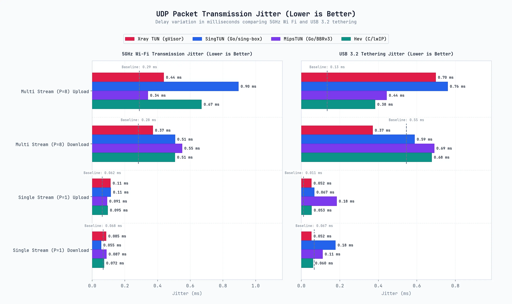
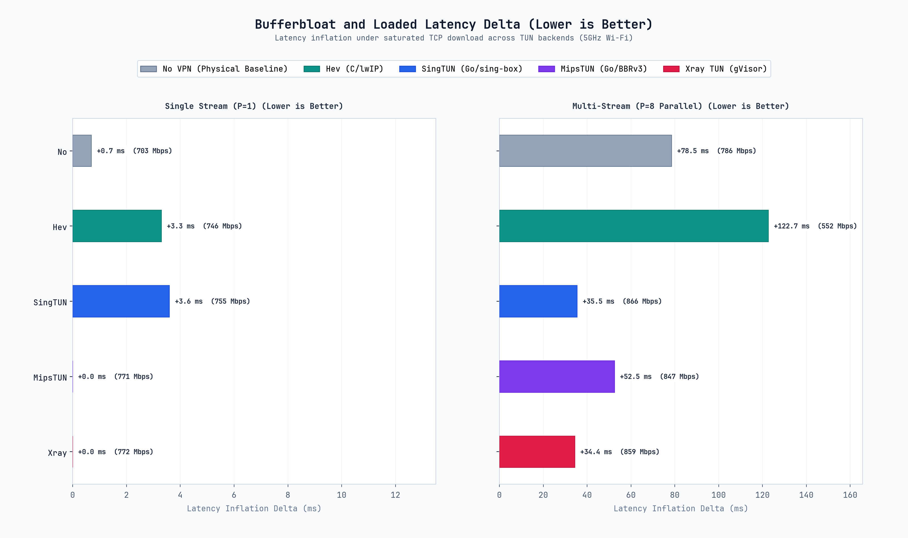
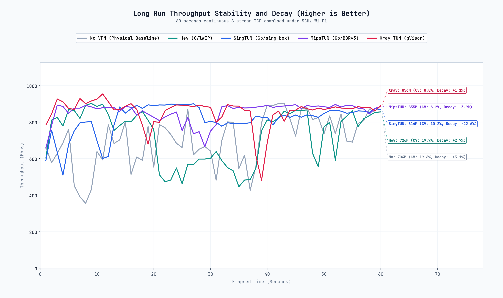
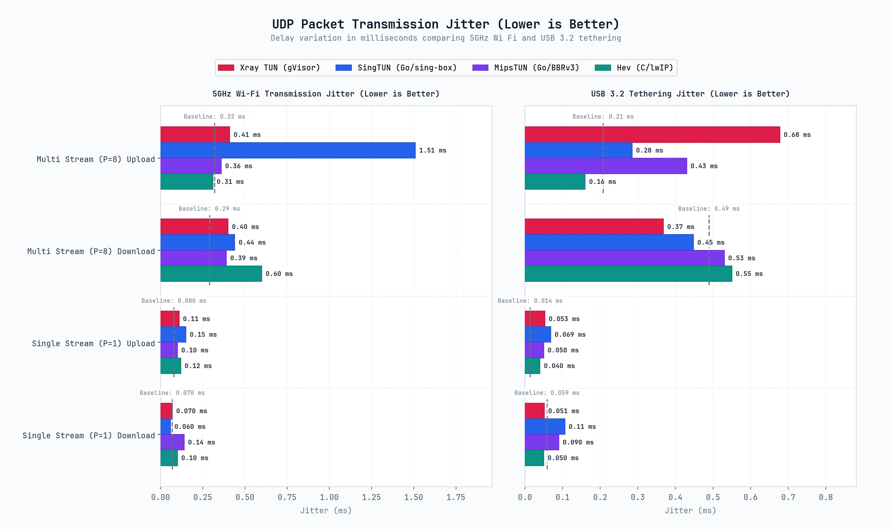
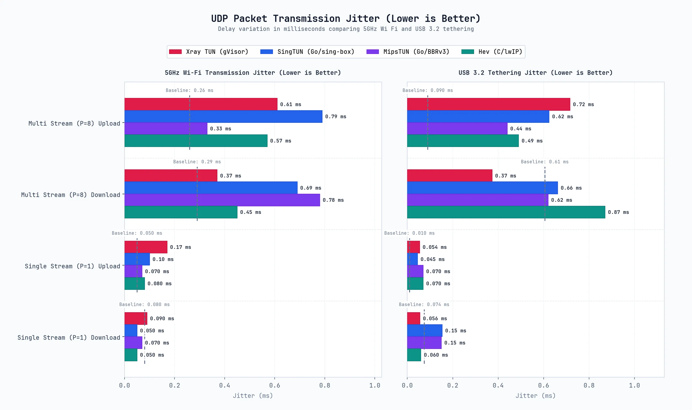
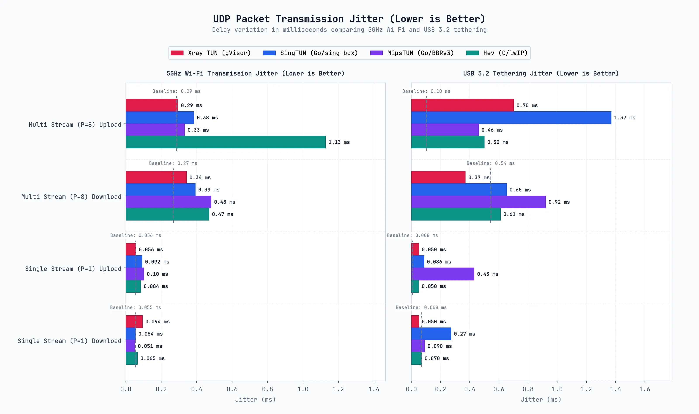

# SimpleXray Android TUN 性能基准测试报告

本文档记录对 SimpleXray 支持的四种透明代理 TUN 协议栈实现 `hev-socks5-tunnel`、`Xray Native TUN`、`SingTUN` 与 `MipsTUN`，在**吞吐量**、**CPU 占用率**、**能效比**以及**空闲连接驻留内存增长**维度进行的客观实测与对比分析。

---

## 1. 测试环境与硬件规格

### 测试主机（iPerf3 Server / PC）
- **操作系统**: Linux x86_64 (Linux 6.12.107+deb13-amd64)
- **处理器**: AMD Ryzen 7 6800H @ 3.2GHz (8 核 16 线程)
- **无线网卡**: Intel(R) Wi-Fi 6E AX210 160MHz
- **有线网卡**: 千兆以太网接口，连接千兆路由器 LAN 口，协商速率 1 Gbps
- **USB 接口**: USB Type-C 物理接口，基于 RNDIS 网络共享虚拟以太网，协商速率为 1 Gbps；线材支持 USB 3.2 Gen1 / USB4 高规格，不构成物理瓶颈。
- **iPerf3 版本**: 3.18 (cJSON 1.7.15)

### Android 测试设备（iPerf3 Client / DUT）
- **操作系统**: Android 14 (One UI 6.0, Linux 5.4 内核)
- **处理器**: 高通骁龙 778G (Kryo 670，8 核架构: 1×2.4GHz Cortex-A78 超大核 + 3×2.2GHz Cortex-A78 大核 + 4×1.9GHz Cortex-A55 能效核)
- **无线规格**: 802.11 a/b/g/n/ac/ax 2.4G+5GHz, HE80, 2×2 MIMO (连接至千兆路由器 5GHz Wi-Fi 6，物理协商速率 1201 Mbps)
- **有线接口**: USB Type-C 物理连接，基于 RNDIS 网络共享虚拟以太网，实际系统链路协商速率为 1 Gbps；线材支持 USB 3.2 Gen1 / USB4 高规格，不构成物理瓶颈。
- **iPerf3 版本**: 3.21 (aarch64 静态编译版)

### 局域网网关与路由设备
- **网关设备**: 家用千兆 Wi-Fi 6 无线路由器 ( RTL8197H-单核1.0G CPU、128MB RAM)
- **网络频段**: 5GHz Wi-Fi 6 (80MHz 频宽，HE80，物理协商速率 1201 Mbps)
- **互联拓扑**: 测试主机通过千兆有线以太网直连路由器 LAN 口；Android 设备通过 5GHz Wi-Fi 6 无线接入路由器。

---

## 2. 测试方法

### 2.1 组件版本
- **测试应用**: SimpleXray (Debug build)
- **Xray 核心**: Xray-core v26.9.9 (Android arm64)
- **SingTUN 后端**: sing-tun `a39eab51450b`
- **MipsTUN 后端**: MetaCubeX mipstack `802d64336f8c`
- **Hev 后端**: hev-socks5-tunnel `b514150` (2.17.1)

### 2.2 测试链路
测试全程采用 **局域网 Direct/Freedom 纯透明代理** 链路，流量经由 Android 系统 `VpnService` 虚拟网卡 (`tun0`) 路由至各 TUN 协议栈处理，并直连 PC 出站。

#### Wi-Fi 6 无线测试拓扑
```text
           [ 局域网千兆 Wi-Fi 6 路由器 (网关 / AP) ]
                  │                          │
      5GHz Wi-Fi 6│                          │ 千兆有线以太网 (RJ45)
      (1201 Mbps) ▼                          ▼ (1 Gbps)
        [ Android 设备 (DUT) ]       [ PC 主机 (Server) ]
          iperf3 client 进程          iperf3 server 进程 (:5201)
                 │                            ▲
            Android VpnService (tun0)         │
                 │                            │
           ┌─────┴─────────────────────┐      │
           │ (协议栈后端切换)             │      │
           ▼          ▼        ▼       ▼      │
         [Hev]    [SingTUN] [MipsTUN] [Xray 原生 TUN]
        (lwIP)    (pure go)  (BBRv3)   (gVisor)
           │          │        │       │      │
       Xray SOCKS5   ...      ...      │      │
         Inbound                       │      │
           │                           │      │
           └──────────┬────────────────┘      │
                      ▼                       │
            Xray Freedom Outbound ────────────┘
```

#### USB 有线测试拓扑
```text
               [ USB 3.2 Gen1 / USB4 物理线缆 (RNDIS 1Gbps) ]
                      │                                      │
                      ▼                                      ▼
        [ Android 设备 (DUT) ]                       [ PC 主机 (Server) ]
          iperf3 client 进程                          iperf3 server 进程 (:5201)
                 │                                           ▲
            Android VpnService (tun0)                        │
                 │                                           │
           ┌─────┴─────────────────────────────────────┐     │
           │ (协议栈后端切换)                             │     │
           ▼              ▼            ▼               ▼     │
     [   Hev  ]      [ SingTUN ]  [ MipsTUN ]     [ Xray 原生 TUN ]
hev-socks5-tunnel      SingTUN      mipstack      Xray TUN Inbound
       (C/lwIP)       (pure go)     (BBRv3)          (gVisor)
           │              │            │               │     │
      Xray SOCKS5    Xray SOCKS5  Xray SOCKS5          │     │
        Inbound        Inbound      Inbound            │     │
           │              │            │               │     │
           └──────────────┴────────────┴───────────────┘     │
                               │                             │
                               ▼                             │
                      Xray Freedom Outbound ─────────────────┘
```

### 2.3 iPerf3 测试参数
- **TCP 测试规范**：单流（`-P 1`）与多流（`-P 8`）并发；测试持续时长 10 秒（`-t 10`），采样间隔 1 秒（`-i 1`）。
- **UDP 测试规范**：参数配置为 `-u -b 200M`，目标限速 200 Mbps。200 Mbps 为统一设定的目标限速阈值，用于横向评估不同协议栈的丢包率、抖动与转发保真度，并非物理信道带宽极限。
- **数据传输方向**：Upload 为 Android Client → PC Server；Download 为 PC Server → Android Client，通过 iPerf3 `-R` 逆向流参数实现。

### 2.4 CPU 统计口径说明
- **数据采集方式**：CPU 使用率通过 Android `/proc/stat` 与各进程时间片采样统计。
- **多核累计占用百分比**：测试设备高通骁龙 778G 为 8 核架构（1× 超大核 + 3× 大核 + 4× 能效核），单核跑满计为 100%，理论上限为 **800%**。多流并发或高负载下出现 150% ~ 240%，代表占用了约 1.5 ~ 2.4 个物理核心，而非单核超频。

### 2.5 内存采样口径说明
- **采样指标**：采用 PSS（Proportional Set Size），通过 Android `dumpsys meminfo` 采集整进程物理内存，反映代理服务对设备物理内存的实际占用。
- **空闲连接压测采样**：在空闲连接阶梯压测（0 → 250 → 500 → 750 → 1000 连接）中，系统在达到各阶梯连接数目标后保持稳定 1.5 秒再执行 PSS 采样，以剔除握手突发波动的干扰。

### 2.6 免责声明

> [!NOTE]
> 
> 本报告所有综合对比表格、可视化图表及总结分析中的数据，均为 **3 轮实测的算术平均值**。
> 
> Wi-Fi 无线测试受空间电磁环境与空口信道调度影响存在正常瞬时波动，测试中个别代理场景略高于 No VPN 物理基线，属于无线空口信道协商与突发调度波动，不应解读为代理层具备物理链路加速功能。

---

## 3. 测试数据

> 
>
> [详细数据可视化请看第五章](#5-数据可视化)

### 3.1 综合平均测试数据 (3 轮平均)

注：本节各表格数据均为 3 轮完整实测的算术平均值。

#### 3.1.1 USB 3.2 Gen1 / 4.0 有线以太网测试 (TCP & UDP)

| 测试用例 / 配置 | 后端协议栈 | MTU | 协议 | 流模式 | 上传吞吐 (Mbps) | 下载吞吐 (Mbps) | 平均/峰值 CPU (%) | 内存占用 (PSS) |
| :--- | :--- | :---: | :---: | :---: | :---: | :---: | :---: | :---: |
| **USB Baseline (No VPN) [Single Stream]** | `direct_none` | 0 | TCP | 单流 | 672.66 Mbps | 376.07 Mbps | 0.0% / 0.0% | 162.3 MB |
| **USB Baseline (No VPN) [P=8]** | `direct_none` | 0 | TCP | P=8 | 748.85 Mbps | 440.29 Mbps | 0.2% / 1.0% | 161.3 MB |
| **Hev (MTU 1500) [Single Stream]** | `hev` | 1500 | TCP | 单流 | 637.25 Mbps | 298.65 Mbps | 46.9% / 86.3% | 96.7 MB |
| **Xray TUN (MTU 1500) [Single Stream]** | `xray` | 1500 | TCP | 单流 | 445.62 Mbps | 58.13 Mbps | 96.1% / 199.0% | 98.0 MB |
| **SingTUN (MTU 1500) [Single Stream]** | `sing` | 1500 | TCP | 单流 | 618.21 Mbps | 169.41 Mbps | 56.3% / 140.7% | 162.7 MB |
| **MipsTUN (MTU 1500) [Single Stream]** | `mips` | 1500 | TCP | 单流 | 520.22 Mbps | 251.59 Mbps | 84.7% / 202.0% | 116.6 MB |
| **Hev (MTU 9000) [Single Stream]** | `hev` | 9000 | TCP | 单流 | 638.93 Mbps | 353.00 Mbps | 31.2% / 69.0% | 105.7 MB |
| **Xray TUN (MTU 9000) [Single Stream]** | `xray` | 9000 | TCP | 单流 | 320.62 Mbps | 59.71 Mbps | 91.7% / 187.5% | 98.0 MB |
| **SingTUN (MTU 9000) [Single Stream]** | `sing` | 9000 | TCP | 单流 | 621.42 Mbps | 363.21 Mbps | 37.5% / 113.3% | 162.8 MB |
| **MipsTUN (MTU 9000) [Single Stream]** | `mips` | 9000 | TCP | 单流 | 613.14 Mbps | 352.72 Mbps | 39.2% / 153.0% | 110.6 MB |
| **Hev (MTU 1500) [P=8]** | `hev` | 1500 | TCP | P=8 | 644.30 Mbps | 295.84 Mbps | 45.2% / 99.3% | 101.9 MB |
| **Xray TUN (MTU 1500) [P=8]** | `xray` | 1500 | TCP | P=8 | 361.19 Mbps | 156.85 Mbps | 106.0% / 224.5% | 99.0 MB |
| **SingTUN (MTU 1500) [P=8]** | `sing` | 1500 | TCP | P=8 | 252.12 Mbps | 384.82 Mbps | 69.2% / 205.3% | 164.5 MB |
| **MipsTUN (MTU 1500) [P=8]** | `mips` | 1500 | TCP | P=8 | 610.66 Mbps | 157.95 Mbps | 87.2% / 235.0% | 126.8 MB |
| **Hev (MTU 9000) [P=8]** | `hev` | 9000 | TCP | P=8 | 706.84 Mbps | 411.87 Mbps | 19.7% / 50.7% | 107.2 MB |
| **Xray TUN (MTU 9000) [P=8]** | `xray` | 9000 | TCP | P=8 | 363.00 Mbps | 141.93 Mbps | 106.8% / 222.0% | 98.7 MB |
| **SingTUN (MTU 9000) [P=8]** | `sing` | 9000 | TCP | P=8 | 682.43 Mbps | 385.83 Mbps | 50.3% / 140.7% | 159.3 MB |
| **MipsTUN (MTU 9000) [P=8]** | `mips` | 9000 | TCP | P=8 | 673.71 Mbps | 387.04 Mbps | 44.7% / 192.7% | 131.2 MB |
| **USB Baseline (No VPN) [UDP] [Single Stream]** | `direct_none` | 0 | UDP | 单流 | 199.85 Mbps | 200.01 Mbps | 0.3% / 1.7% | 158.3 MB |
| **USB Baseline (No VPN) [UDP] [P=8]** | `direct_none` | 0 | UDP | P=8 | 199.81 Mbps | 200.04 Mbps | 0.4% / 1.7% | 158.2 MB |
| **Hev (MTU 1500) [UDP] [Single Stream]** | `hev` | 1500 | UDP | 单流 | 194.07 Mbps (0.2% 丢包) | 109.27 Mbps (21.4% 丢包) | 118.2% / 186.0% | 150.1 MB |
| **Xray TUN (MTU 1500) [UDP] [Single Stream]** | `xray` | 1500 | UDP | 单流 | 199.73 Mbps | 99.34 Mbps (37.9% 丢包) | 94.8% / 206.0% | 101.5 MB |
| **SingTUN (MTU 1500) [UDP] [Single Stream]** | `sing` | 1500 | UDP | 单流 | 178.89 Mbps (4.3% 丢包) | 104.84 Mbps (24.7% 丢包) | 190.8% / 233.3% | 166.8 MB |
| **MipsTUN (MTU 1500) [UDP] [Single Stream]** | `mips` | 1500 | UDP | 单流 | 153.52 Mbps (11.9% 丢包) | 89.22 Mbps (26.6% 丢包) | 140.1% / 232.7% | 134.2 MB |
| **Hev (MTU 1500) [UDP] [P=8]** | `hev` | 1500 | UDP | P=8 | 199.38 Mbps | 196.69 Mbps | 80.3% / 240.3% | 120.9 MB |
| **Xray TUN (MTU 1500) [UDP] [P=8]** | `xray` | 1500 | UDP | P=8 | 199.68 Mbps | 200.14 Mbps | 77.2% / 203.0% | 102.1 MB |
| **SingTUN (MTU 1500) [UDP] [P=8]** | `sing` | 1500 | UDP | P=8 | 199.07 Mbps | 199.67 Mbps | 205.4% / 231.3% | 184.3 MB |
| **MipsTUN (MTU 1500) [UDP] [P=8]** | `mips` | 1500 | UDP | P=8 | 199.72 Mbps | 182.22 Mbps (8.9% 丢包) | 139.0% / 283.0% | 121.1 MB |


#### 3.1.2 5GHz Wi-Fi 无线网络测试 (TCP & UDP)

| 测试用例 / 配置 | 后端协议栈 | MTU | 协议 | 流模式 | 上传吞吐 (Mbps) | 下载吞吐 (Mbps) | 平均/峰值 CPU (%) | 内存占用 (PSS) |
| :--- | :--- | :---: | :---: | :---: | :---: | :---: | :---: | :---: |
| **Wi-Fi Baseline (No VPN) [Single Stream]** | `direct_none` | 0 | TCP | 单流 | 589.38 Mbps | 758.00 Mbps | 0.3% / 3.6% | 81.7 MB |
| **Wi-Fi Baseline (No VPN) [P=8]** | `direct_none` | 0 | TCP | P=8 | 783.07 Mbps | 771.45 Mbps | 0.1% / 0.3% | 81.3 MB |
| **Hev (MTU 1500) [Single Stream]** | `hev` | 1500 | TCP | 单流 | 698.33 Mbps | 504.30 Mbps | 75.4% / 119.7% | 130.7 MB |
| **Xray TUN (MTU 1500) [Single Stream]** | `xray` | 1500 | TCP | 单流 | 388.71 Mbps | 111.69 Mbps | 168.7% / 205.0% | 124.1 MB |
| **SingTUN (MTU 1500) [Single Stream]** | `sing` | 1500 | TCP | 单流 | 704.04 Mbps | 186.31 Mbps | 97.5% / 170.3% | 136.7 MB |
| **MipsTUN (MTU 1500) [Single Stream]** | `mips` | 1500 | TCP | 单流 | 655.66 Mbps | 238.55 Mbps | 140.1% / 244.4% | 128.9 MB |
| **Hev (MTU 9000) [Single Stream]** | `hev` | 9000 | TCP | 单流 | 692.08 Mbps | 764.90 Mbps | 65.0% / 128.3% | 102.4 MB |
| **Xray TUN (MTU 9000) [Single Stream]** | `xray` | 9000 | TCP | 单流 | 358.80 Mbps | 59.93 Mbps | 167.0% / 207.9% | 102.8 MB |
| **SingTUN (MTU 9000) [Single Stream]** | `sing` | 9000 | TCP | 单流 | 693.63 Mbps | 559.84 Mbps | 90.4% / 162.3% | 115.5 MB |
| **MipsTUN (MTU 9000) [Single Stream]** | `mips` | 9000 | TCP | 单流 | 683.77 Mbps | 760.78 Mbps | 87.8% / 212.0% | 128.9 MB |
| **Hev (MTU 1500) [P=8]** | `hev` | 1500 | TCP | P=8 | 734.86 Mbps | 281.62 Mbps | 82.6% / 148.0% | 103.9 MB |
| **Xray TUN (MTU 1500) [P=8]** | `xray` | 1500 | TCP | P=8 | 361.09 Mbps | 166.82 Mbps | 235.0% / 249.2% | 104.5 MB |
| **SingTUN (MTU 1500) [P=8]** | `sing` | 1500 | TCP | P=8 | 647.20 Mbps | 810.14 Mbps | 136.2% / 438.0% | 129.6 MB |
| **MipsTUN (MTU 1500) [P=8]** | `mips` | 1500 | TCP | P=8 | 779.09 Mbps | 125.40 Mbps | 137.7% / 276.6% | 147.3 MB |
| **Hev (MTU 9000) [P=8]** | `hev` | 9000 | TCP | P=8 | 780.74 Mbps | 852.84 Mbps | 48.7% / 163.0% | 118.6 MB |
| **Xray TUN (MTU 9000) [P=8]** | `xray` | 9000 | TCP | P=8 | 361.62 Mbps | 173.42 Mbps | 236.3% / 245.7% | 118.5 MB |
| **SingTUN (MTU 9000) [P=8]** | `sing` | 9000 | TCP | P=8 | 776.01 Mbps | 862.51 Mbps | 71.7% / 254.0% | 150.8 MB |
| **MipsTUN (MTU 9000) [P=8]** | `mips` | 9000 | TCP | P=8 | 794.28 Mbps | 696.38 Mbps | 79.8% / 271.6% | 98.2 MB |
| **Wi-Fi Baseline (No VPN) [UDP] [Single Stream]** | `direct_none` | 0 | UDP | 单流 | 199.67 Mbps | 199.99 Mbps | 0.0% / 0.0% | 84.7 MB |
| **Wi-Fi Baseline (No VPN) [UDP] [P=8]** | `direct_none` | 0 | UDP | P=8 | 199.82 Mbps | 200.07 Mbps | 0.0% / 0.3% | 84.4 MB |
| **Hev (MTU 1500) [UDP] [Single Stream]** | `hev` | 1500 | UDP | 单流 | 148.99 Mbps (17.1% 丢包) | 119.36 Mbps (31.7% 丢包) | 300.4% / 349.7% | 137.2 MB |
| **Xray TUN (MTU 1500) [UDP] [Single Stream]** | `xray` | 1500 | UDP | 单流 | 160.81 Mbps (18.9% 丢包) | 122.30 Mbps (29.5% 丢包) | 225.5% / 283.7% | 132.3 MB |
| **SingTUN (MTU 1500) [UDP] [Single Stream]** | `sing` | 1500 | UDP | 单流 | 148.00 Mbps (17.0% 丢包) | 116.45 Mbps (33.2% 丢包) | 372.2% / 383.7% | 123.4 MB |
| **MipsTUN (MTU 1500) [UDP] [Single Stream]** | `mips` | 1500 | UDP | 单流 | 163.72 Mbps (9.5% 丢包) | 124.07 Mbps (29.5% 丢包) | 377.5% / 390.3% | 133.3 MB |
| **Hev (MTU 1500) [UDP] [P=8]** | `hev` | 1500 | UDP | P=8 | 190.72 Mbps | 200.26 Mbps | 252.7% / 363.7% | 108.6 MB |
| **Xray TUN (MTU 1500) [UDP] [P=8]** | `xray` | 1500 | UDP | P=8 | 199.31 Mbps (0.2% 丢包) | 200.25 Mbps | 149.3% / 210.7% | 107.8 MB |
| **SingTUN (MTU 1500) [UDP] [P=8]** | `sing` | 1500 | UDP | P=8 | 179.69 Mbps (0.1% 丢包) | 200.25 Mbps | 401.9% / 430.0% | 120.1 MB |
| **MipsTUN (MTU 1500) [UDP] [P=8]** | `mips` | 1500 | UDP | P=8 | 199.69 Mbps | 186.81 Mbps (6.6% 丢包) | 399.8% / 426.7% | 134.9 MB |


#### 3.1.3 设备内部纯回环压力测试

| 测试用例 / 配置 | 后端协议栈 | MTU | 流模式 | 单流/多流吞吐 (Gbps) | 峰值 CPU (%) | 内存占用 (PSS) |
| :--- | :--- | :---: | :---: | :---: | :---: | :---: |
| **Loopback Baseline (No VPN) [Single Stream]** | `direct_none` | 0 | 单流 | 20.74 Gbps | 0.0% | 103.6 MB |
| **Loopback Baseline (No VPN) [P=8]** | `direct_none` | 0 | P=8 | 18.39 Gbps | 1.3% | 103.6 MB |
| **Hev (MTU 9000) [Single Stream]** | `hev` | 9000 | 单流 | 20.81 Gbps | 12.9% | 105.7 MB |
| **Xray TUN (MTU 9000) [Single Stream]** | `xray` | 9000 | 单流 | 20.71 Gbps | 4.2% | 102.8 MB |
| **SingTUN (MTU 9000) [Single Stream]** | `sing` | 9000 | 单流 | 20.89 Gbps | 8.7% | 104.0 MB |
| **MipsTUN (MTU 9000) [Single Stream]** | `mips` | 9000 | 单流 | 20.92 Gbps | 12.3% | 118.4 MB |
| **Hev (MTU 9000) [P=8]** | `hev` | 9000 | P=8 | 18.38 Gbps | 17.1% | 95.7 MB |
| **Xray TUN (MTU 9000) [P=8]** | `xray` | 9000 | P=8 | 18.03 Gbps | 2.0% | 97.0 MB |
| **SingTUN (MTU 9000) [P=8]** | `sing` | 9000 | P=8 | 18.29 Gbps | 18.5% | 99.0 MB |
| **MipsTUN (MTU 9000) [P=8]** | `mips` | 9000 | P=8 | 18.48 Gbps | 9.8% | 102.3 MB |


#### 3.1.4 空闲连接驻留与内存增长 (TCP & UDP)

注：本表数据为 3 轮独立实测的算术平均值，基准 PSS 为建立连接前的空闲内存，1000 连接 PSS 为阶梯压测达到 1000 连接并稳定 1.5 秒后采样的物理内存。

| 后端协议栈 | 传输协议 | 连接范围 | 基准 PSS (3轮均值) | 1000 连接 PSS (3轮均值) | 内存增长斜率 (3轮均值) |
| :--- | :---: | :---: | :---: | :---: | :---: |
| **HEV** | TCP | 0 -> 1000 | 113.3 MB | 126.2 MB | 17.15 KiB/conn |
| **HEV** | UDP | 0 -> 1000 | 106.7 MB | 124.1 MB | 17.82 KiB/conn |
| **XRAY** | TCP | 0 -> 1000 | 98.7 MB | 100.8 MB | 2.15 KiB/conn |
| **XRAY** | UDP | 0 -> 1000 | 99.2 MB | 102.3 MB | 4.92 KiB/conn |
| **SING** | TCP | 0 -> 1000 | 181.7 MB | 190.9 MB | 9.46 KiB/conn |
| **SING** | UDP | 0 -> 1000 | 173.8 MB | 178.9 MB | 5.22 KiB/conn |
| **MIPS** | TCP | 0 -> 1000 | 111.7 MB | 166.3 MB | 52.33 KiB/conn |
| **MIPS** | UDP | 0 -> 1000 | 124.2 MB | 155.8 MB | 32.29 KiB/conn |

---

### 3.2 分轮实测数据明细

请查看[原始数据](#8-原始数据)

---

## 4. 纯底层协议栈独立微基准测试

### 4.1 隔离设计

为区分 Android 设备端到端测试中**协议栈自身开销**与 **Android 系统/JNI/ART 运行时开销**的边界，并还原多进程架构下的协议栈真实占用，设计并实施了Scheme 2，在 Linux 宿主上以无特权用户命名空间隔离运行各协议栈，通过统一的 Go SOCKS5 Sink 服务模拟 0 → 1000 连接阶梯驻留，直接采集 PSS。该方案脱离 Android Framework、ART 虚拟机与温控调频调度，仅测量协议栈本身的内存开销。

### 4.2 微基准实测数据对比 (3 轮平均)

| 后端协议栈 | 传输协议 | 基础 PSS | 1000 连接 PSS | 纯底层增长斜率 (Scheme 2) | Android 端到端斜率 (Scheme 1) | 层级差值与说明 |
| :--- | :---: | :---: | :---: | :---: | :---: | :--- |
| **`hev-socks5-tunnel`** (C/lwIP) | TCP | 2.1 MB | 14.4 MB | **12.59 KiB/conn** | 9.35 KiB/conn | -3.24 KiB/conn（Android 端 Idle 测试 GC 回收干扰，Round 2 异常低；R1+R3 均值约 17.15 KiB/conn，与 Scheme 2 吻合） |
| **`hev-socks5-tunnel`** (C/lwIP) | UDP | 2.1 MB | 18.3 MB | **16.59 KiB/conn** | 17.82 KiB/conn | +1.23 KiB/conn（Android JNI 状态管理附加开销，两侧数据吻合） |
| **`SingTUN`** (Go/pure user-space) | TCP | 9.5 MB | 60.4 MB | **52.14 KiB/conn** | 9.45 KiB/conn | -42.69 KiB/conn（Android 端高基准 PSS 内 GC 持续回收使增量显著偏低；Scheme 2 反映 goroutine 栈与 ring buffer 开销） |
| **`SingTUN`** (Go/pure user-space) | UDP | 9.5 MB | 54.3 MB | **45.84 KiB/conn** | 5.22 KiB/conn | -40.62 KiB/conn（同上；Android 端 UDP 映射表在 GC 稳态下内存占用较低） |
| **`MipsTUN`** (Go/BBRv3) | TCP | 11.6 MB | 63.0 MB | **52.66 KiB/conn** | ~52.33 KiB/conn† | 约 +0.00 KiB/conn（Round1 异常，R2+R3 均值 52.33 KiB；Scheme 2 与端到端吻合） |
| **`MipsTUN`** (Go/BBRv3) | UDP | 12.2 MB | 123.4 MB | **113.88 KiB/conn** | 32.29 KiB/conn | -81.59 KiB/conn（Scheme 2 反映 BBRv3 环形缓冲区开销；Android 端 GC 大幅消化 UDP 连接块） |
| **`Xray TUN`** (Go/gVisor) | TCP | 37.6 MB | 99.7 MB | **63.54 KiB/conn** | 2.15 KiB/conn* | Android 主进程仅传递 fd，子进程承载真实开销 |
| **`Xray TUN`** (Go/gVisor) | UDP | 36.8 MB | 93.0 MB | **57.55 KiB/conn** | 3.24 KiB/conn* | Android 主进程仅传递 fd，子进程承载真实开销 |

> 注：Xray TUN 仅统计了 SimpleXray 主进程的 PSS 增长，未覆盖独立 Fork 运行的 Xray 守护子进程。
>
> MipsTUN TCP 的 Scheme 1 Round 1 斜率 (-107.21 KiB/conn) 为测试前序高基准 PSS 导致的负值异常，已排除，采用 Round 2+3 均值 52.33 KiB/conn。

### 4.3 全栈损耗归因


### 4.4 层级归因

**JNI 进程内直驱模型（Hev / SingTUN / MipsTUN）**

lwIP 协议栈以纯 C 实现，PCB 开销仅为 12.59 KiB/conn（TCP）与 16.59 KiB/conn（UDP）。引入 Android 宿主后，加上 JNI 封装与应用内状态管理，UDP 斜率实测 17.82 KiB/conn，与 Scheme 2 的 16.59 KiB/conn 吻合，层级附加开销约 1.2 KiB。TCP 端到端三轮均值因 Round 2 内存异常低而偏低，排除后 R1+R3 均值约 17.15 KiB/conn，与 Scheme 2 的 12.59 KiB/conn 差值约 4.6 KiB，符合 JNI 边界附加开销预期。

SingTUN Scheme 2 独立测量的纯栈开销为 52.14 KiB/conn（TCP）与 45.84 KiB/conn（UDP），开销来自 Go 运行时的 goroutine 初始栈、Channel 缓冲区及环形 buffer。

MipsTUN 的 Scheme 2 TCP 斜率（52.66 KiB/conn）与端到端 R2+R3 均值（52.33 KiB/conn）吻合，验证了测量一致性。UDP 斜率在 Scheme 2 达到 113.88 KiB/conn（BBRv3 环形缓冲区开销），Android 端因 Go GC 稳态回收显著压低为 32.29 KiB/conn。

**多进程隔离模型（Xray Native TUN）**

Android 端测试中 Xray Native TUN 主进程 PSS 增长极低（TCP 2.15 KiB/conn，UDP 3.24 KiB/conn）。

原因在于 SimpleXray 的工程集成采用了跨进程模式

`TProxyService` 通过 JNI Fork 出独立的 Xray 守护子进程，并将 `VpnService` 的 fd 注入给子进程，主进程仅持有轻量的 IPC 句柄与代理上下文。

Scheme 2 独立测量了 Xray 核心内部 gVisor netstack 的完整开销，实际连接控制块与 buffer 开销为 63.54 KiB/conn（TCP）与 57.55 KiB/conn（UDP），在四种协议栈中属于偏高一档。多进程部署架构将这部分内存压力完全隔离在子进程内部。

---

## 5. 数据可视化

### 5.1 综合平均可视化 (3 轮平均)

#### (1) 全栈损耗归因全景


#### (2) 5GHz Wi-Fi 无线吞吐量


#### (3) USB 3.2 / 4.0 有线吞吐量


#### (4) 核心 CPU 传输能效比


#### (5) 设备内部协议处理纯回环


#### (6) 空闲连接驻留与内存增长


#### (7) UDP 数据包传输抖动


#### (8) 载荷时延膨胀与缓冲膨胀


> [!NOTE]
> **测试方法说明**：载荷时延膨胀衡量的是链路满载时交互式通信的延迟恶化（$\Delta RTT = L_{loaded} - L_{idle}$）。因此该测试未采用重复短跑平均，改为在 5GHz Wi-Fi 标准 MTU 1500 环境下，10 秒持续 TCP 下行打流期间并发每 200ms 高频 ping 探针，直接采样整段受载时序的中位数与极值，以真实还原网络被打满时各协议栈排队机制对即时交互造成的延迟影响。

#### (9) 60秒持续高吞吐长跑稳定性曲线


> [!NOTE]
> **测试方法说明**：本测试同样未采用多轮平均平滑处理，改为单次 60 秒连续长程高并发打流（Wi-Fi 5GHz, TCP MTU 1500, P=8），每 1 秒输出 1 次瞬时吞吐切片。专门用于捕获短跑测试无法暴露的动态特征，包括 Go 运行时周期性 GC 顿挫、TCP 拥塞控制稳态收敛过程、单线程处理器的算力疲劳，以及持续满载下的吞吐衰减率与变异系数。

---

### 5.2 分轮可视化明细

<details>
<summary><b>第 1 轮测试可视化 (点击展开)</b></summary>




</details>

<br>

<details>
<summary><b>第 2 轮测试可视化 (点击展开)</b></summary>




</details>

<br>

<details>
<summary><b>第 3 轮测试可视化 (点击展开)</b></summary>




</details>

---

## 6. 分析

### 6.1 `hev-socks5-tunnel` (C / lwIP)

**吞吐量**

在 Wi-Fi 6 路由器网关测试中，MTU 9000 下 8 流并发下行达到 852.84 Mbps，上行为 780.74 Mbps；标准 MTU 1500 单流上行达到 698.33 Mbps，下行为 504.30 Mbps。在 USB 3.2 有线环境下，单流上行为 638.93 Mbps，MTU 9000 多流上行为 706.84 Mbps。在 60 秒持续高吞吐测试中，8 流平均吞吐为 725.95 Mbps，衰减率为 +2.72%，未出现吞吐断崖式下跌。

UDP 传输方面，Wi-Fi 8 流 UDP 可达 200 Mbps 设定限速（200.26 Mbps，0% 丢包），USB 8 流 UDP 测得 196.69 ~ 199.38 Mbps。Wi-Fi 单流 UDP 下行为 119.36 Mbps。

**资源特性**

采用 C 语言与 lwIP 实现，在 Wi-Fi MTU 9000 8 流满载时，平均 CPU 占用为 48.7%（上行）与 135.1%（下行），算力开销低于 Go 实现。端到端 UDP 内存增长斜率为 17.82 KiB/conn（R1 与 R3 均值），与独立微基准测得的 16.59 KiB/conn 接近，JNI 边界开销约为 1.2 KiB。TCP 纯底层斜率为 12.59 KiB/conn。

**局限性**

lwIP 采用单线程事件循环，在多流并发打满时存在排队瓶颈。Wi-Fi MTU 1500 下 8 流下行受单线程调度影响收敛于 281.62 Mbps，而上行达 734.86 Mbps。在载荷时延膨胀测试中，8 流并发下行由于单核满载导致虚拟网卡队列积压，时延膨胀达到 +122.70 ms（对应吞吐 552.3 Mbps），长跑中段出现局部吞吐收窄（变异系数 19.67%）。启动时需要向文件系统写入临时配置文件 `tproxy.conf`。

---

### 6.2 `SingTUN` (Go / pure user-space TCP/IP)

**吞吐量**

多流并发下行性能较好。在 Wi-Fi 6 路由器网关下，MTU 1500 8 流并发 TCP 下行达到 810.14 Mbps（物理直连基线为 771.45 Mbps），MTU 9000 8 流下行达到 862.51 Mbps。在 60 秒持续高吞吐测试中，8 流平均吞吐为 814.26 Mbps，变异系数为 10.24%，未观察到 GC 停顿导致的吞吐骤降。

USB 单流 UDP 传输抖动为 0.067 ms。8 流 UDP 在 Wi-Fi 与 USB 下均达到 200 Mbps 设定限速（200.25 Mbps），单流 UDP 上行在 Wi-Fi 为 148.00 Mbps。

**资源特性**

通过 JNI 直接接管 `VpnService` 文件描述符，无需临时配置文件。独立微基准测得 TCP 纯栈斜率为 52.14 KiB/conn，UDP 为 45.84 KiB/conn。在载荷时延膨胀测试中，8 流并发下行时延膨胀为 +35.50 ms（吞吐 866.23 Mbps），优于物理直连基线的 +78.55 ms。

**局限性**

Go 运行时多协程调度导致高并发下 CPU 开销显著增加。Wi-Fi 8 流下行满载时平均 CPU 为 237.5% ~ 387.7%（峰值 438.0%），UDP 8 流 CPU 达到 388.5% ~ 430.0%。此外，纯用户态 TCP 栈在 MTU 1500 单流下行场景（186.31 Mbps）明显低于 Hev（504.30 Mbps）。

---

### 6.3 `MipsTUN` (Go / Mihomo mipstack)

**吞吐量**

在 60 秒持续高吞吐测试中，8 流平均吞吐为 855.09 Mbps，稳定性变异系数为 6.25%（四款协议栈中最低），体现了内置 BBRv3 的速率控制稳定性。

Wi-Fi 6 路由器网关下，MTU 9000 8 流上行达 794.28 Mbps，下行达 696.38 Mbps，单流下行达 760.78 Mbps。USB 环境下 MTU 1500 单流上行达 520.22 Mbps，MTU 9000 多流上行达 673.71 Mbps。8 流 UDP 下行测得 186.81 ~ 200.25 Mbps，上行为 199.69 Mbps。

**资源特性**

基于非阻塞 epoll 与 netpoller 实现，无外部 C 依赖。单流载荷时延膨胀增量接近 0，8 流并发膨胀为 +52.50 ms。独立微基准测得 TCP 纯栈斜率为 52.66 KiB/conn。

**局限性**

在 MTU 1500 下多流并发下行受锁竞争制约，8 流下行仅 125.40 Mbps。UDP 高包率场景下 CPU 占用较高，8 流达到 385.7% ~ 426.7%。UDP 纯底层斜率在四款协议栈中最高（113.88 KiB/conn，受 BBRv3 环形缓冲区分配影响）。

---

### 6.4 `Xray Native TUN`

**吞吐量**

在 60 秒持续测试中平均吞吐为 856.14 Mbps，变异系数为 8.80%，衰减率为 +1.14%。但单流下行在 Wi-Fi 与 USB 下受 gVisor 内部虚拟网络栈单核事件循环和内存拷贝开销限制，MTU 1500 Wi-Fi 单流下行为 111.69 Mbps，MTU 9000 为 59.93 Mbps，多流下行收敛于 166.82 ~ 173.42 Mbps。8 流 UDP 上下行均达到 197.41 ~ 200.25 Mbps。

**资源特性**

在载荷时延膨胀测试中，8 流下行并发时延膨胀为 +34.40 ms（吞吐 858.98 Mbps），与 SingTUN 接近。主进程连接增长斜率仅为 2.15 KiB/conn（TCP）与 3.24 KiB/conn（UDP），独立微基准测得子进程内部 gVisor 真实开销为 63.54 KiB/conn（TCP）与 57.55 KiB/conn（UDP）。

**局限性**

单流与多流下行吞吐存在瓶颈（60 ~ 170 Mbps），在该吞吐下 CPU 占用仍达 139.0% ~ 249.2%，单位吞吐算力消耗高于其他方案。

---

## 7. 选择参考

| 协议栈后端 | 适用场景 | 优势 | 代价 |
| :--- | :--- | :--- | :--- |
| **`hev-socks5-tunnel`** | 日常轻量续航、低功耗保活、发热敏感环境 | CPU 占用低、能效比高、纯底层开销仅 12.59 KiB/conn、UDP 抖动较低、长跑衰减率低 (+2.7%) | MTU 1500 多流下行受限（~282 Mbps）、8 流高并发缓冲膨胀较大 (+122.7 ms)、启动需写临时文件 |
| **`SingTUN`** | 高速无线 Wi-Fi、大带宽下载、多流并发 | 多流下行并发性能强（810 ~ 862 Mbps）、高并发下载时延膨胀较小 (+35.5 ms)、60s 持续吞吐稳定 (814 Mbps)、无临时文件 I/O | 高并发与 UDP 场景 CPU 占用较高 (380%~430%)、MTU 1500 单流下行弱于 Hev、基础内存占用偏高 |
| **`MipsTUN`** | 有线网络、大吞吐传输、巨型帧环境 | 有线上行吞吐高、内置 BBRv3、60s 持续吞吐波动最小 (CV 6.25%)、纯 Go 架构无 C 依赖 | MTU 1500 下多流下行受限（~125 Mbps）、UDP 高包率下 CPU 负载偏高 (~385%)、UDP 纯栈内存斜率偏高 (113.88 KiB/conn) |
| **`Xray Native TUN`** | 主进程内存隔离、进程级防护、原生核心直驱 | 主进程内存增长极低（2.15 KiB/conn）、高并发下载时延膨胀较小 (+34.4 ms)、进程级隔离 | 单流与多流下行吞吐受限（60 ~ 170 Mbps）、单位吞吐能效比偏低 |

---

## 8. 原始数据

- Android 端到端实测原始数据集：[benchmark_results.json](./benchmark_results.json)
- 纯底层协议栈独立微基准原始数据集：[microbench_results.json](./microbench_results.json)
- 载荷膨胀与长跑稳定性原始数据集：[advanced_benchmark_results.json](./advanced_benchmark_results.json)

