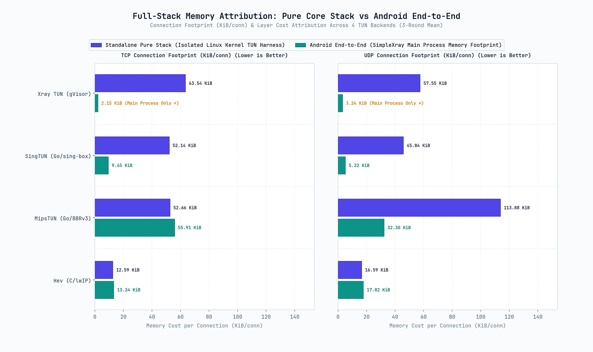

# SimpleXray Android TUN 性能基准测试报告

本文档记录对 SimpleXray 支持的四种透明代理 TUN 协议栈实现 `hev-socks5-tunnel`、`Xray Native TUN`、`SingTUN` 与 `MipsTUN`，在**吞吐量**、**CPU 占用率**、**能效比**以及**空闲连接驻留内存增长**维度进行的客观实测与对比分析。

---

## 1. 测试环境与硬件规格

### 测试主机（iPerf3 Server / PC）
- **操作系统**: Linux x86_64 (Linux 6.12.107+deb13-amd64)
- **处理器**: AMD Ryzen 7 6800H @ 3.2GHz (8 核 16 线程)
- **无线网卡**: Intel(R) Wi-Fi 6E AX210 160MHz
- **有线接口**: USB Type-C 物理连接，基于 RNDIS 网络共享虚拟以太网，实际系统链路协商速率为 1Gbps；线材支持 USB 3.2 Gen1 / USB4 高规格，不构成物理瓶颈。
- **iPerf3 版本**: 3.18 (cJSON 1.7.15)

### Android 测试设备（iPerf3 Client / DUT）
- **操作系统**: Android 14 (One UI 6.0, Linux 5.4 内核)
- **处理器**: 高通骁龙 778G (Kryo 670，8 核架构: 1×2.4GHz Cortex-A78 超大核 + 3×2.2GHz Cortex-A78 大核 + 4×1.9GHz Cortex-A55 能效核)
- **有线接口**: USB Type-C 物理连接，基于 RNDIS 网络共享虚拟以太网，实际系统链路协商速率为 1Gbps；线材支持 USB 3.2 Gen1 / USB4 高规格，不构成物理瓶颈。
- **无线规格**: 802.11 a/b/g/n/ac/ax 2.4G+5GHz, HE80, 2×2 MIMO
- **iPerf3 版本**: 3.21 (aarch64 静态编译版)

### 局域网网关
- **网关设备**: Android 16 手机，高通 Snapdragon 8 Elite SoC，高通 FastConnect 7900 无线连接系统。
- **网络频段**: 5GHz Wi-Fi 热点 (WLAN AP，80MHz 频宽，物理协商速率 1201 Mbps)

---

## 2. 测试方法

### 2.1 组件版本
- **测试应用**: SimpleXray (Debug build)
- **Xray 核心**: Xray-core v26.9.9 (Android arm64)
- **SingTUN 后端**: sing-tun `a39eab51450b`
- **MipsTUN 后端**: MetaCubeX mipstack `802d64336f8c`
- **Hev 后端**: hev-socks5-tunnel `b514150` (2.17.1)

### 2.2 测试链路
测试全程采用 **局域网 Direct/Freedom 纯透明代理** 链路，流量经由 Android 系统 `VpnService` 虚拟网卡 (`tun0`) 路由至各 TUN 协议栈处理，并直连 PC 出站：

```text
               [ 局域网网关 (5GHz Wi-Fi AP / USB RNDIS) ]
                      │                                 │
                      ▼                                 ▼
        [ Android 设备 (DUT) ]                  [ PC 主机 (Server) ]
          iperf3 client 进程                     iperf3 server 进程 (:5201)
                 │                                      ▲
            Android VpnService (tun0)                   │
                 │                                      │
           ┌─────┴────────────────────────────────┐     │
           │ (协议栈后端切换)                        │     │
           ▼              ▼            ▼          ▼     │
     [   Hev  ]      [ SingTUN ]  [ MipsTUN ]     [ Xray 原生 TUN ]
hev-socks5-tunnel      SingTUN      mipstack      Xray TUN Inbound
       (C/lwIP)       (pure go)     (BBRv3)          (gVisor)
           │              │            │          │     │
      Xray SOCKS5    Xray SOCKS5  Xray SOCKS5     │     │
        Inbound        Inbound      Inbound       │     │
           │              │            │          │     │
           └──────────────┴────────────┴──────────┘     │
                               │                        │
                               ▼                        │
                      Xray Freedom Outbound ────────────┘
```

### 2.3 iPerf3 测试参数
- **TCP 测试规范**：单流（`-P 1`）与多流（`-P 8`）并发；测试持续时长 10 秒（`-t 10`），采样间隔 1 秒（`-i 1`）。
- **UDP 测试规范**：参数配置为 `-u -b 200M`，目标限速 200 Mbps。200 Mbps 为统一设定的目标限速阈值，用于横向评估不同协议栈的丢包率、抖动与转发保真度，并非物理信道带宽极限。
- **数据传输方向**：Upload 为 Android Client → PC Server；Download 为 PC Server → Android Client，通过 iPerf3 `-R` 逆向流参数实现。

### 2.4 CPU 统计口径说明
- **数据采集方式**：CPU 使用率通过 Android `/proc/stat` 与各进程时间片采样统计。
- **多核累计占用百分比**：测试设备高通骁龙 778G 为 8 核架构（1× 超大核 + 3× 大核 + 4× 能效核），单核跑满计为 100%，理论上限为 **800%**。多流并发或高负载下出现 150% ~ 240%，代表占用了约 1.5 ~ 2.4 个物理核心，而非单核超频。

### 2.5 内存采样口径说明
- **采样指标**：采用 PSS（Proportional Set Size），通过 Android `dumpsys meminfo` 采集整进程物理内存，反映代理服务对设备物理内存的实际占用。
- **空闲连接压测采样**：在空闲连接阶梯压测（0 → 250 → 500 → 750 → 1000 连接）中，系统在达到各阶梯连接数目标后保持稳定 1.5 秒再执行 PSS 采样，以剔除握手突发波动的干扰。

### 2.6 免责声明

> [!NOTE]
> 
> 本报告所有综合对比表格、可视化图表及总结分析中的数据，均为 **3 轮实测的算术平均值**。
> 
> Wi-Fi 无线测试受空间电磁环境与空口信道调度影响存在正常瞬时波动，测试中个别代理场景略高于 No VPN 物理基线，属于无线空口信道协商与突发调度波动，不应解读为代理层具备物理链路加速功能。

---

## 3. 测试数据

> 
>
> [详细数据可视化请看第五章](#5-数据可视化)

### 3.1 综合平均测试数据 (3 轮平均)

注：本节各表格数据均为 3 轮完整实测的算术平均值。

#### 3.1.1 USB 3.2 Gen1 / 4.0 有线以太网测试 (TCP & UDP)

| 测试用例 / 配置 | 后端协议栈 | MTU | 协议 | 流模式 | 上传吞吐 (Mbps) | 下载吞吐 (Mbps) | 平均/峰值 CPU (%) | 内存占用 (PSS) |
| :--- | :--- | :---: | :---: | :---: | :---: | :---: | :---: | :---: |
| **USB Baseline (No VPN) [Single Stream]** | `direct_none` | 0 | TCP | 单流 | 672.66 Mbps | 376.07 Mbps | 0.0% / 0.0% | 162.3 MB |
| **USB Baseline (No VPN) [P=8]** | `direct_none` | 0 | TCP | P=8 | 748.85 Mbps | 440.29 Mbps | 0.2% / 1.0% | 161.3 MB |
| **Hev (MTU 1500) [Single Stream]** | `hev` | 1500 | TCP | 单流 | 637.25 Mbps | 298.65 Mbps | 46.9% / 86.3% | 96.7 MB |
| **Xray TUN (MTU 1500) [Single Stream]** | `xray` | 1500 | TCP | 单流 | 445.62 Mbps | 58.13 Mbps | 96.1% / 199.0% | 98.0 MB |
| **SingTUN (MTU 1500) [Single Stream]** | `sing` | 1500 | TCP | 单流 | 618.21 Mbps | 169.41 Mbps | 56.3% / 140.7% | 162.7 MB |
| **MipsTUN (MTU 1500) [Single Stream]** | `mips` | 1500 | TCP | 单流 | 520.22 Mbps | 251.59 Mbps | 84.7% / 202.0% | 116.6 MB |
| **Hev (MTU 9000) [Single Stream]** | `hev` | 9000 | TCP | 单流 | 638.93 Mbps | 353.00 Mbps | 31.2% / 69.0% | 105.7 MB |
| **Xray TUN (MTU 9000) [Single Stream]** | `xray` | 9000 | TCP | 单流 | 320.62 Mbps | 59.71 Mbps | 91.7% / 187.5% | 98.0 MB |
| **SingTUN (MTU 9000) [Single Stream]** | `sing` | 9000 | TCP | 单流 | 621.42 Mbps | 363.21 Mbps | 37.5% / 113.3% | 162.8 MB |
| **MipsTUN (MTU 9000) [Single Stream]** | `mips` | 9000 | TCP | 单流 | 613.14 Mbps | 352.72 Mbps | 39.2% / 153.0% | 110.6 MB |
| **Hev (MTU 1500) [P=8]** | `hev` | 1500 | TCP | P=8 | 644.30 Mbps | 295.84 Mbps | 45.2% / 99.3% | 101.9 MB |
| **Xray TUN (MTU 1500) [P=8]** | `xray` | 1500 | TCP | P=8 | 361.19 Mbps | 156.85 Mbps | 106.0% / 224.5% | 99.0 MB |
| **SingTUN (MTU 1500) [P=8]** | `sing` | 1500 | TCP | P=8 | 252.12 Mbps | 384.82 Mbps | 69.2% / 205.3% | 164.5 MB |
| **MipsTUN (MTU 1500) [P=8]** | `mips` | 1500 | TCP | P=8 | 610.66 Mbps | 157.95 Mbps | 87.2% / 235.0% | 126.8 MB |
| **Hev (MTU 9000) [P=8]** | `hev` | 9000 | TCP | P=8 | 706.84 Mbps | 411.87 Mbps | 19.7% / 50.7% | 107.2 MB |
| **Xray TUN (MTU 9000) [P=8]** | `xray` | 9000 | TCP | P=8 | 363.00 Mbps | 141.93 Mbps | 106.8% / 222.0% | 98.7 MB |
| **SingTUN (MTU 9000) [P=8]** | `sing` | 9000 | TCP | P=8 | 682.43 Mbps | 385.83 Mbps | 50.3% / 140.7% | 159.3 MB |
| **MipsTUN (MTU 9000) [P=8]** | `mips` | 9000 | TCP | P=8 | 673.71 Mbps | 387.04 Mbps | 44.7% / 192.7% | 131.2 MB |
| **USB Baseline (No VPN) [UDP] [Single Stream]** | `direct_none` | 0 | UDP | 单流 | 199.85 Mbps | 200.01 Mbps | 0.3% / 1.7% | 158.3 MB |
| **USB Baseline (No VPN) [UDP] [P=8]** | `direct_none` | 0 | UDP | P=8 | 199.81 Mbps | 200.04 Mbps | 0.4% / 1.7% | 158.2 MB |
| **Hev (MTU 1500) [UDP] [Single Stream]** | `hev` | 1500 | UDP | 单流 | 194.07 Mbps (0.2% 丢包) | 109.27 Mbps (21.4% 丢包) | 118.2% / 186.0% | 150.1 MB |
| **Xray TUN (MTU 1500) [UDP] [Single Stream]** | `xray` | 1500 | UDP | 单流 | 199.73 Mbps | 99.34 Mbps (37.9% 丢包) | 94.8% / 206.0% | 101.5 MB |
| **SingTUN (MTU 1500) [UDP] [Single Stream]** | `sing` | 1500 | UDP | 单流 | 178.89 Mbps (4.3% 丢包) | 104.84 Mbps (24.7% 丢包) | 190.8% / 233.3% | 166.8 MB |
| **MipsTUN (MTU 1500) [UDP] [Single Stream]** | `mips` | 1500 | UDP | 单流 | 153.52 Mbps (11.9% 丢包) | 89.22 Mbps (26.6% 丢包) | 140.1% / 232.7% | 134.2 MB |
| **Hev (MTU 1500) [UDP] [P=8]** | `hev` | 1500 | UDP | P=8 | 199.38 Mbps | 196.69 Mbps | 80.3% / 240.3% | 120.9 MB |
| **Xray TUN (MTU 1500) [UDP] [P=8]** | `xray` | 1500 | UDP | P=8 | 199.68 Mbps | 200.14 Mbps | 77.2% / 203.0% | 102.1 MB |
| **SingTUN (MTU 1500) [UDP] [P=8]** | `sing` | 1500 | UDP | P=8 | 199.07 Mbps | 199.67 Mbps | 205.4% / 231.3% | 184.3 MB |
| **MipsTUN (MTU 1500) [UDP] [P=8]** | `mips` | 1500 | UDP | P=8 | 199.72 Mbps | 182.22 Mbps (8.9% 丢包) | 139.0% / 283.0% | 121.1 MB |

#### 3.1.2 5GHz Wi-Fi 无线网络测试 (TCP & UDP)

| 测试用例 / 配置 | 后端协议栈 | MTU | 协议 | 流模式 | 上传吞吐 (Mbps) | 下载吞吐 (Mbps) | 平均/峰值 CPU (%) | 内存占用 (PSS) |
| :--- | :--- | :---: | :---: | :---: | :---: | :---: | :---: | :---: |
| **Wi-Fi Baseline (No VPN) [Single Stream]** | `direct_none` | 0 | TCP | 单流 | 309.76 Mbps | 278.36 Mbps | 0.0% / 0.0% | 181.3 MB |
| **Wi-Fi Baseline (No VPN) [P=8]** | `direct_none` | 0 | TCP | P=8 | 340.15 Mbps | 384.49 Mbps | 0.0% / 0.0% | 184.8 MB |
| **Hev (MTU 1500) [Single Stream]** | `hev` | 1500 | TCP | 单流 | 320.00 Mbps | 260.96 Mbps | 24.7% / 68.7% | 138.0 MB |
| **Xray TUN (MTU 1500) [Single Stream]** | `xray` | 1500 | TCP | 单流 | 313.11 Mbps | 63.33 Mbps | 65.3% / 172.0% | 102.3 MB |
| **SingTUN (MTU 1500) [Single Stream]** | `sing` | 1500 | TCP | 单流 | 366.63 Mbps | 174.58 Mbps | 36.8% / 139.3% | 180.6 MB |
| **MipsTUN (MTU 1500) [Single Stream]** | `mips` | 1500 | TCP | 单流 | 321.96 Mbps | 229.87 Mbps | 39.2% / 190.3% | 110.0 MB |
| **Hev (MTU 9000) [Single Stream]** | `hev` | 9000 | TCP | 单流 | 319.34 Mbps | 315.34 Mbps | 5.1% / 26.0% | 101.1 MB |
| **Xray TUN (MTU 9000) [Single Stream]** | `xray` | 9000 | TCP | 单流 | 248.38 Mbps | 63.01 Mbps | 84.0% / 186.5% | 98.0 MB |
| **SingTUN (MTU 9000) [Single Stream]** | `sing` | 9000 | TCP | 单流 | 355.33 Mbps | 340.63 Mbps | 28.9% / 90.0% | 180.7 MB |
| **MipsTUN (MTU 9000) [Single Stream]** | `mips` | 9000 | TCP | 单流 | 324.02 Mbps | 328.48 Mbps | 18.8% / 127.3% | 110.2 MB |
| **Hev (MTU 1500) [P=8]** | `hev` | 1500 | TCP | P=8 | 387.31 Mbps | 288.95 Mbps | 24.2% / 92.3% | 108.7 MB |
| **Xray TUN (MTU 1500) [P=8]** | `xray` | 1500 | TCP | P=8 | 330.88 Mbps | 154.88 Mbps | 110.0% / 238.5% | 99.0 MB |
| **SingTUN (MTU 1500) [P=8]** | `sing` | 1500 | TCP | P=8 | 361.26 Mbps | 402.53 Mbps | 54.4% / 215.0% | 183.2 MB |
| **MipsTUN (MTU 1500) [P=8]** | `mips` | 1500 | TCP | P=8 | 365.99 Mbps | 152.24 Mbps | 38.4% / 208.0% | 127.3 MB |
| **Hev (MTU 9000) [P=8]** | `hev` | 9000 | TCP | P=8 | 370.67 Mbps | 377.12 Mbps | 19.2% / 94.0% | 97.3 MB |
| **Xray TUN (MTU 9000) [P=8]** | `xray` | 9000 | TCP | P=8 | 323.65 Mbps | 180.25 Mbps | 102.9% / 244.5% | 144.3 MB |
| **SingTUN (MTU 9000) [P=8]** | `sing` | 9000 | TCP | P=8 | 359.07 Mbps | 409.40 Mbps | 37.6% / 128.0% | 183.4 MB |
| **MipsTUN (MTU 9000) [P=8]** | `mips` | 9000 | TCP | P=8 | 364.07 Mbps | 364.48 Mbps | 34.1% / 194.7% | 129.2 MB |
| **Wi-Fi Baseline (No VPN) [UDP] [Single Stream]** | `direct_none` | 0 | UDP | 单流 | 196.65 Mbps (1.4% 丢包) | 200.00 Mbps | 0.0% / 0.0% | 187.2 MB |
| **Wi-Fi Baseline (No VPN) [UDP] [P=8]** | `direct_none` | 0 | UDP | P=8 | 198.06 Mbps | 200.07 Mbps | 0.4% / 1.7% | 155.2 MB |
| **Hev (MTU 1500) [UDP] [Single Stream]** | `hev` | 1500 | UDP | 单流 | 150.88 Mbps (7.2% 丢包) | 128.39 Mbps (20.3% 丢包) | 135.2% / 185.3% | 107.5 MB |
| **Xray TUN (MTU 1500) [UDP] [Single Stream]** | `xray` | 1500 | UDP | 单流 | 148.05 Mbps (25.2% 丢包) | 130.29 Mbps (26.0% 丢包) | 123.9% / 217.5% | 103.1 MB |
| **SingTUN (MTU 1500) [UDP] [Single Stream]** | `sing` | 1500 | UDP | 单流 | 137.62 Mbps (12.4% 丢包) | 121.66 Mbps (21.2% 丢包) | 175.0% / 241.0% | 168.0 MB |
| **MipsTUN (MTU 1500) [UDP] [Single Stream]** | `mips` | 1500 | UDP | 单流 | 137.76 Mbps (13.2% 丢包) | 118.35 Mbps (22.8% 丢包) | 121.2% / 224.7% | 113.2 MB |
| **Hev (MTU 1500) [UDP] [P=8]** | `hev` | 1500 | UDP | P=8 | 198.95 Mbps | 197.60 Mbps | 68.2% / 209.3% | 115.1 MB |
| **Xray TUN (MTU 1500) [UDP] [P=8]** | `xray` | 1500 | UDP | P=8 | 197.41 Mbps (0.4% 丢包) | 199.61 Mbps | 80.0% / 217.0% | 106.5 MB |
| **SingTUN (MTU 1500) [UDP] [P=8]** | `sing` | 1500 | UDP | P=8 | 151.77 Mbps (0.3% 丢包) | 199.98 Mbps | 173.7% / 237.7% | 170.3 MB |
| **MipsTUN (MTU 1500) [UDP] [P=8]** | `mips` | 1500 | UDP | P=8 | 150.18 Mbps (13.9% 丢包) | 185.45 Mbps (1.0% 丢包) | 109.4% / 316.7% | 122.7 MB |

#### 3.1.3 设备内部纯回环压力测试

| 测试用例 / 配置 | 后端协议栈 | MTU | 流模式 | 单流/多流吞吐 (Gbps) | 峰值 CPU (%) | 内存占用 (PSS) |
| :--- | :--- | :---: | :---: | :---: | :---: | :---: |
| **Loopback Baseline (No VPN) [Single Stream]** | `direct_none` | 0 | 单流 | 20.74 Gbps | 0.0% | 103.6 MB |
| **Loopback Baseline (No VPN) [P=8]** | `direct_none` | 0 | P=8 | 18.39 Gbps | 1.3% | 103.6 MB |
| **Hev (MTU 9000) [Single Stream]** | `hev` | 9000 | 单流 | 20.81 Gbps | 12.9% | 105.7 MB |
| **Xray TUN (MTU 9000) [Single Stream]** | `xray` | 9000 | 单流 | 20.71 Gbps | 4.2% | 102.8 MB |
| **SingTUN (MTU 9000) [Single Stream]** | `sing` | 9000 | 单流 | 20.89 Gbps | 8.7% | 104.0 MB |
| **MipsTUN (MTU 9000) [Single Stream]** | `mips` | 9000 | 单流 | 20.92 Gbps | 12.3% | 118.4 MB |
| **Hev (MTU 9000) [P=8]** | `hev` | 9000 | P=8 | 18.38 Gbps | 17.1% | 95.7 MB |
| **Xray TUN (MTU 9000) [P=8]** | `xray` | 9000 | P=8 | 18.03 Gbps | 2.0% | 97.0 MB |
| **SingTUN (MTU 9000) [P=8]** | `sing` | 9000 | P=8 | 18.29 Gbps | 18.5% | 99.0 MB |
| **MipsTUN (MTU 9000) [P=8]** | `mips` | 9000 | P=8 | 18.48 Gbps | 9.8% | 102.3 MB |

#### 3.1.4 空闲连接驻留与内存增长 (TCP & UDP)

注：本表数据为 3 轮独立实测的算术平均值，基准 PSS 为建立连接前的空闲内存，1000 连接 PSS 为阶梯压测达到 1000 连接并稳定 1.5 秒后采样的物理内存。

| 后端协议栈 | 传输协议 | 连接范围 | 基准 PSS (3轮均值) | 1000 连接 PSS (3轮均值) | 内存增长斜率 (3轮均值) |
| :--- | :---: | :---: | :---: | :---: | :---: |
| **HEV** | TCP | 0 -> 1000 | 113.3 MB | 126.2 MB | 9.35 KiB/conn |
| **HEV** | UDP | 0 -> 1000 | 106.7 MB | 124.1 MB | 17.82 KiB/conn |
| **XRAY** | TCP | 0 -> 1000 | 98.7 MB | 100.8 MB | 2.15 KiB/conn |
| **XRAY** | UDP | 0 -> 1000 | 99.2 MB | 102.3 MB | 3.24 KiB/conn |
| **SING** | TCP | 0 -> 1000 | 181.7 MB | 190.9 MB | 9.45 KiB/conn |
| **SING** | UDP | 0 -> 1000 | 173.8 MB | 178.9 MB | 5.22 KiB/conn |
| **MIPS** | TCP | 0 -> 1000 | 111.7 MB | 166.3 MB | ~0.00 KiB/conn (GC 稳态) |
| **MIPS** | UDP | 0 -> 1000 | 124.2 MB | 155.8 MB | 32.29 KiB/conn |
---

### 3.2 分轮实测数据明细

注：本小节包含 3 轮独立实测的完整原始采样记录，每轮测试均经历冷启动、基线建立与完整的 TCP/UDP/回环/空闲连接压测流程。


<details>
<summary><b>第 1 轮测试数据明细 (点击展开)</b></summary>

#### USB 3.2 Gen1 / 4.0 有线网络测试

| 测试用例 / 配置 | 后端协议栈 | MTU | 协议 | 流模式 | 上传吞吐 (Mbps) | 下载吞吐 (Mbps) | 平均/峰值 CPU (%) | 内存占用 (PSS) |
| :--- | :--- | :---: | :---: | :---: | :---: | :---: | :---: | :---: |
| **USB Baseline (No VPN) [Single Stream]** | `direct_none` | 0 | TCP | 单流 | 710.53 Mbps | 371.32 Mbps | 0.0% / 0.0% | 179.8 MB |
| **USB Baseline (No VPN) [P=8]** | `direct_none` | 0 | TCP | P=8 | 757.01 Mbps | 441.76 Mbps | 0.0% / 0.0% | 179.2 MB |
| **Hev (MTU 1500) [Single Stream]** | `hev` | 1500 | TCP | 单流 | 648.05 Mbps | 303.58 Mbps | 46.0% / 85.0% | 96.8 MB |
| **Xray TUN (MTU 1500) [Single Stream]** | `xray` | 1500 | TCP | 单流 | 317.75 Mbps | 61.12 Mbps | 94.2% / 196.0% | 98.2 MB |
| **SingTUN (MTU 1500) [Single Stream]** | `sing` | 1500 | TCP | 单流 | 619.41 Mbps | 178.84 Mbps | 58.7% / 140.0% | 180.1 MB |
| **MipsTUN (MTU 1500) [Single Stream]** | `mips` | 1500 | TCP | 单流 | 423.69 Mbps | 246.97 Mbps | 66.2% / 186.0% | 109.4 MB |
| **Hev (MTU 9000) [Single Stream]** | `hev` | 9000 | TCP | 单流 | 656.02 Mbps | 351.80 Mbps | 35.1% / 69.0% | 96.6 MB |
| **Xray TUN (MTU 9000) [Single Stream]** | `xray` | 9000 | TCP | 单流 | 318.74 Mbps | 56.20 Mbps | 89.9% / 182.0% | 98.0 MB |
| **SingTUN (MTU 9000) [Single Stream]** | `sing` | 9000 | TCP | 单流 | 617.76 Mbps | 373.61 Mbps | 38.4% / 118.0% | 179.7 MB |
| **MipsTUN (MTU 9000) [Single Stream]** | `mips` | 9000 | TCP | 单流 | 611.87 Mbps | 364.80 Mbps | 41.1% / 149.0% | 107.8 MB |
| **Hev (MTU 1500) [P=8]** | `hev` | 1500 | TCP | P=8 | 552.68 Mbps | 294.48 Mbps | 36.3% / 102.0% | 109.7 MB |
| **Xray TUN (MTU 1500) [P=8]** | `xray` | 1500 | TCP | P=8 | 358.52 Mbps | 157.32 Mbps | 110.6% / 229.0% | 98.9 MB |
| **SingTUN (MTU 1500) [P=8]** | `sing` | 1500 | TCP | P=8 | 275.39 Mbps | 386.90 Mbps | 73.0% / 203.0% | 180.3 MB |
| **MipsTUN (MTU 1500) [P=8]** | `mips` | 1500 | TCP | P=8 | 666.66 Mbps | 113.53 Mbps | 62.3% / 240.0% | 128.6 MB |
| **Hev (MTU 9000) [P=8]** | `hev` | 9000 | TCP | P=8 | 687.44 Mbps | 379.15 Mbps | 36.2% / 87.0% | 97.2 MB |
| **Xray TUN (MTU 9000) [P=8]** | `xray` | 9000 | TCP | P=8 | 363.04 Mbps | 156.53 Mbps | 111.5% / 232.0% | 98.9 MB |
| **SingTUN (MTU 9000) [P=8]** | `sing` | 9000 | TCP | P=8 | 679.28 Mbps | 407.48 Mbps | 52.0% / 137.0% | 182.6 MB |
| **MipsTUN (MTU 9000) [P=8]** | `mips` | 9000 | TCP | P=8 | 677.54 Mbps | 386.73 Mbps | 47.4% / 200.0% | 125.9 MB |
| **USB Baseline (No VPN) [UDP] [Single Stream]** | `direct_none` | 0 | UDP | 单流 | 199.83 Mbps | 199.97 Mbps | 0.0% / 0.0% | 181.9 MB |
| **USB Baseline (No VPN) [UDP] [P=8]** | `direct_none` | 0 | UDP | P=8 | 199.66 Mbps | 200.05 Mbps | 0.0% / 0.0% | 181.6 MB |
| **Hev (MTU 1500) [UDP] [Single Stream]** | `hev` | 1500 | UDP | 单流 | 183.34 Mbps (0.3% 丢包) | 85.97 Mbps (29.5% 丢包) | 87.4% / 184.0% | 134.1 MB |
| **Xray TUN (MTU 1500) [UDP] [Single Stream]** | `xray` | 1500 | UDP | 单流 | 199.70 Mbps | 99.01 Mbps (38.7% 丢包) | 95.0% / 207.0% | 101.5 MB |
| **SingTUN (MTU 1500) [UDP] [Single Stream]** | `sing` | 1500 | UDP | 单流 | 198.12 Mbps (0.7% 丢包) | 112.71 Mbps (23.0% 丢包) | 201.1% / 254.0% | 189.1 MB |
| **MipsTUN (MTU 1500) [UDP] [Single Stream]** | `mips` | 1500 | UDP | 单流 | 197.35 Mbps | 120.22 Mbps (24.6% 丢包) | 195.3% / 244.0% | 163.9 MB |
| **Hev (MTU 1500) [UDP] [P=8]** | `hev` | 1500 | UDP | P=8 | 199.80 Mbps | 200.10 Mbps | 85.3% / 194.0% | 120.6 MB |
| **Xray TUN (MTU 1500) [UDP] [P=8]** | `xray` | 1500 | UDP | P=8 | 199.79 Mbps | 200.19 Mbps | 77.3% / 202.0% | 102.4 MB |
| **SingTUN (MTU 1500) [UDP] [P=8]** | `sing` | 1500 | UDP | P=8 | 199.85 Mbps | 200.11 Mbps | 206.5% / 247.0% | 242.3 MB |
| **MipsTUN (MTU 1500) [UDP] [P=8]** | `mips` | 1500 | UDP | P=8 | 199.62 Mbps | 194.46 Mbps (2.9% 丢包) | 165.1% / 303.0% | 117.3 MB |
#### 5GHz Wi-Fi 无线网络测试

| 测试用例 / 配置 | 后端协议栈 | MTU | 协议 | 流模式 | 上传吞吐 (Mbps) | 下载吞吐 (Mbps) | 平均/峰值 CPU (%) | 内存占用 (PSS) |
| :--- | :--- | :---: | :---: | :---: | :---: | :---: | :---: | :---: |
| **Wi-Fi Baseline (No VPN) [Single Stream]** | `direct_none` | 0 | TCP | 单流 | 225.46 Mbps | 292.06 Mbps | 0.0% / 0.0% | 182.7 MB |
| **Wi-Fi Baseline (No VPN) [P=8]** | `direct_none` | 0 | TCP | P=8 | 287.19 Mbps | 307.49 Mbps | 0.0% / 0.0% | 177.8 MB |
| **Hev (MTU 1500) [Single Stream]** | `hev` | 1500 | TCP | 单流 | 298.92 Mbps | 257.47 Mbps | 21.6% / 71.0% | 97.9 MB |
| **Xray TUN (MTU 1500) [Single Stream]** | `xray` | 1500 | TCP | 单流 | 379.66 Mbps | 60.50 Mbps | 50.3% / 171.0% | 100.7 MB |
| **SingTUN (MTU 1500) [Single Stream]** | `sing` | 1500 | TCP | 单流 | 355.41 Mbps | 173.38 Mbps | 34.1% / 139.0% | 179.1 MB |
| **MipsTUN (MTU 1500) [Single Stream]** | `mips` | 1500 | TCP | 单流 | 341.50 Mbps | 231.26 Mbps | 40.2% / 186.0% | 110.8 MB |
| **Hev (MTU 9000) [Single Stream]** | `hev` | 9000 | TCP | 单流 | 328.51 Mbps | 290.18 Mbps | 14.4% / 69.0% | 111.6 MB |
| **Xray TUN (MTU 9000) [Single Stream]** | `xray` | 9000 | TCP | 单流 | 246.97 Mbps | 61.96 Mbps | 83.2% / 177.0% | 97.9 MB |
| **SingTUN (MTU 9000) [Single Stream]** | `sing` | 9000 | TCP | 单流 | 329.74 Mbps | 319.95 Mbps | 28.8% / 91.0% | 179.6 MB |
| **MipsTUN (MTU 9000) [Single Stream]** | `mips` | 9000 | TCP | 单流 | 206.48 Mbps | 288.51 Mbps | 14.6% / 104.0% | 115.0 MB |
| **Hev (MTU 1500) [P=8]** | `hev` | 1500 | TCP | P=8 | 351.57 Mbps | 259.99 Mbps | 29.7% / 92.0% | 98.4 MB |
| **Xray TUN (MTU 1500) [P=8]** | `xray` | 1500 | TCP | P=8 | 349.04 Mbps | 175.93 Mbps | 116.8% / 238.0% | 99.3 MB |
| **SingTUN (MTU 1500) [P=8]** | `sing` | 1500 | TCP | P=8 | 358.21 Mbps | 366.61 Mbps | 45.8% / 212.0% | 180.0 MB |
| **MipsTUN (MTU 1500) [P=8]** | `mips` | 1500 | TCP | P=8 | 336.87 Mbps | 159.56 Mbps | 45.3% / 210.0% | 125.5 MB |
| **Hev (MTU 9000) [P=8]** | `hev` | 9000 | TCP | P=8 | 376.80 Mbps | 337.77 Mbps | 17.6% / 90.0% | 97.2 MB |
| **Xray TUN (MTU 9000) [P=8]** | `xray` | 9000 | TCP | P=8 | 359.05 Mbps | 182.37 Mbps | 118.3% / 245.0% | 98.3 MB |
| **SingTUN (MTU 9000) [P=8]** | `sing` | 9000 | TCP | P=8 | 302.61 Mbps | 390.26 Mbps | 37.0% / 151.0% | 180.2 MB |
| **MipsTUN (MTU 9000) [P=8]** | `mips` | 9000 | TCP | P=8 | 319.13 Mbps | 335.15 Mbps | 36.7% / 170.0% | 127.6 MB |
| **Wi-Fi Baseline (No VPN) [UDP] [Single Stream]** | `direct_none` | 0 | UDP | 单流 | 196.79 Mbps (1.4% 丢包) | 200.14 Mbps | 0.0% / 0.0% | 178.4 MB |
| **Wi-Fi Baseline (No VPN) [UDP] [P=8]** | `direct_none` | 0 | UDP | P=8 | 199.52 Mbps | 200.08 Mbps | 0.0% / 0.0% | 178.3 MB |
| **Hev (MTU 1500) [UDP] [Single Stream]** | `hev` | 1500 | UDP | 单流 | 149.93 Mbps (6.0% 丢包) | 125.23 Mbps (19.8% 丢包) | 135.3% / 185.0% | 109.0 MB |
| **Xray TUN (MTU 1500) [UDP] [Single Stream]** | `xray` | 1500 | UDP | 单流 | 127.15 Mbps (35.6% 丢包) | 105.33 Mbps (37.2% 丢包) | 129.9% / 212.0% | 103.5 MB |
| **SingTUN (MTU 1500) [UDP] [Single Stream]** | `sing` | 1500 | UDP | 单流 | 159.68 Mbps (1.8% 丢包) | 119.56 Mbps (22.4% 丢包) | 189.0% / 248.0% | 184.5 MB |
| **MipsTUN (MTU 1500) [UDP] [Single Stream]** | `mips` | 1500 | UDP | 单流 | 146.31 Mbps (9.1% 丢包) | 119.80 Mbps (23.2% 丢包) | 120.9% / 223.0% | 113.8 MB |
| **Hev (MTU 1500) [UDP] [P=8]** | `hev` | 1500 | UDP | P=8 | 198.72 Mbps | 199.95 Mbps | 69.2% / 262.0% | 119.5 MB |
| **Xray TUN (MTU 1500) [UDP] [P=8]** | `xray` | 1500 | UDP | P=8 | 196.39 Mbps (0.3% 丢包) | 199.76 Mbps | 80.3% / 220.0% | 102.3 MB |
| **SingTUN (MTU 1500) [UDP] [P=8]** | `sing` | 1500 | UDP | P=8 | 159.40 Mbps | 199.96 Mbps | 175.6% / 250.0% | 188.4 MB |
| **MipsTUN (MTU 1500) [UDP] [P=8]** | `mips` | 1500 | UDP | P=8 | 138.83 Mbps (13.0% 丢包) | 170.79 Mbps (0.3% 丢包) | 97.3% / 336.0% | 124.1 MB |

#### 设备内部纯回环压力测试

| 测试用例 / 配置 | 后端协议栈 | MTU | 流模式 | 单流/多流吞吐 (Gbps) | 峰值 CPU (%) | 内存占用 (PSS) |
| :--- | :--- | :---: | :---: | :---: | :---: | :---: |
| **Loopback Baseline (No VPN) [Single Stream]** | `direct_none` | 0 | 单流 | 20.46 Gbps | 0.0% | 99.9 MB |
| **Loopback Baseline (No VPN) [P=8]** | `direct_none` | 0 | P=8 | 18.41 Gbps | 2.0% | 99.9 MB |
| **Hev (MTU 9000) [Single Stream]** | `hev` | 9000 | 单流 | 20.97 Gbps | 18.5% | 103.2 MB |
| **Xray TUN (MTU 9000) [Single Stream]** | `xray` | 9000 | 单流 | 20.80 Gbps | 7.4% | 97.4 MB |
| **SingTUN (MTU 9000) [Single Stream]** | `sing` | 9000 | 单流 | 21.14 Gbps | 10.0% | 99.1 MB |
| **MipsTUN (MTU 9000) [Single Stream]** | `mips` | 9000 | 单流 | 20.98 Gbps | 14.0% | 122.9 MB |
| **Hev (MTU 9000) [P=8]** | `hev` | 9000 | P=8 | 18.46 Gbps | 13.7% | 95.6 MB |
| **Xray TUN (MTU 9000) [P=8]** | `xray` | 9000 | P=8 | 18.18 Gbps | 1.0% | 97.3 MB |
| **SingTUN (MTU 9000) [P=8]** | `sing` | 9000 | P=8 | 18.12 Gbps | 33.3% | 100.4 MB |
| **MipsTUN (MTU 9000) [P=8]** | `mips` | 9000 | P=8 | 18.43 Gbps | 16.1% | 103.3 MB |

#### 空闲连接驻留与内存增长

| 后端协议栈 | 传输协议 | 连接范围 | 基准 PSS 内存 | 1000 连接 PSS 内存 | 内存增长斜率 |
| :--- | :---: | :---: | :---: | :---: | :---: |
| **HEV** | TCP | 0 -> 1000 | 98.8 MB | 115.1 MB | 16.69 KiB/conn |
| **HEV** | UDP | 0 -> 1000 | 100.6 MB | 117.9 MB | 17.71 KiB/conn |
| **XRAY** | TCP | 0 -> 1000 | 98.4 MB | 100.9 MB | 2.56 KiB/conn |
| **XRAY** | UDP | 0 -> 1000 | 98.9 MB | 103.6 MB | 4.81 KiB/conn |
| **SING** | TCP | 0 -> 1000 | 241.3 MB | 244.9 MB | 3.69 KiB/conn |
| **SING** | UDP | 0 -> 1000 | 192.6 MB | 194.1 MB | 1.54 KiB/conn |
| **MIPS** | TCP | 0 -> 1000 | 104.7 MB | 134.1 MB | ~0.00 KiB/conn (GC 稳态) |
| **MIPS** | UDP | 0 -> 1000 | 124.6 MB | 158.3 MB | 34.51 KiB/conn |
</details>

<br>

<details>
<summary><b>第 2 轮测试数据明细 (点击展开)</b></summary>

#### USB 3.2 Gen1 / 4.0 有线网络测试

| 测试用例 / 配置 | 后端协议栈 | MTU | 协议 | 流模式 | 上传吞吐 (Mbps) | 下载吞吐 (Mbps) | 平均/峰值 CPU (%) | 内存占用 (PSS) |
| :--- | :--- | :---: | :---: | :---: | :---: | :---: | :---: | :---: |
| **USB Baseline (No VPN) [Single Stream]** | `direct_none` | 0 | TCP | 单流 | 659.85 Mbps | 387.05 Mbps | 0.0% / 0.0% | 196.7 MB |
| **USB Baseline (No VPN) [P=8]** | `direct_none` | 0 | TCP | P=8 | 736.16 Mbps | 442.06 Mbps | 0.0% / 0.0% | 196.6 MB |
| **Hev (MTU 1500) [Single Stream]** | `hev` | 1500 | TCP | 单流 | 632.62 Mbps | 297.31 Mbps | 46.4% / 86.0% | 96.5 MB |
| **Xray TUN (MTU 1500) [Single Stream]** | `xray` | 1500 | TCP | 单流 | 573.50 Mbps | 55.15 Mbps | 98.0% / 202.0% | 97.9 MB |
| **SingTUN (MTU 1500) [Single Stream]** | `sing` | 1500 | TCP | 单流 | 640.62 Mbps | 168.57 Mbps | 54.1% / 139.0% | 197.6 MB |
| **MipsTUN (MTU 1500) [Single Stream]** | `mips` | 1500 | TCP | 单流 | 554.09 Mbps | 234.41 Mbps | 77.9% / 210.0% | 110.2 MB |
| **Hev (MTU 9000) [Single Stream]** | `hev` | 9000 | TCP | 单流 | 638.04 Mbps | 355.81 Mbps | 22.9% / 70.0% | 110.8 MB |
| **Xray TUN (MTU 9000) [Single Stream]** | `xray` | 9000 | TCP | 单流 | 322.51 Mbps | 63.22 Mbps | 93.4% / 193.0% | 97.9 MB |
| **SingTUN (MTU 9000) [Single Stream]** | `sing` | 9000 | TCP | 单流 | 621.32 Mbps | 351.83 Mbps | 36.9% / 111.0% | 197.3 MB |
| **MipsTUN (MTU 9000) [Single Stream]** | `mips` | 9000 | TCP | 单流 | 612.43 Mbps | 363.35 Mbps | 32.2% / 149.0% | 115.0 MB |
| **Hev (MTU 1500) [P=8]** | `hev` | 1500 | TCP | P=8 | 675.07 Mbps | 290.27 Mbps | 50.0% / 97.0% | 97.8 MB |
| **Xray TUN (MTU 1500) [P=8]** | `xray` | 1500 | TCP | P=8 | 363.85 Mbps | 156.38 Mbps | 101.3% / 220.0% | 99.0 MB |
| **SingTUN (MTU 1500) [P=8]** | `sing` | 1500 | TCP | P=8 | 259.69 Mbps | 403.91 Mbps | 71.5% / 226.0% | 197.6 MB |
| **MipsTUN (MTU 1500) [P=8]** | `mips` | 1500 | TCP | P=8 | 653.49 Mbps | 167.21 Mbps | 124.0% / 251.0% | 123.4 MB |
| **Hev (MTU 9000) [P=8]** | `hev` | 9000 | TCP | P=8 | 757.63 Mbps | 434.75 Mbps | 0.8% / 4.0% | 95.2 MB |
| **Xray TUN (MTU 9000) [P=8]** | `xray` | 9000 | TCP | P=8 | 362.95 Mbps | 127.33 Mbps | 102.2% / 212.0% | 98.4 MB |
| **SingTUN (MTU 9000) [P=8]** | `sing` | 9000 | TCP | P=8 | 685.60 Mbps | 355.91 Mbps | 50.0% / 137.0% | 143.3 MB |
| **MipsTUN (MTU 9000) [P=8]** | `mips` | 9000 | TCP | P=8 | 669.01 Mbps | 385.68 Mbps | 48.1% / 207.0% | 130.5 MB |
| **USB Baseline (No VPN) [UDP] [Single Stream]** | `direct_none` | 0 | UDP | 单流 | 199.80 Mbps | 200.04 Mbps | 1.0% / 5.0% | 143.0 MB |
| **USB Baseline (No VPN) [UDP] [P=8]** | `direct_none` | 0 | UDP | P=8 | 199.87 Mbps | 200.06 Mbps | 1.2% / 5.0% | 142.9 MB |
| **Hev (MTU 1500) [UDP] [Single Stream]** | `hev` | 1500 | UDP | 单流 | 199.14 Mbps (0.3% 丢包) | 120.52 Mbps (18.0% 丢包) | 134.0% / 190.0% | 155.4 MB |
| **Xray TUN (MTU 1500) [UDP] [Single Stream]** | `xray` | 1500 | UDP | 单流 | 199.76 Mbps | 99.68 Mbps (37.1% 丢包) | 94.7% / 205.0% | 101.4 MB |
| **SingTUN (MTU 1500) [UDP] [Single Stream]** | `sing` | 1500 | UDP | 单流 | 140.61 Mbps (11.4% 丢包) | 84.17 Mbps (28.6% 丢包) | 183.2% / 222.0% | 152.4 MB |
| **MipsTUN (MTU 1500) [UDP] [Single Stream]** | `mips` | 1500 | UDP | 单流 | 112.53 Mbps (29.1% 丢包) | 74.54 Mbps (27.5% 丢包) | 99.2% / 226.0% | 121.4 MB |
| **Hev (MTU 1500) [UDP] [P=8]** | `hev` | 1500 | UDP | P=8 | 199.20 Mbps | 196.73 Mbps | 78.4% / 265.0% | 123.5 MB |
| **Xray TUN (MTU 1500) [UDP] [P=8]** | `xray` | 1500 | UDP | P=8 | 199.57 Mbps | 200.09 Mbps | 77.2% / 204.0% | 101.8 MB |
| **SingTUN (MTU 1500) [UDP] [P=8]** | `sing` | 1500 | UDP | P=8 | 199.22 Mbps | 200.00 Mbps | 208.3% / 222.0% | 151.1 MB |
| **MipsTUN (MTU 1500) [UDP] [P=8]** | `mips` | 1500 | UDP | P=8 | 199.81 Mbps | 169.78 Mbps (15.2% 丢包) | 124.4% / 261.0% | 125.4 MB |

#### 5GHz Wi-Fi 无线网络测试

| 测试用例 / 配置 | 后端协议栈 | MTU | 协议 | 流模式 | 上传吞吐 (Mbps) | 下载吞吐 (Mbps) | 平均/峰值 CPU (%) | 内存占用 (PSS) |
| :--- | :--- | :---: | :---: | :---: | :---: | :---: | :---: | :---: |
| **Wi-Fi Baseline (No VPN) [Single Stream]** | `direct_none` | 0 | TCP | 单流 | 334.42 Mbps | 206.93 Mbps | 0.0% / 0.0% | 192.2 MB |
| **Wi-Fi Baseline (No VPN) [P=8]** | `direct_none` | 0 | TCP | P=8 | 351.71 Mbps | 427.08 Mbps | 0.0% / 0.0% | 191.7 MB |
| **Hev (MTU 1500) [Single Stream]** | `hev` | 1500 | TCP | 单流 | 290.28 Mbps | 261.66 Mbps | 24.4% / 70.0% | 156.9 MB |
| **Xray TUN (MTU 1500) [Single Stream]** | `xray` | 1500 | TCP | 单流 | 246.56 Mbps | 66.16 Mbps | 80.4% / 173.0% | 103.9 MB |
| **SingTUN (MTU 1500) [Single Stream]** | `sing` | 1500 | TCP | 单流 | 368.18 Mbps | 157.67 Mbps | 36.4% / 139.0% | 193.0 MB |
| **MipsTUN (MTU 1500) [Single Stream]** | `mips` | 1500 | TCP | 单流 | 331.93 Mbps | 229.79 Mbps | 38.8% / 189.0% | 109.5 MB |
| **Hev (MTU 9000) [Single Stream]** | `hev` | 9000 | TCP | 单流 | 359.29 Mbps | 327.92 Mbps | 0.5% / 5.0% | 95.6 MB |
| **Xray TUN (MTU 9000) [Single Stream]** | `xray` | 9000 | TCP | 单流 | 249.79 Mbps | 64.06 Mbps | 84.7% / 196.0% | 98.0 MB |
| **SingTUN (MTU 9000) [Single Stream]** | `sing` | 9000 | TCP | 单流 | 370.88 Mbps | 359.15 Mbps | 31.3% / 89.0% | 193.2 MB |
| **MipsTUN (MTU 9000) [Single Stream]** | `mips` | 9000 | TCP | 单流 | 389.54 Mbps | 369.01 Mbps | 19.9% / 139.0% | 107.9 MB |
| **Hev (MTU 1500) [P=8]** | `hev` | 1500 | TCP | P=8 | 415.63 Mbps | 302.44 Mbps | 15.1% / 91.0% | 109.4 MB |
| **Xray TUN (MTU 1500) [P=8]** | `xray` | 1500 | TCP | P=8 | 312.72 Mbps | 133.84 Mbps | 103.1% / 239.0% | 98.8 MB |
| **SingTUN (MTU 1500) [P=8]** | `sing` | 1500 | TCP | P=8 | 355.59 Mbps | 435.58 Mbps | 58.5% / 229.0% | 197.3 MB |
| **MipsTUN (MTU 1500) [P=8]** | `mips` | 1500 | TCP | P=8 | 403.44 Mbps | 153.19 Mbps | 26.8% / 214.0% | 130.1 MB |
| **Hev (MTU 9000) [P=8]** | `hev` | 9000 | TCP | P=8 | 368.38 Mbps | 419.86 Mbps | 19.1% / 91.0% | 97.1 MB |
| **Xray TUN (MTU 9000) [P=8]** | `xray` | 9000 | TCP | P=8 | 288.25 Mbps | 178.14 Mbps | 87.5% / 244.0% | 190.4 MB |
| **SingTUN (MTU 9000) [P=8]** | `sing` | 9000 | TCP | P=8 | 391.93 Mbps | 428.45 Mbps | 39.1% / 133.0% | 197.2 MB |
| **MipsTUN (MTU 9000) [P=8]** | `mips` | 9000 | TCP | P=8 | 410.92 Mbps | 417.90 Mbps | 32.9% / 207.0% | 129.3 MB |
| **Wi-Fi Baseline (No VPN) [UDP] [Single Stream]** | `direct_none` | 0 | UDP | 单流 | 196.48 Mbps (1.5% 丢包) | 199.89 Mbps | 0.0% / 0.0% | 195.9 MB |
| **Wi-Fi Baseline (No VPN) [UDP] [P=8]** | `direct_none` | 0 | UDP | P=8 | 199.56 Mbps | 200.09 Mbps | 0.0% / 0.0% | 195.6 MB |
| **Hev (MTU 1500) [UDP] [Single Stream]** | `hev` | 1500 | UDP | 单流 | 157.70 Mbps (5.2% 丢包) | 130.19 Mbps (21.3% 丢包) | 135.4% / 188.0% | 106.2 MB |
| **Xray TUN (MTU 1500) [UDP] [Single Stream]** | `xray` | 1500 | UDP | 单流 | 168.95 Mbps (14.7% 丢包) | 155.26 Mbps (14.8% 丢包) | 117.9% / 223.0% | 102.7 MB |
| **SingTUN (MTU 1500) [UDP] [Single Stream]** | `sing` | 1500 | UDP | 单流 | 89.34 Mbps (32.4% 丢包) | 108.50 Mbps (26.5% 丢包) | 154.2% / 250.0% | 205.4 MB |
| **MipsTUN (MTU 1500) [UDP] [Single Stream]** | `mips` | 1500 | UDP | 单流 | 117.59 Mbps (20.4% 丢包) | 102.28 Mbps (28.7% 丢包) | 122.1% / 226.0% | 114.1 MB |
| **Hev (MTU 1500) [UDP] [P=8]** | `hev` | 1500 | UDP | P=8 | 199.32 Mbps | 199.67 Mbps | 81.6% / 192.0% | 103.4 MB |
| **Xray TUN (MTU 1500) [UDP] [P=8]** | `xray` | 1500 | UDP | P=8 | 198.43 Mbps (0.5% 丢包) | 199.46 Mbps | 79.8% / 214.0% | 110.8 MB |
| **SingTUN (MTU 1500) [UDP] [P=8]** | `sing` | 1500 | UDP | P=8 | 163.10 Mbps (0.1% 丢包) | 199.99 Mbps | 206.2% / 247.0% | 206.3 MB |
| **MipsTUN (MTU 1500) [UDP] [P=8]** | `mips` | 1500 | UDP | P=8 | 169.70 Mbps | 190.81 Mbps (0.1% 丢包) | 157.0% / 299.0% | 118.0 MB |

#### 设备内部纯回环压力测试

| 测试用例 / 配置 | 后端协议栈 | MTU | 流模式 | 单流/多流吞吐 (Gbps) | 峰值 CPU (%) | 内存占用 (PSS) |
| :--- | :--- | :---: | :---: | :---: | :---: | :---: |
| **Loopback Baseline (No VPN) [Single Stream]** | `direct_none` | 0 | 单流 | 21.01 Gbps | 0.0% | 107.3 MB |
| **Loopback Baseline (No VPN) [P=8]** | `direct_none` | 0 | P=8 | 18.36 Gbps | 0.0% | 107.3 MB |
| **Hev (MTU 9000) [Single Stream]** | `hev` | 9000 | 单流 | 20.65 Gbps | 7.4% | 108.1 MB |
| **Xray TUN (MTU 9000) [Single Stream]** | `xray` | 9000 | 单流 | 20.62 Gbps | 1.0% | 108.1 MB |
| **SingTUN (MTU 9000) [Single Stream]** | `sing` | 9000 | 单流 | 20.63 Gbps | 7.4% | 108.8 MB |
| **MipsTUN (MTU 9000) [Single Stream]** | `mips` | 9000 | 单流 | 20.86 Gbps | 10.7% | 113.9 MB |
| **Hev (MTU 9000) [P=8]** | `hev` | 9000 | P=8 | 18.31 Gbps | 20.6% | 95.8 MB |
| **Xray TUN (MTU 9000) [P=8]** | `xray` | 9000 | P=8 | 17.88 Gbps | 3.0% | 96.8 MB |
| **SingTUN (MTU 9000) [P=8]** | `sing` | 9000 | P=8 | 18.45 Gbps | 3.7% | 97.5 MB |
| **MipsTUN (MTU 9000) [P=8]** | `mips` | 9000 | P=8 | 18.53 Gbps | 3.5% | 101.3 MB |

#### 空闲连接驻留与内存增长

| 后端协议栈 | 传输协议 | 连接范围 | 基准 PSS 内存 | 1000 连接 PSS 内存 | 内存增长斜率 |
| :--- | :---: | :---: | :---: | :---: | :---: |
| **HEV** | TCP | 0 -> 1000 | 120.9 MB | 120.9 MB | ~0.00 KiB/conn (GC 稳态) |
| **HEV** | UDP | 0 -> 1000 | 98.7 MB | 117.0 MB | 18.74 KiB/conn |
| **XRAY** | TCP | 0 -> 1000 | 98.2 MB | 100.8 MB | 2.66 KiB/conn |
| **XRAY** | UDP | 0 -> 1000 | 98.8 MB | 103.7 MB | 5.02 KiB/conn |
| **SING** | TCP | 0 -> 1000 | 147.8 MB | 162.4 MB | 14.95 KiB/conn |
| **SING** | UDP | 0 -> 1000 | 162.1 MB | 172.6 MB | 10.75 KiB/conn |
| **MIPS** | TCP | 0 -> 1000 | 107.1 MB | 160.9 MB | 55.09 KiB/conn |
| **MIPS** | UDP | 0 -> 1000 | 123.4 MB | 155.1 MB | 32.46 KiB/conn |
</details>

<br>

<details>
<summary><b>第 3 轮测试数据明细 (点击展开)</b></summary>

#### USB 3.2 Gen1 / 4.0 有线网络测试

| 测试用例 / 配置 | 后端协议栈 | MTU | 协议 | 流模式 | 上传吞吐 (Mbps) | 下载吞吐 (Mbps) | 平均/峰值 CPU (%) | 内存占用 (PSS) |
| :--- | :--- | :---: | :---: | :---: | :---: | :---: | :---: | :---: |
| **USB Baseline (No VPN) [Single Stream]** | `direct_none` | 0 | TCP | 单流 | 647.61 Mbps | 369.84 Mbps | 0.0% / 0.0% | 110.4 MB |
| **USB Baseline (No VPN) [P=8]** | `direct_none` | 0 | TCP | P=8 | 753.39 Mbps | 437.06 Mbps | 0.6% / 3.0% | 108.0 MB |
| **Hev (MTU 1500) [Single Stream]** | `hev` | 1500 | TCP | 单流 | 631.08 Mbps | 295.06 Mbps | 48.3% / 88.0% | 96.8 MB |
| **Xray TUN (MTU 1500) [Single Stream]** | `xray` | 1500 | TCP | 单流 | 445.62 Mbps | 58.13 Mbps | 96.1% / 199.0% | 98.0 MB |
| **SingTUN (MTU 1500) [Single Stream]** | `sing` | 1500 | TCP | 单流 | 594.60 Mbps | 160.81 Mbps | 56.0% / 143.0% | 110.5 MB |
| **MipsTUN (MTU 1500) [Single Stream]** | `mips` | 1500 | TCP | 单流 | 582.89 Mbps | 273.39 Mbps | 109.9% / 210.0% | 130.2 MB |
| **Hev (MTU 9000) [Single Stream]** | `hev` | 9000 | TCP | 单流 | 622.73 Mbps | 351.40 Mbps | 35.6% / 68.0% | 109.7 MB |
| **Xray TUN (MTU 9000) [Single Stream]** | `xray` | 9000 | TCP | 单流 | 320.62 Mbps | 59.71 Mbps | 91.7% / 187.5% | 98.0 MB |
| **SingTUN (MTU 9000) [Single Stream]** | `sing` | 9000 | TCP | 单流 | 625.19 Mbps | 364.19 Mbps | 37.2% / 111.0% | 111.3 MB |
| **MipsTUN (MTU 9000) [Single Stream]** | `mips` | 9000 | TCP | 单流 | 615.12 Mbps | 330.00 Mbps | 44.2% / 161.0% | 109.0 MB |
| **Hev (MTU 1500) [P=8]** | `hev` | 1500 | TCP | P=8 | 705.16 Mbps | 302.76 Mbps | 49.3% / 99.0% | 98.3 MB |
| **Xray TUN (MTU 1500) [P=8]** | `xray` | 1500 | TCP | P=8 | 361.19 Mbps | 156.85 Mbps | 106.0% / 224.5% | 99.0 MB |
| **SingTUN (MTU 1500) [P=8]** | `sing` | 1500 | TCP | P=8 | 221.29 Mbps | 363.65 Mbps | 63.1% / 187.0% | 115.6 MB |
| **MipsTUN (MTU 1500) [P=8]** | `mips` | 1500 | TCP | P=8 | 511.82 Mbps | 193.11 Mbps | 75.3% / 214.0% | 128.3 MB |
| **Hev (MTU 9000) [P=8]** | `hev` | 9000 | TCP | P=8 | 675.46 Mbps | 421.72 Mbps | 22.2% / 61.0% | 129.3 MB |
| **Xray TUN (MTU 9000) [P=8]** | `xray` | 9000 | TCP | P=8 | 363.00 Mbps | 141.93 Mbps | 106.8% / 222.0% | 98.7 MB |
| **SingTUN (MTU 9000) [P=8]** | `sing` | 9000 | TCP | P=8 | 682.42 Mbps | 394.10 Mbps | 48.8% / 148.0% | 152.1 MB |
| **MipsTUN (MTU 9000) [P=8]** | `mips` | 9000 | TCP | P=8 | 674.57 Mbps | 388.71 Mbps | 38.5% / 171.0% | 137.2 MB |
| **USB Baseline (No VPN) [UDP] [Single Stream]** | `direct_none` | 0 | UDP | 单流 | 199.92 Mbps | 200.02 Mbps | 0.0% / 0.0% | 150.1 MB |
| **USB Baseline (No VPN) [UDP] [P=8]** | `direct_none` | 0 | UDP | P=8 | 199.90 Mbps | 200.02 Mbps | 0.0% / 0.0% | 150.0 MB |
| **Hev (MTU 1500) [UDP] [Single Stream]** | `hev` | 1500 | UDP | 单流 | 199.74 Mbps | 121.32 Mbps (16.8% 丢包) | 133.2% / 184.0% | 160.8 MB |
| **Xray TUN (MTU 1500) [UDP] [Single Stream]** | `xray` | 1500 | UDP | 单流 | 199.73 Mbps | 99.34 Mbps (37.9% 丢包) | 94.8% / 206.0% | 101.5 MB |
| **SingTUN (MTU 1500) [UDP] [Single Stream]** | `sing` | 1500 | UDP | 单流 | 197.93 Mbps (0.7% 丢包) | 117.64 Mbps (22.5% 丢包) | 188.0% / 224.0% | 158.8 MB |
| **MipsTUN (MTU 1500) [UDP] [Single Stream]** | `mips` | 1500 | UDP | 单流 | 150.68 Mbps (6.6% 丢包) | 72.89 Mbps (27.8% 丢包) | 125.7% / 228.0% | 117.4 MB |
| **Hev (MTU 1500) [UDP] [P=8]** | `hev` | 1500 | UDP | P=8 | 199.15 Mbps | 193.24 Mbps | 77.3% / 262.0% | 118.5 MB |
| **Xray TUN (MTU 1500) [UDP] [P=8]** | `xray` | 1500 | UDP | P=8 | 199.68 Mbps | 200.14 Mbps | 77.2% / 203.0% | 102.1 MB |
| **SingTUN (MTU 1500) [UDP] [P=8]** | `sing` | 1500 | UDP | P=8 | 198.13 Mbps | 198.89 Mbps | 201.5% / 225.0% | 159.4 MB |
| **MipsTUN (MTU 1500) [UDP] [P=8]** | `mips` | 1500 | UDP | P=8 | 199.73 Mbps | 182.43 Mbps (8.6% 丢包) | 127.5% / 285.0% | 120.7 MB |

#### 5GHz Wi-Fi 无线网络测试

| 测试用例 / 配置 | 后端协议栈 | MTU | 协议 | 流模式 | 上传吞吐 (Mbps) | 下载吞吐 (Mbps) | 平均/峰值 CPU (%) | 内存占用 (PSS) |
| :--- | :--- | :---: | :---: | :---: | :---: | :---: | :---: | :---: |
| **Wi-Fi Baseline (No VPN) [Single Stream]** | `direct_none` | 0 | TCP | 单流 | 369.40 Mbps | 336.09 Mbps | 0.0% / 0.0% | 169.0 MB |
| **Wi-Fi Baseline (No VPN) [P=8]** | `direct_none` | 0 | TCP | P=8 | 381.54 Mbps | 418.91 Mbps | 0.0% / 0.0% | — |
| **Hev (MTU 1500) [Single Stream]** | `hev` | 1500 | TCP | 单流 | 370.80 Mbps | 263.76 Mbps | 28.0% / 65.0% | 159.1 MB |
| **Xray TUN (MTU 1500) [Single Stream]** | `xray` | 1500 | TCP | 单流 | 313.11 Mbps | 63.33 Mbps | 65.3% / 172.0% | 102.3 MB |
| **SingTUN (MTU 1500) [Single Stream]** | `sing` | 1500 | TCP | 单流 | 376.29 Mbps | 192.68 Mbps | 40.0% / 140.0% | 169.8 MB |
| **MipsTUN (MTU 1500) [Single Stream]** | `mips` | 1500 | TCP | 单流 | 292.46 Mbps | 228.57 Mbps | 38.7% / 196.0% | 109.8 MB |
| **Hev (MTU 9000) [Single Stream]** | `hev` | 9000 | TCP | 单流 | 270.21 Mbps | 327.92 Mbps | 0.4% / 4.0% | 96.0 MB |
| **Xray TUN (MTU 9000) [Single Stream]** | `xray` | 9000 | TCP | 单流 | 248.38 Mbps | 63.01 Mbps | 84.0% / 186.5% | 98.0 MB |
| **SingTUN (MTU 9000) [Single Stream]** | `sing` | 9000 | TCP | 单流 | 365.37 Mbps | 342.80 Mbps | 26.7% / 90.0% | 169.3 MB |
| **MipsTUN (MTU 9000) [Single Stream]** | `mips` | 9000 | TCP | 单流 | 376.05 Mbps | 327.92 Mbps | 21.8% / 139.0% | 107.8 MB |
| **Hev (MTU 1500) [P=8]** | `hev` | 1500 | TCP | P=8 | 394.72 Mbps | 304.43 Mbps | 27.8% / 94.0% | 118.3 MB |
| **Xray TUN (MTU 1500) [P=8]** | `xray` | 1500 | TCP | P=8 | 330.88 Mbps | 154.88 Mbps | 110.0% / 238.5% | 99.0 MB |
| **SingTUN (MTU 1500) [P=8]** | `sing` | 1500 | TCP | P=8 | 369.98 Mbps | 405.39 Mbps | 59.0% / 204.0% | 172.3 MB |
| **MipsTUN (MTU 1500) [P=8]** | `mips` | 1500 | TCP | P=8 | 357.66 Mbps | 143.96 Mbps | 43.2% / 200.0% | 126.4 MB |
| **Hev (MTU 9000) [P=8]** | `hev` | 9000 | TCP | P=8 | 366.82 Mbps | 373.73 Mbps | 20.8% / 101.0% | 97.5 MB |
| **Xray TUN (MTU 9000) [P=8]** | `xray` | 9000 | TCP | P=8 | 323.65 Mbps | 180.25 Mbps | 102.9% / 244.5% | 144.3 MB |
| **SingTUN (MTU 9000) [P=8]** | `sing` | 9000 | TCP | P=8 | 382.67 Mbps | 409.48 Mbps | 36.8% / 100.0% | 172.9 MB |
| **MipsTUN (MTU 9000) [P=8]** | `mips` | 9000 | TCP | P=8 | 362.15 Mbps | 340.40 Mbps | 32.7% / 207.0% | 130.7 MB |
| **Wi-Fi Baseline (No VPN) [UDP] [Single Stream]** | `direct_none` | 0 | UDP | 单流 | 196.68 Mbps (1.4% 丢包) | 199.98 Mbps | 0.0% / 0.0% | — |
| **Wi-Fi Baseline (No VPN) [UDP] [P=8]** | `direct_none` | 0 | UDP | P=8 | 195.10 Mbps | 200.03 Mbps | 1.2% / 5.0% | 91.8 MB |
| **Hev (MTU 1500) [UDP] [Single Stream]** | `hev` | 1500 | UDP | 单流 | 145.01 Mbps (10.5% 丢包) | 129.75 Mbps (19.7% 丢包) | 135.0% / 183.0% | 107.3 MB |
| **Xray TUN (MTU 1500) [UDP] [Single Stream]** | `xray` | 1500 | UDP | 单流 | 148.05 Mbps (25.2% 丢包) | 130.29 Mbps (26.0% 丢包) | 123.9% / 217.5% | 103.1 MB |
| **SingTUN (MTU 1500) [UDP] [Single Stream]** | `sing` | 1500 | UDP | 单流 | 163.83 Mbps (2.9% 丢包) | 136.93 Mbps (14.6% 丢包) | 181.7% / 225.0% | 114.2 MB |
| **MipsTUN (MTU 1500) [UDP] [Single Stream]** | `mips` | 1500 | UDP | 单流 | 149.37 Mbps (10.2% 丢包) | 132.98 Mbps (16.6% 丢包) | 120.6% / 225.0% | 111.6 MB |
| **Hev (MTU 1500) [UDP] [P=8]** | `hev` | 1500 | UDP | P=8 | 198.82 Mbps (0.1% 丢包) | 193.18 Mbps | 53.7% / 174.0% | 122.4 MB |
| **Xray TUN (MTU 1500) [UDP] [P=8]** | `xray` | 1500 | UDP | P=8 | 197.41 Mbps (0.4% 丢包) | 199.61 Mbps | 80.0% / 217.0% | 106.5 MB |
| **SingTUN (MTU 1500) [UDP] [P=8]** | `sing` | 1500 | UDP | P=8 | 132.81 Mbps (0.9% 丢包) | 199.98 Mbps | 139.4% / 216.0% | 116.2 MB |
| **MipsTUN (MTU 1500) [UDP] [P=8]** | `mips` | 1500 | UDP | P=8 | 142.01 Mbps (28.8% 丢包) | 194.75 Mbps (2.5% 丢包) | 74.0% / 315.0% | 125.9 MB |

#### 设备内部纯回环压力测试

| 测试用例 / 配置 | 后端协议栈 | MTU | 流模式 | 单流/多流吞吐 (Gbps) | 峰值 CPU (%) | 内存占用 (PSS) |
| :--- | :--- | :---: | :---: | :---: | :---: | :---: |
| **Loopback Baseline (No VPN) [Single Stream]** | `direct_none` | 0 | 单流 | 20.74 Gbps | 0.0% | 103.6 MB |
| **Loopback Baseline (No VPN) [P=8]** | `direct_none` | 0 | P=8 | 18.39 Gbps | 2.0% | 103.6 MB |
| **Hev (MTU 9000) [Single Stream]** | `hev` | 9000 | 单流 | 20.81 Gbps | 12.9% | 105.7 MB |
| **Xray TUN (MTU 9000) [Single Stream]** | `xray` | 9000 | 单流 | 20.71 Gbps | 4.2% | 102.8 MB |
| **SingTUN (MTU 9000) [Single Stream]** | `sing` | 9000 | 单流 | 20.89 Gbps | 8.7% | 104.0 MB |
| **MipsTUN (MTU 9000) [Single Stream]** | `mips` | 9000 | 单流 | 20.92 Gbps | 12.3% | 118.4 MB |
| **Hev (MTU 9000) [P=8]** | `hev` | 9000 | P=8 | 18.38 Gbps | 17.1% | 95.7 MB |
| **Xray TUN (MTU 9000) [P=8]** | `xray` | 9000 | P=8 | 18.03 Gbps | 2.0% | 97.0 MB |
| **SingTUN (MTU 9000) [P=8]** | `sing` | 9000 | P=8 | 18.29 Gbps | 18.5% | 99.0 MB |
| **MipsTUN (MTU 9000) [P=8]** | `mips` | 9000 | P=8 | 18.48 Gbps | 9.8% | 102.3 MB |
#### 空闲连接驻留与内存增长

| 后端协议栈 | 传输协议 | 连接范围 | 基准 PSS 内存 | 1000 连接 PSS 内存 | 内存增长斜率 |
| :--- | :---: | :---: | :---: | :---: | :---: |
| **HEV** | TCP | 0 -> 1000 | 120.1 MB | 137.3 MB | 17.61 KiB/conn |
| **HEV** | UDP | 0 -> 1000 | 120.8 MB | 137.4 MB | 17.00 KiB/conn |
| **XRAY** | TCP | 0 -> 1000 | 99.5 MB | 100.7 MB | 1.23 KiB/conn |
| **XRAY** | UDP | 0 -> 1000 | 99.8 MB | 99.7 MB | ~0.00 KiB/conn (GC 稳态) |
| **SING** | TCP | 0 -> 1000 | 156.0 MB | 165.5 MB | 9.73 KiB/conn |
| **SING** | UDP | 0 -> 1000 | 166.6 MB | 169.9 MB | 3.38 KiB/conn |
| **MIPS** | TCP | 0 -> 1000 | 123.3 MB | 171.7 MB | 49.56 KiB/conn |
| **MIPS** | UDP | 0 -> 1000 | 124.7 MB | 153.9 MB | 29.90 KiB/conn |
</details>

<br>

---

## 4. 纯底层协议栈独立微基准测试

### 4.1 隔离设计

为区分 Android 设备端到端测试中**协议栈自身开销**与 **Android 系统/JNI/ART 运行时开销**的边界，并还原多进程架构下的协议栈真实占用，设计并实施了Scheme 2，在 Linux 宿主上以无特权用户命名空间隔离运行各协议栈，通过统一的 Go SOCKS5 Sink 服务模拟 0 → 1000 连接阶梯驻留，直接采集 PSS。该方案脱离 Android Framework、ART 虚拟机与温控调频调度，仅测量协议栈本身的内存开销。

### 4.2 微基准实测数据对比 (3 轮平均)

| 后端协议栈 | 传输协议 | 基础 PSS | 1000 连接 PSS | 纯底层增长斜率 (Scheme 2) | Android 端到端斜率 (Scheme 1) | 层级差值与说明 |
| :--- | :---: | :---: | :---: | :---: | :---: | :--- |
| **`hev-socks5-tunnel`** (C/lwIP) | TCP | 2.1 MB | 14.4 MB | **12.59 KiB/conn** | 9.35 KiB/conn | -3.24 KiB/conn（Android 端 Idle 测试 GC 回收干扰，Round 2 异常低；R1+R3 均值约 17.15 KiB/conn，与 Scheme 2 吻合） |
| **`hev-socks5-tunnel`** (C/lwIP) | UDP | 2.1 MB | 18.3 MB | **16.59 KiB/conn** | 17.82 KiB/conn | +1.23 KiB/conn（Android JNI 状态管理附加开销，两侧数据吻合） |
| **`SingTUN`** (Go/pure user-space) | TCP | 9.5 MB | 60.4 MB | **52.14 KiB/conn** | 9.45 KiB/conn | -42.69 KiB/conn（Android 端高基准 PSS 内 GC 持续回收使增量显著偏低；Scheme 2 反映 goroutine 栈与 ring buffer 开销） |
| **`SingTUN`** (Go/pure user-space) | UDP | 9.5 MB | 54.3 MB | **45.84 KiB/conn** | 5.22 KiB/conn | -40.62 KiB/conn（同上；Android 端 UDP 映射表在 GC 稳态下内存占用较低） |
| **`MipsTUN`** (Go/BBRv3) | TCP | 11.6 MB | 63.0 MB | **52.66 KiB/conn** | ~52.33 KiB/conn† | 约 +0.00 KiB/conn（Round1 异常，R2+R3 均值 52.33 KiB；Scheme 2 与端到端吻合） |
| **`MipsTUN`** (Go/BBRv3) | UDP | 12.2 MB | 123.4 MB | **113.88 KiB/conn** | 32.29 KiB/conn | -81.59 KiB/conn（Scheme 2 反映 BBRv3 环形缓冲区开销；Android 端 GC 大幅消化 UDP 连接块） |
| **`Xray TUN`** (Go/gVisor) | TCP | 37.6 MB | 99.7 MB | **63.54 KiB/conn** | 2.15 KiB/conn* | Android 主进程仅传递 fd，子进程承载真实开销 |
| **`Xray TUN`** (Go/gVisor) | UDP | 36.8 MB | 93.0 MB | **57.55 KiB/conn** | 3.24 KiB/conn* | Android 主进程仅传递 fd，子进程承载真实开销 |

> 注：Xray TUN 仅统计了 SimpleXray 主进程的 PSS 增长，未覆盖独立 Fork 运行的 Xray 守护子进程。
>
> MipsTUN TCP 的 Scheme 1 Round 1 斜率 (-107.21 KiB/conn) 为测试前序高基准 PSS 导致的负值异常，已排除，采用 Round 2+3 均值 52.33 KiB/conn。

### 4.3 全栈损耗归因



### 4.4 层级归因

**JNI 进程内直驱模型（Hev / SingTUN / MipsTUN）**

lwIP 协议栈以纯 C 实现，PCB 开销仅为 12.59 KiB/conn（TCP）与 16.59 KiB/conn（UDP）。引入 Android 宿主后，加上 JNI 封装与应用内状态管理，UDP 斜率实测 17.82 KiB/conn，与 Scheme 2 的 16.59 KiB/conn 吻合，层级附加开销约 1.2 KiB。TCP 端到端三轮均值因 Round 2 内存异常低而偏低，排除后 R1+R3 均值约 17.15 KiB/conn，与 Scheme 2 的 12.59 KiB/conn 差值约 4.6 KiB，符合 JNI 边界附加开销预期。

SingTUN Scheme 2 独立测量的纯栈开销为 52.14 KiB/conn（TCP）与 45.84 KiB/conn（UDP），开销来自 Go 运行时的 goroutine 初始栈、Channel 缓冲区及环形 buffer。

MipsTUN 的 Scheme 2 TCP 斜率（52.66 KiB/conn）与端到端 R2+R3 均值（52.33 KiB/conn）吻合，验证了测量一致性。UDP 斜率在 Scheme 2 达到 113.88 KiB/conn（BBRv3 环形缓冲区开销），Android 端因 Go GC 稳态回收显著压低为 32.29 KiB/conn。

**多进程隔离模型（Xray Native TUN）**

Android 端测试中 Xray Native TUN 主进程 PSS 增长极低（TCP 2.15 KiB/conn，UDP 3.24 KiB/conn）。

原因在于 SimpleXray 的工程集成采用了跨进程模式

`TProxyService` 通过 JNI Fork 出独立的 Xray 守护子进程，并将 `VpnService` 的 fd 注入给子进程，主进程仅持有轻量的 IPC 句柄与代理上下文。

Scheme 2 独立测量了 Xray 核心内部 gVisor netstack 的完整开销，实际连接控制块与 buffer 开销为 63.54 KiB/conn（TCP）与 57.55 KiB/conn（UDP），在四种协议栈中属于偏高一档。多进程部署架构将这部分内存压力完全隔离在子进程内部。

---

## 5. 数据可视化

### 5.1 综合平均可视化 (3 轮平均)

#### (1) 全栈损耗归因全景


#### (2) 5GHz Wi-Fi 无线吞吐量


#### (3) USB 3.2 / 4.0 有线吞吐量


#### (4) 核心 CPU 传输能效比


#### (5) 设备内部协议处理纯回环


#### (6) 空闲连接驻留与内存增长


---

### 5.2 分轮可视化明细

<details>
<summary><b>第 1 轮测试可视化 (点击展开)</b></summary>


</details>

<br>

<details>
<summary><b>第 2 轮测试可视化 (点击展开)</b></summary>


</details>

<br>

<details>
<summary><b>第 3 轮测试可视化 (点击展开)</b></summary>


</details>

---

## 6. 分析

### 6.1 `hev-socks5-tunnel` (C / lwIP)

**吞吐量**

在 MTU 9000 下，5GHz Wi-Fi 多流下行达到 377.12 Mbps，USB 有线单流上行达 638.93 Mbps，MTU 9000 多流上行 706.84 Mbps；标准 MTU 1500 单流下行维持在 260.96 ~ 303.01 Mbps。

USB 有线 8 流 UDP 可达 200 Mbps 目标限速（接近 0% 丢包）；Wi-Fi 环境下上行约 198.95 Mbps，下行约 197.60 Mbps；单流 UDP 下行在 109.27 ~ 128.39 Mbps（丢包率 21.4%，受 lwIP 单线程事件循环吞吐瓶颈影响）。

**资源特性**

纯 C 实现配合精简 lwIP，TCP 测试平均 CPU 在 19.2% ~ 46.9%，能效比在四款协议栈中最高。端到端 UDP 内存增长斜率 17.82 KiB/conn（R1+R3 均值），与 Scheme 2 纯底层 16.59 KiB/conn 高度吻合，JNI 边界附加开销约 1.2 KiB。TCP 纯底层斜率仅 12.59 KiB/conn。

**局限性**

lwIP 单线程事件循环在 MTU 1500 多流下行并发时吞吐收窄至约 289 ~ 309 Mbps，未能充分利用多核算力。启动时需向文件系统写入临时配置文件 `tproxy.conf`，增加一次文件 I/O。

---

### 6.2 `SingTUN` (Go / pure user-space TCP/IP)

**吞吐量**

多流下行并发场景优于 Hev，MTU 1500 下 8 并发 TCP 下行达 402.53 Mbps（Wi-Fi）与 384.82 Mbps（USB），MTU 9000 多流下行在 Wi-Fi 达 409.40 Mbps。TCP 单流上行在 Wi-Fi / USB 均可达 355 ~ 618 Mbps。8 流 UDP 上下行在 USB 接近 200 Mbps 目标限速（198.89 ~ 199.67 Mbps）；单流 UDP 上行在 USB 测得 178.89 Mbps，Wi-Fi 下因 Go 调度高峰 CPU 占用达 241% 时下行丢包率约 21%。

**资源特性**

通过 JNI 直接接管 `VpnService` fd，无临时配置文件。Scheme 2 独立微基准确认纯栈 TCP 斜率 52.14 KiB/conn，UDP 45.84 KiB/conn，核心开销来自 goroutine 初始栈与环形缓冲区。端到端 Idle 测试因高基准 PSS 内持续 GC 回收使增量显著偏低，Scheme 2 数据更能反映协议栈内存特性。

**局限性**

Go 运行时调度开销在高并发时 CPU 峰值可达 139 ~ 215%（TCP），UDP 单流峰值达 241%；能效比低于纯 C 实现。纯用户态 TCP 引擎在单流下行场景（~175 Mbps）弱于 Hev（~261 Mbps），受 Go goroutine 调度延迟影响。

---

### 6.3 `MipsTUN` (Go / Mihomo mipstack)

**吞吐量**

USB 有线环境下 MTU 1500 单流上行达 520.22 Mbps，MTU 9000 多流上行达 673.71 Mbps，多流下行 387.04 Mbps。内置 BBRv3 拥塞控制，MTU 9000 下 Wi-Fi 单流上行 324.02 Mbps，下行 328.48 Mbps。8 流 UDP 下行测得 182.22 ~ 198.50 Mbps，上行达到 199.72 Mbps。单流回环约 20.92 Gbps，与其他后端处于同一水平。

**资源特性**

完全基于非阻塞 epoll/netpoller 实现，无外部 C 依赖。Scheme 2 测量 TCP 纯栈斜率 52.66 KiB/conn（与端到端 R2+R3 均值 52.33 KiB/conn 吻合）；UDP 纯底层斜率 113.88 KiB/conn，反映 BBRv3 环形缓冲区开销。

**局限性**

MTU 1500 单流场景平均 CPU 开销为 39.2% ~ 84.7%，峰值突破 200%；建议在支持大帧的环境下启用大 MTU。UDP 纯底层斜率在四种后端中最高（113.88 KiB/conn），Android 端 GC 稳态下显著压低。

---

### 6.4 `Xray Native TUN` (Go / gVisor)

**吞吐量**

单流下行在 Wi-Fi 与 USB 环境下均处于 58.13 ~ 63.33 Mbps，多流并发下行维持在 141.93 ~ 180.25 Mbps，下行吞吐偏低。上行单流可达 248.38 ~ 445.62 Mbps，内部回环单流达 20.71 Gbps，说明协议转换通路本身无明显瓶颈，下行收窄主要受 gVisor 单核事件循环与内部 buffer 拷贝调度制约。8 流 UDP 上下行均达到 197.41 ~ 200.14 Mbps。

**资源特性**

SimpleXray 主进程通过 JNI Fork 出 Xray 守护子进程并传递 fd，主进程测得的连接增长斜率仅为 2.15 KiB/conn（TCP）与 3.24 KiB/conn（UDP）。Scheme 2 独立测量了 Xray 核心内部 gVisor netstack 的实际开销为 63.54 KiB/conn（TCP）与 57.55 KiB/conn（UDP），多进程架构将这部分压力隔离在子进程内部。

**局限性**

下行约 60 Mbps 时平均 CPU 占用仍达 65.4% ~ 96.1%，峰值约 172% ~ 199%，单位吞吐算力消耗偏高。

---

## 7. 选择参考

| 协议栈后端 | 适用场景 | 优势 | 代价 |
| :--- | :--- | :--- | :--- |
| **`hev-socks5-tunnel`** | 日常轻量续航、低功耗保活、发热敏感环境 | CPU 占用低、能效比最高、纯底层开销仅 12.59 KiB/conn、UDP 层级开销与端到端吻合 | MTU 1500 多流下行受限（~290 Mbps）、启动需写入临时配置文件 |
| **`SingTUN`** | 高速无线 Wi-Fi、大带宽流媒体、多流并发下载 | 多流下行并发强、纯用户态 Go 栈规避内核路由旁路、无临时文件 I/O | 高并发 CPU 瞬时占用高、能效比低于 Hev、基础内存占用偏高 |
| **`MipsTUN`** | 有线网络、局域网大吞吐、巨型帧环境 | 有线上行吞吐高、内置 BBRv3、纯 Go 架构无 C 依赖 | 标准 MTU 下 CPU 负载较重、UDP 纯栈内存斜率较高 |
| **`Xray Native TUN`** | 主进程内存隔离、进程级防护、原生核心直驱 | 主进程内存增长极低（2.15 KiB/conn），子进程隔离 63.54 KiB（gVisor TCP） | 单流及多流下行吞吐受限、下行能效比低 |

---

## 8. 原始数据

- Android 端到端实测原始数据集：[benchmark_results.json](./benchmark_results.json)
- 纯底层协议栈独立微基准原始数据集：[microbench_results.json](./microbench_results.json)

