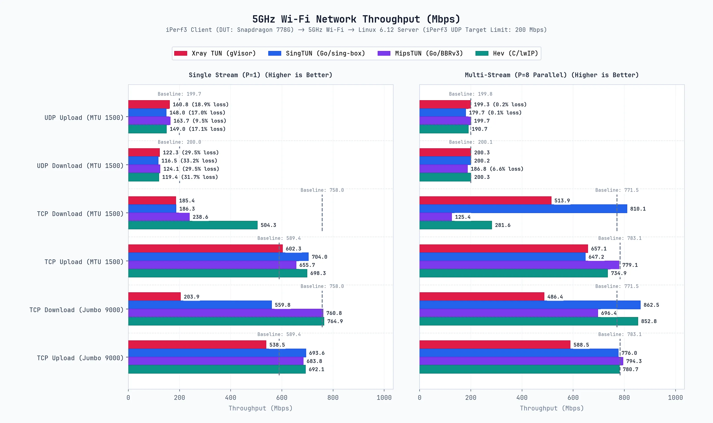
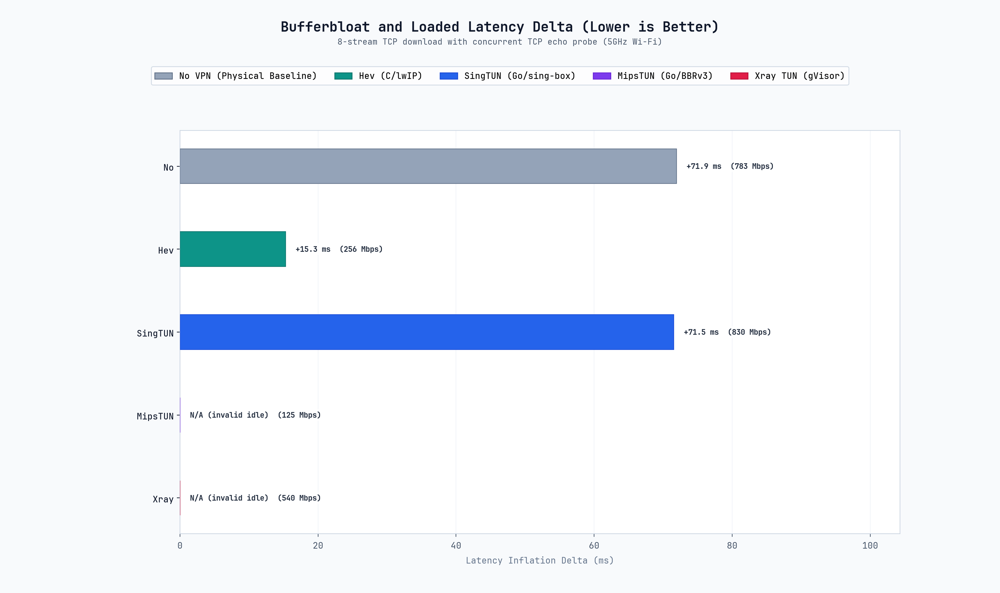
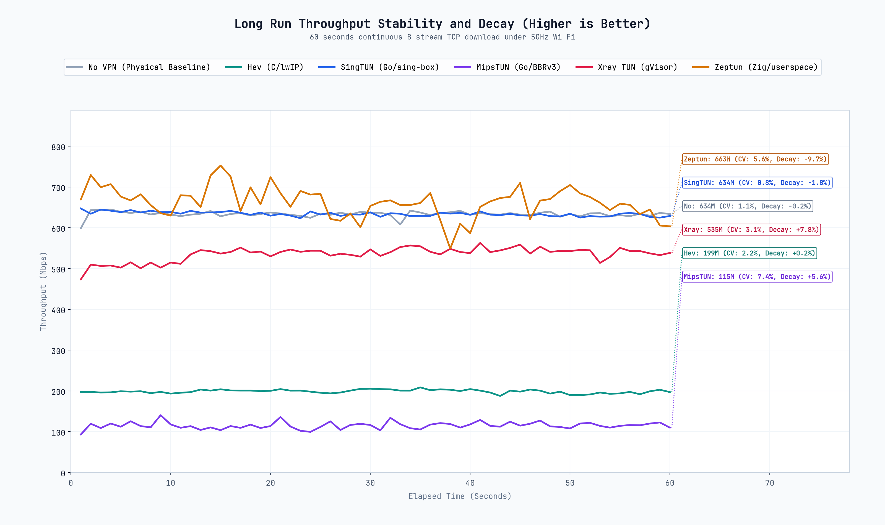
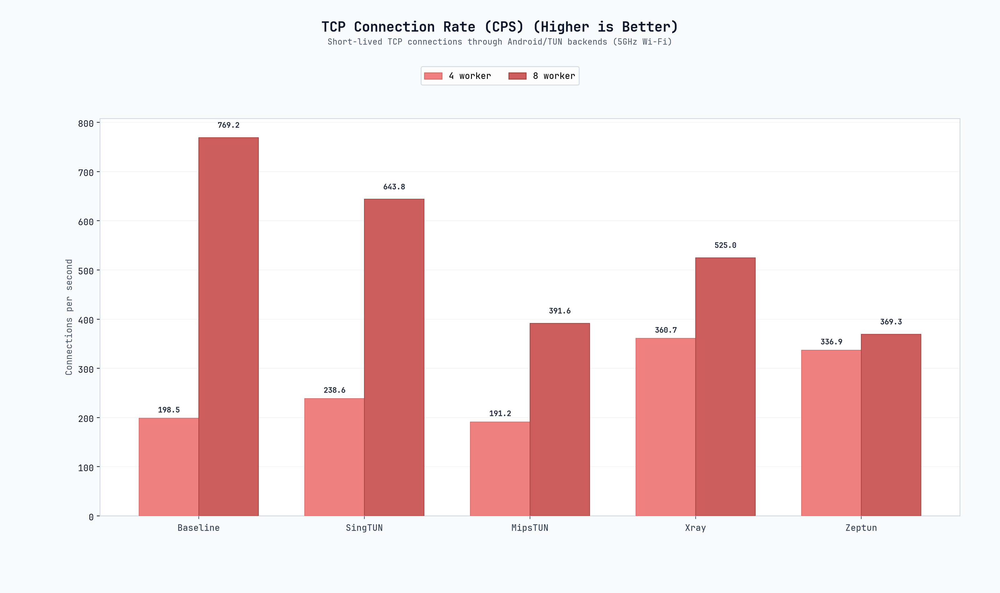
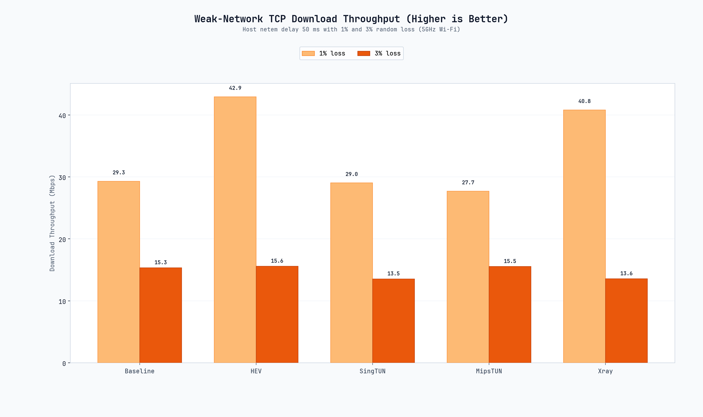
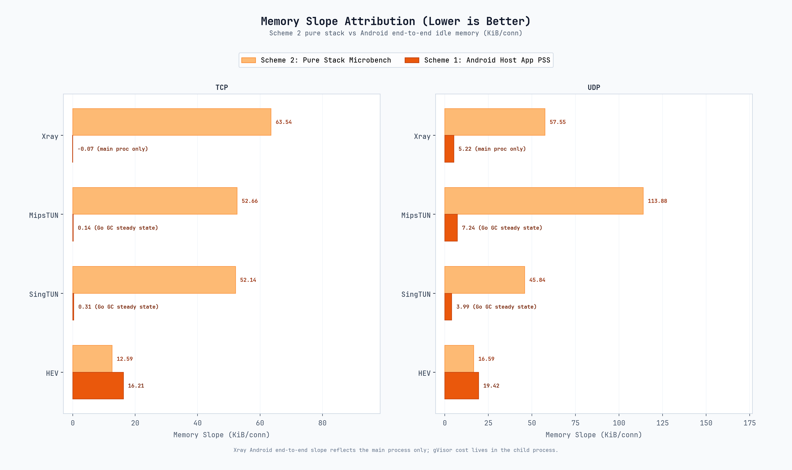

# SimpleXray 778G 轻量基准报告

本报告汇集 2026 年 9 月 22 日轻量测试数据，涵盖 Wi-Fi TCP、受载时延、长跑稳定性、CPS、弱网和 Scheme 2 纯栈内存微基准。完整历史数据已归档，本报告只维护当前结论。

## 1. Wi-Fi TCP

测试为 5GHz Wi-Fi、MTU 1500/9000、单流与八流、上行与下行，三轮平均。

### MTU 1500

| 后端 | P=1 上行 | P=1 下行 | P=8 上行 | P=8 下行 |
| :--- | ---: | ---: | ---: | ---: |
| HEV | 611.87 | 576.17 | 625.36 | 261.85 |
| SingTUN | 607.76 | 143.92 | 570.70 | 635.56 |
| MipsTUN | 528.36 | 197.08 | 629.66 | 116.92 |
| Xray Native TUN | 536.26 | 198.71 | 645.61 | 527.91 |

### MTU 9000

| 后端 | P=1 上行 | P=1 下行 | P=8 上行 | P=8 下行 |
| :--- | ---: | ---: | ---: | ---: |
| HEV | 646.86 | 597.72 | 631.60 | 630.23 |
| SingTUN | 640.58 | 538.27 | 635.07 | 663.32 |
| MipsTUN | 628.33 | 626.46 | 633.70 | 565.00 |
| Xray Native TUN | 591.52 | 196.65 | 642.94 | 536.63 |

## 2. 受载时延

测试为八流 TCP 下行、MTU 1500、TCP echo 探针。正值表示受载时延增加，负值表示 idle 基线异常。

| 后端 | 吞吐 | Idle RTT | Loaded RTT | Delta | 有效性 |
| :--- | ---: | ---: | ---: | ---: | :---: |
| 物理直连 | 783.40 Mbps | 29.04 ms | 100.98 ms | +71.94 ms | 是 |
| HEV | 255.98 Mbps | 27.52 ms | 42.81 ms | +15.30 ms | 是 |
| SingTUN | 829.72 Mbps | 28.63 ms | 100.18 ms | +71.55 ms | 是 |
| MipsTUN | 125.18 Mbps | 28.33 ms | 12.36 ms | -15.96 ms | 否（idle 基线异常） |
| Xray Native TUN | 539.85 Mbps | 28.95 ms | 9.59 ms | -19.36 ms | 否（idle 基线异常） |

## 3. 60 秒长跑稳定性

测试为八流 TCP 下行、MTU 1500、持续 60 秒。衰减率按末 5 秒相对前 5 秒计算。

| 后端 | 平均吞吐 | 变异系数 | 末段变化 |
| :--- | ---: | ---: | ---: |
| 物理直连 | 633.50 Mbps | 1.12% | -0.21% |
| HEV | 198.82 Mbps | 2.17% | +0.19% |
| SingTUN | 634.03 Mbps | 0.83% | -1.75% |
| MipsTUN | 115.15 Mbps | 7.37% | +5.56% |
| Xray Native TUN | 535.11 Mbps | 3.14% | +7.82% |

HEV 和 MipsTUN 的长跑结果与标准 Wi-Fi P=8 下行一致，数值偏低属于当前数据路径特性，不是测试异常。

## 4. CPS 短连接速率

测试为 5000 次短连接、4/8 worker。数值单位为每秒成功连接数。

| 后端 | 4 worker | 8 worker |
| :--- | ---: | ---: |
| 物理直连 | 198.5 | 769.2 |
| HEV | 超时 | 超时 |
| SingTUN | 238.6 | 643.8 |
| MipsTUN | 191.2 | 391.6 |
| Xray Native TUN | 360.7 | 525.0 |

HEV 在 120 秒内未完成 5000 次连接。补充测试显示 HEV 在 4 worker 下 100、500、1000 次连接的速率均约 16 CPS，增加并发没有提升。

## 5. 弱网测试

测试为主机 Netem、50ms 延迟、1% 与 3% 丢包、八流 TCP 下行。1% 为三轮平均，3% 为两轮平均。

| 后端 | 1% 丢包 + 50ms | 3% 丢包 + 50ms |
| :--- | ---: | ---: |
| 物理直连 | 29.30 Mbps | 15.34 Mbps |
| HEV | 42.94 Mbps | 15.59 Mbps |
| SingTUN | 29.04 Mbps | 13.54 Mbps |
| MipsTUN | 27.69 Mbps | 15.54 Mbps |
| Xray Native TUN | 40.81 Mbps | 13.56 Mbps |

1% 丢包下 HEV 与 Xray Native TUN 吞吐较高。3% 丢包下各后端差异缩小，吞吐集中在 13.5 到 15.6 Mbps。

## 6. 内存斜率

Scheme 2 为纯栈微基准，Android 端到端为三轮 idle memory 平均。Android 端只统计 SimpleXray 主进程，Xray 的真实 gVisor 开销位于子进程中。

| 后端 | Scheme 2 TCP | Android TCP | Scheme 2 UDP | Android UDP |
| :--- | ---: | ---: | ---: | ---: |
| HEV | 12.59 | 16.21 | 16.59 | 19.42 |
| SingTUN | 52.14 | 0.31 | 45.84 | 3.99 |
| MipsTUN | 52.66 | 0.14 | 113.88 | 7.24 |
| Xray Native TUN | 63.54 | -0.07 | 57.55 | 5.22 |

单位为 KiB/conn。

## 7. 当前结论

1. Wi-Fi 单流下行仍存在明显协议栈差异，HEV 最高，其余后端集中在 144 到 199 Mbps。
2. HEV 的八流下行和长跑吞吐偏低，但 CPU 成本最低。
3. SingTUN 多流吞吐和长跑稳定性较好，CPS 也处于中上水平。
4. MipsTUN 的 UDP 内存斜率最高，八流下行吞吐偏低，弱网 3% 下略有优势。
5. Xray Native TUN 多流吞吐较高，但 CPS 和弱网表现没有形成绝对优势。
6. HEV 的短连接 CPS 存在明显瓶颈，约 16 CPS 后不再随并发提升。
7. Android 端到端空闲内存斜率会被 Go GC 和主进程隔离压低，真实纯栈开销应优先参考 Scheme 2；Xray 的 gVisor 开销仍在子进程中。

## 8. 原始数据

- [`data/benchmark_results.json`](../data/benchmark_results.json)
- [`data/advanced_benchmark_results.json`](../data/advanced_benchmark_results.json)
- [`data/cps_results.json`](../data/cps_results.json)
- [`data/weaknet_results.json`](../data/weaknet_results.json)
- [`data/microbench_results.json`](../data/microbench_results.json)
- [`data/idle_memory_results.json`](../data/idle_memory_results.json)
