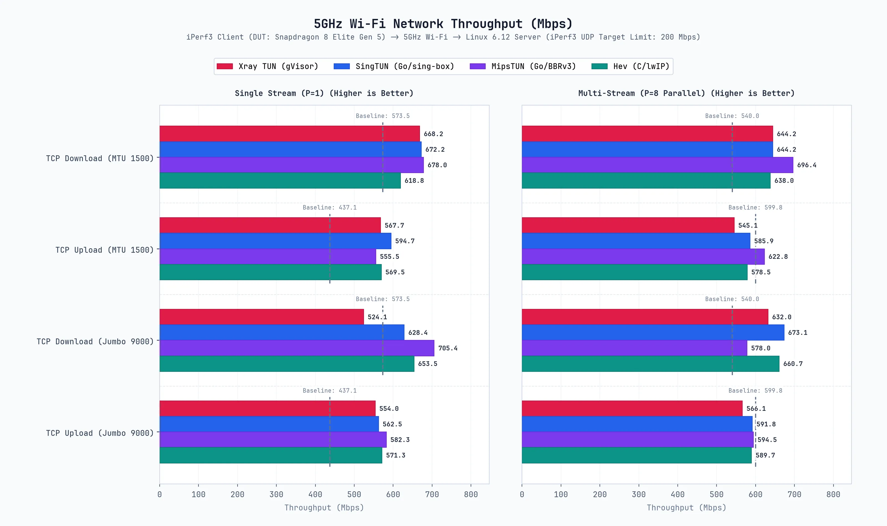
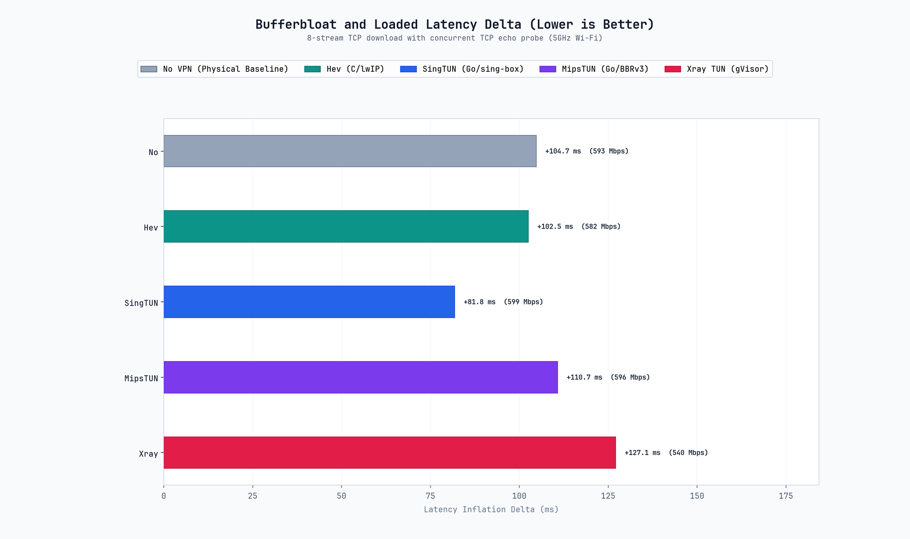
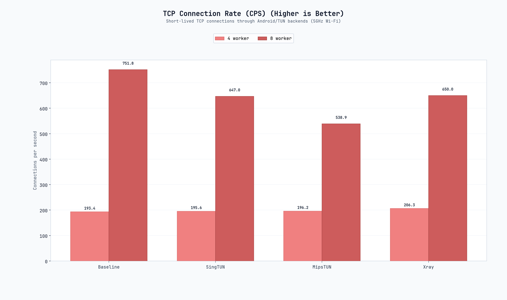
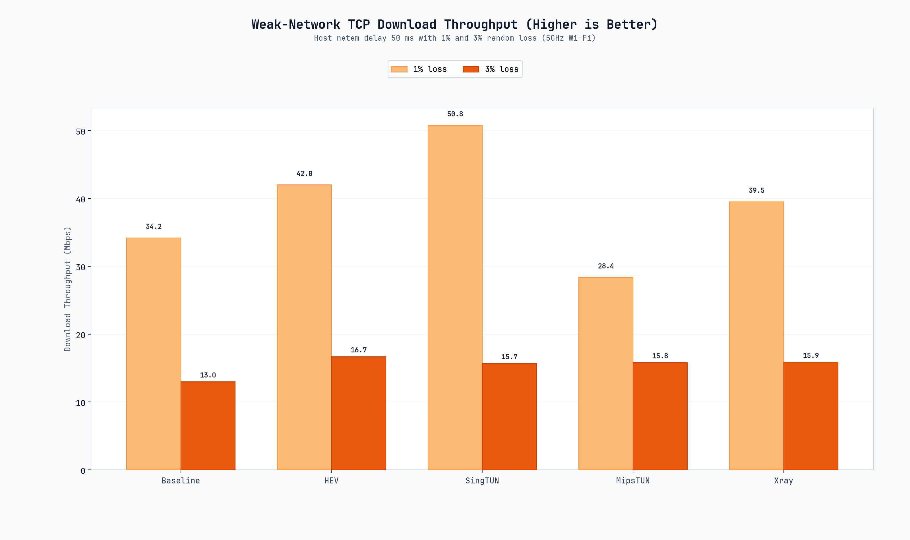
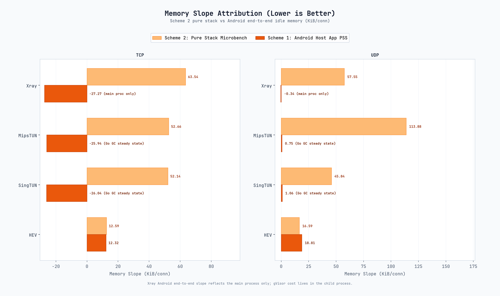

# SimpleXray 8 Elite Gen 5 轻量基准报告

本报告汇集 2026 年 9 月 22 日 Snapdragon 8 Elite Gen 5 旗舰机轻量测试数据，涵盖 Wi-Fi TCP、受载时延、长跑稳定性、CPS、弱网和内存斜率。完整历史数据已归档，本报告只维护当前结论。

## 1. Wi-Fi TCP

测试为 5GHz Wi-Fi、MTU 1500/9000、单流与八流、上行与下行，三轮平均。

### MTU 1500

| 后端 | P=1 上行 | P=1 下行 | P=8 上行 | P=8 下行 |
| :--- | ---: | ---: | ---: | ---: |
| HEV | 569.45 | 618.84 | 578.53 | 637.98 |
| SingTUN | 594.66 | 672.22 | 585.89 | 644.17 |
| MipsTUN | 555.49 | 677.97 | 622.78 | 696.41 |
| Xray Native TUN | 567.73 | 668.18 | 545.08 | 644.21 |

### MTU 9000

| 后端 | P=1 上行 | P=1 下行 | P=8 上行 | P=8 下行 |
| :--- | ---: | ---: | ---: | ---: |
| HEV | 571.25 | 653.49 | 589.69 | 660.73 |
| SingTUN | 562.50 | 628.43 | 591.79 | 673.08 |
| MipsTUN | 582.33 | 705.40 | 594.45 | 578.02 |
| Xray Native TUN | 553.98 | 524.13 | 566.14 | 632.04 |

## 2. 受载时延

测试为八流 TCP 下行、MTU 1500、TCP echo 探针。

| 后端 | 吞吐 | Idle RTT | Loaded RTT | Delta | 有效性 |
| :--- | ---: | ---: | ---: | ---: | :---: |
| 物理直连 | 592.74 Mbps | 18.70 ms | 123.44 ms | +104.74 ms | 是 |
| HEV | 582.29 Mbps | 19.15 ms | 121.66 ms | +102.51 ms | 是 |
| SingTUN | 599.24 Mbps | 18.78 ms | 100.58 ms | +81.81 ms | 是 |
| MipsTUN | 596.04 Mbps | 17.92 ms | 128.66 ms | +110.74 ms | 是 |
| Xray Native TUN | 540.03 Mbps | 18.36 ms | 145.45 ms | +127.09 ms | 是 |

## 3. 60 秒长跑稳定性

测试为八流 TCP 下行、MTU 1500、持续 60 秒。衰减率按末 5 秒相对前 5 秒计算。

| 后端 | 平均吞吐 | 变异系数 | 末段变化 |
| :--- | ---: | ---: | ---: |
| 物理直连 | 587.31 Mbps | 10.06% | +1.08% |
| HEV | 661.68 Mbps | 9.18% | +2.52% |
| SingTUN | 614.54 Mbps | 10.39% | -3.89% |
| MipsTUN | 610.92 Mbps | 10.82% | +33.36% |
| Xray Native TUN | 651.92 Mbps | 12.89% | +19.52% |

## 4. CPS 短连接速率

测试为 5000 次短连接、4/8 worker，数值单位为每秒成功连接数。

| 后端 | 4 worker | 8 worker |
| :--- | ---: | ---: |
| 物理直连 | 193.4 | 751.8 |
| SingTUN | 195.6 | 647.0 |
| MipsTUN | 196.2 | 538.9 |
| Xray Native TUN | 206.3 | 650.0 |

HEV 单测：

> HEV 5000 次连接数在 120 秒内未完成，降低连接数后，4 worker 约 16 CPS，8 worker 约 35 CPS。提高并发能改善 CPS，但提升有限。

| 连接数 | 4 worker | 8 worker |
| :--- | ---: | ---: |
| 1000 | 16.8 | 35.3 |
| 2000 | 超时 | 35.2 |
| 5000 | 超时 | 超时 |

## 5. 弱网测试

测试为主机 Netem、50ms 延迟、1% 与 3% 丢包、八流 TCP 下行。

| 后端 | 1% 丢包 + 50ms | 3% 丢包 + 50ms |
| :--- | ---: | ---: |
| 物理直连 | 34.20 Mbps | 12.97 Mbps |
| HEV | 42.01 Mbps | 16.68 Mbps |
| SingTUN | 50.79 Mbps | 15.68 Mbps |
| MipsTUN | 28.37 Mbps | 15.81 Mbps |
| Xray Native TUN | 39.51 Mbps | 15.86 Mbps |

## 6. 内存斜率

Scheme 2 为纯栈微基准，Android 端到端为三轮 idle memory 平均。Android 端只统计 SimpleXray 主进程，Xray 的真实 gVisor 开销位于子进程中。

| 后端 | Scheme 2 TCP | Android TCP | Scheme 2 UDP | Android UDP |
| :--- | ---: | ---: | ---: | ---: |
| HEV | 12.59 | 12.32 | 16.59 | 18.81 |
| SingTUN | 52.14 | -26.04 | 45.84 | 1.06 |
| MipsTUN | 52.66 | -25.94 | 113.88 | 0.75 |
| Xray Native TUN | 63.54 | -27.27 | 57.55 | -0.34 |

单位为 KiB/conn。

## 7. 当前结论

1. 旗舰机 Wi-Fi TCP 三轮平均单流和多流下行能力明显高于中端机。
2. HEV 的受载时延和 CPU 成本较低，但八流下行和长跑吞吐仍偏低。
3. HEV 短连接瓶颈延续，4 worker 约 16.8 CPS，8 worker 约 35 CPS，5000 次测试超时。
4. 弱网下各后端差异被丢包压缩，3% 时吞吐集中在约 13 到 17 Mbps。
5. Android 端到端 idle memory 受 Go GC 和主进程隔离影响，真实纯栈开销仍以 Scheme 2 为主。

## 8. 数据目录

- [`data/benchmark_results.json`](../data/benchmark_results.json)
- [`data/advanced_benchmark_results.json`](../data/advanced_benchmark_results.json)
- [`data/cps_results.json`](../data/cps_results.json)
- [`data/weaknet_results.json`](../data/weaknet_results.json)
- [`data/microbench_results.json`](../data/microbench_results.json)
- [`data/idle_memory_results.json`](../data/idle_memory_results.json)
